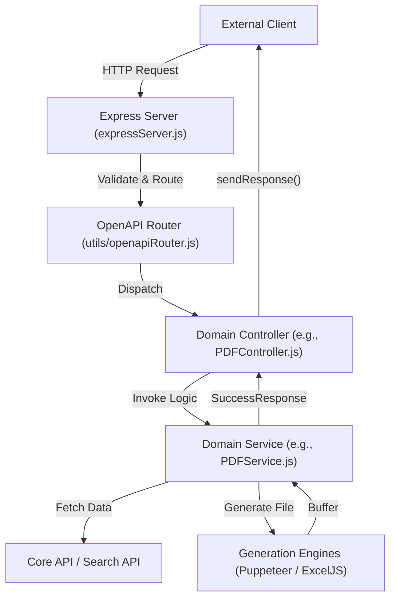
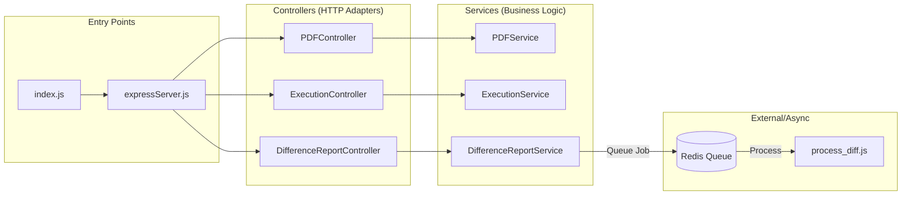

# Overview

Relevant source files

The following files were used as context for generating this wiki page:

- [.dockerignore](.dockerignore)
- [.gitignore](.gitignore)
- [LICENSE](LICENSE)
- [README.md](README.md)

The **Ingenium Report Service** is a specialized microservice designed to generate, process, and export reports for procedures and executions within the Ingenium ecosystem. It provides a RESTful API for converting complex data structures into human-readable formats such as **PDF** and **Excel**, and supports asynchronous processing for resource-intensive tasks like difference reporting.

Built with **Node.js** and **Express**, the service follows an OpenAPI-first design pattern, ensuring strict request validation and automatic routing based on a central specification file [server/api/openapi.yaml:1-1]().

## System Architecture

The service is organized into a layered architecture that separates transport concerns from business logic.

### High-Level Component Interaction
This diagram illustrates how an external request flows through the system components to produce a report.

**Request Flow: Natural Language to Code Entities**

**Sources:** [README.md:156-163](), [server/expressServer.js:1-1](), [server/utils/openapiRouter.js:1-1]()

## Key Capabilities

*   **PDF Generation**: Utilizes **Puppeteer** to render HTML templates into high-quality PDF documents for procedures and execution logs [README.md:12-12]().
*   **Excel Export**: Leverages **exceljs** to transform execution data and search results into formatted spreadsheets [README.md:13-13]().
*   **Difference Reporting**: An asynchronous workflow that compares two versions of a procedure or execution, highlighting changes using `v-node-htmldiff` [README.md:14-14]().
*   **Async Task Queue**: Uses **BullMQ** and **Redis** to handle long-running report generation jobs without blocking the main API thread [README.md:18-18]().

## Codebase Structure

The project is divided into several logical layers, each with a specific responsibility:

| Layer | Primary Files/Directories | Responsibility |
| :--- | :--- | :--- |
| **API Spec** | `server/api/openapi.yaml` | The "Source of Truth" defining all endpoints, schemas, and routing metadata. |
| **Server** | `server/expressServer.js` | Express initialization, middleware setup (JWT, CORS), and OpenAPI validation. |
| **Routing** | `server/utils/openapiRouter.js` | Dynamically maps API paths to Controller methods. |
| **Controllers** | `server/controllers/` | Thin wrappers that extract parameters and format HTTP responses. |
| **Services** | `server/services/` | Business logic, upstream API calls, and report generation orchestration. |
| **Infrastructure** | `server/config.js`, `server/logger.js` | Global configuration and structured logging. |

**Sources:** [README.md:140-154](), [server/api/openapi.yaml:1-10]()

## Service Mapping: Logic to Implementation
The following diagram bridges the functional requirements to the specific code entities responsible for them.

**Functional Mapping**

**Sources:** [server/index.js:1-1](), [server/controllers/PDFController.js:1-1](), [server/services/diff_report/DifferenceReportService.js:1-1](), [server/services/diff_report/process_diff.js:1-1]()

## Getting Started & Configuration

To begin working with the Ingenium Report Service, you must configure the environment variables required for upstream API connectivity (Core API, Search API), Redis, and SMTP.

*   For installation steps and local setup, see **[Getting Started](#1.1)**.
*   For a complete list of environment variables and their effects, see **[Configuration Reference](#1.2)**.

**Sources:** [README.md:29-54](), [README.md:68-103]()
