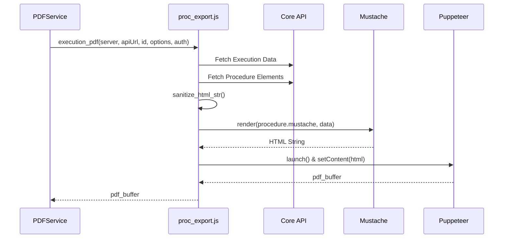
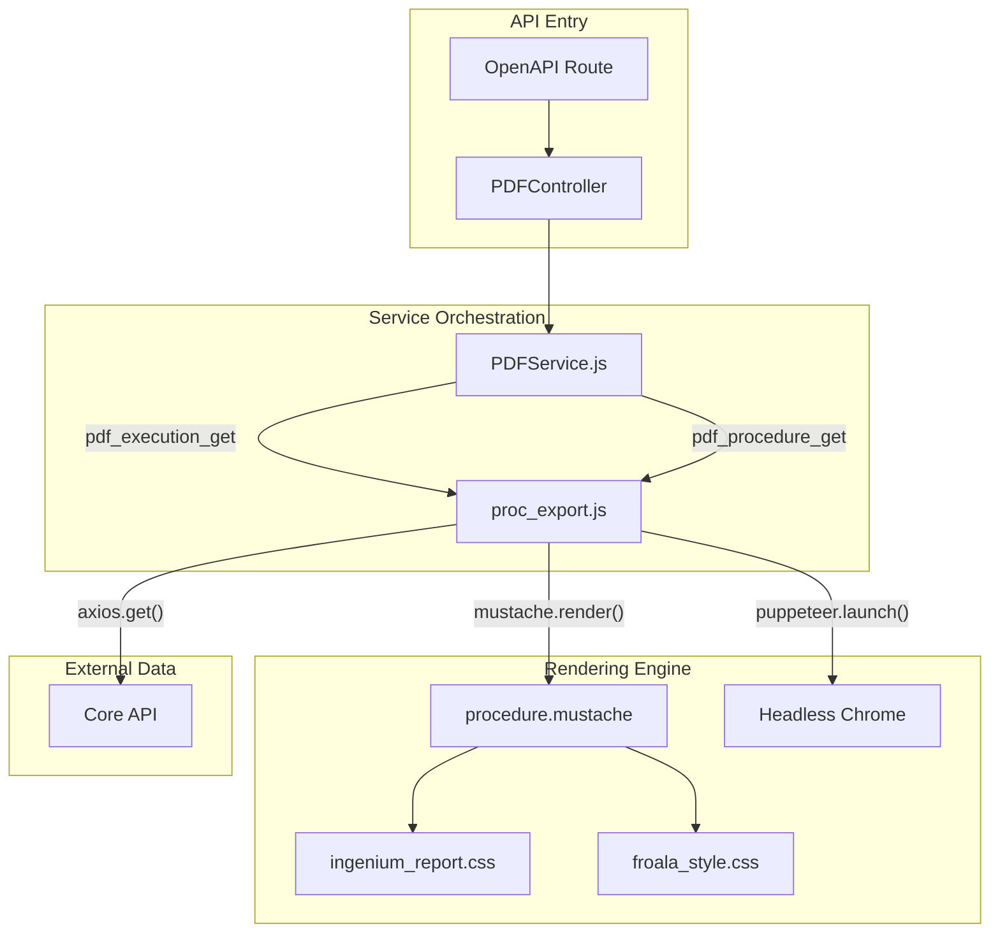

# PDF Generation Service

Relevant source files

The following files were used as context for generating this wiki page:

- [server/services/PDFService.js](server/services/PDFService.js)
- [server/services/pdf/css/froala_style.css](server/services/pdf/css/froala_style.css)
- [server/services/pdf/css/ingenium_report.css](server/services/pdf/css/ingenium_report.css)
- [server/services/pdf/package-lock.json](server/services/pdf/package-lock.json)
- [server/services/pdf/package.json](server/services/pdf/package.json)
- [server/services/pdf/proc_export.js](server/services/pdf/proc_export.js)
- [server/services/pdf/procedure.mustache](server/services/pdf/procedure.mustache)
- [server/services/pdf/test.js](server/services/pdf/test.js)

The **PDF Generation Service** is responsible for orchestrating the conversion of Ingenium procedures and execution "As Runs" into formatted PDF documents. It acts as a bridge between the API layer and the low-level rendering logic implemented using Puppeteer and Mustache templates.

## Overview

The service is encapsulated in `PDFService.js`, which provides static methods to handle PDF requests. It delegates the heavy lifting to `proc_export.js`, which manages data fetching from the Core API, HTML templating, and PDF rendering.

### Key Capabilities
*   **Procedure Export**: Generates a PDF for a specific version of a procedure definition.
*   **Execution Export**: Generates an "As Run" report for a completed or in-progress execution, including sign-offs and actual values.
*   **Configurable Options**: Supports toggling Table of Contents (TOC) levels and various comment flags (general, activity report, and data review).

## Implementation Details

The `PDFService` class follows a standard pattern of extracting options, logging the request, and calling the underlying export functions.

### PDFService.js
This file defines two primary entry points:
*   `pdf_execution_get`: Orchestrates execution (As Run) PDFs [server/services/PDFService.js:21-46]().
*   `pdf_procedure_get`: Orchestrates procedure definition PDFs [server/services/PDFService.js:57-79]().

Both methods wrap their logic in a Promise and return a `_pdf_buffer` within a success response, which the Controller layer then streams to the client [server/services/PDFService.js:35]().

### Data Flow and Orchestration

The following diagram illustrates how a request flows from the Service layer into the export engine.

**PDF Generation Sequence**

**Sources:** [server/services/PDFService.js:33-34](), [server/services/pdf/proc_export.js:49-67]() (referenced in test usage).

## Core Export Logic (proc_export.js)

The `proc_export.js` file contains the logic for fetching data and rendering the PDF. It utilizes several helper functions to format data for the templates:

| Function | Purpose |
| :--- | :--- |
| `procedure_pdf` | Fetches procedure metadata and elements, renders via template, and returns a PDF buffer [server/services/pdf/proc_export.js:49](). |
| `execution_pdf` | Fetches execution records, transitions, and used procedures to generate an "As Run" report [server/services/pdf/proc_export.js:59](). |
| `get_verification_expression` | Converts condition constants (e.g., `GREATER_THAN`) into human-readable mathematical symbols for the PDF [server/services/pdf/proc_export.js:115-141](). |
| `sanitize_html_str` | Cleans up specific Froala editor HTML artifacts (like `calc(0%)`) that interfere with rendering [server/services/pdf/proc_export.js:214-218](). |

**Sources:** [server/services/pdf/proc_export.js:1-218]()

## Templating and Styling

The service uses **Mustache** for HTML templating and **Puppeteer** for "headless" Chrome rendering.

### Templates
The primary template is `procedure.mustache`. It contains logic for:
*   **Metadata Tables**: Displays Ingenium IDs, versions, and authors [server/services/pdf/procedure.mustache:15-82]().
*   **Status History**: Lists execution transitions and user comments [server/services/pdf/procedure.mustache:206-224]().
*   **Table of Contents**: Dynamically generated based on the `toc_level` option [server/services/pdf/procedure.mustache:261-265]().

### Stylesheets
Two CSS files are injected during the rendering process to ensure the PDF matches the Ingenium brand and the Froala editor's output:
1.  `ingenium_report.css`: Defines layout, status colors (PASS/FAIL), and print-specific adjustments [server/services/pdf/css/ingenium_report.css:1-113]().
2.  `froala_style.css`: Provides standard styling for rich-text content generated by the web editor [server/services/pdf/css/froala_style.css:1-61]().

**Sources:** [server/services/pdf/procedure.mustache:1-265](), [server/services/pdf/css/ingenium_report.css:1-384](), [server/services/pdf/css/froala_style.css:1-246]()

## Configuration Options

The service accepts several flags that modify the content of the generated PDF:

| Option | Type | Description |
| :--- | :--- | :--- |
| `toc_level` | Integer | Controls depth of TOC. `0` for all, `-1` for none [server/services/PDFService.js:14](). |
| `comment` | Boolean | Include general execution comments [server/services/PDFService.js:27](). |
| `activity_report_comment` | Boolean | Include activity-specific comments [server/services/PDFService.js:28](). |
| `data_review_comment` | Boolean | Include data review/sign-off comments [server/services/PDFService.js:29](). |
| `all_steps` | Boolean | If false, only steps with comments/data are shown [server/services/PDFService.js:30](). |

**Sources:** [server/services/PDFService.js:25-31]()

## Code Entity Mapping

This diagram maps the logical PDF generation steps to the specific files and functions in the codebase.

**System Entity Map**

**Sources:** [server/services/PDFService.js:8-80](), [server/services/pdf/proc_export.js:1-13](), [server/services/pdf/procedure.mustache:1-10]()
