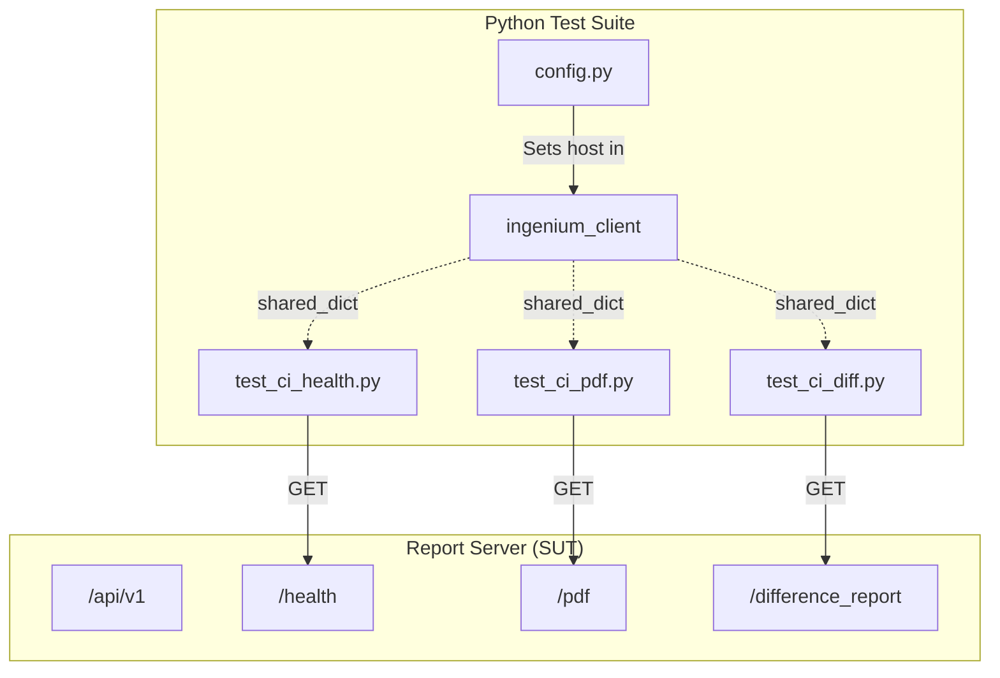
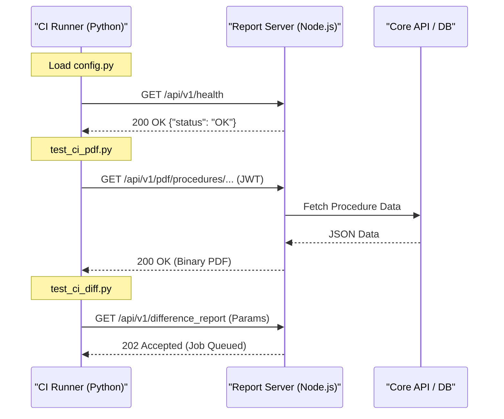

# Python CI Integration Tests

Relevant source files

The following files were used as context for generating this wiki page:

- [tests/config.py](tests/config.py)
- [tests/requirements.txt](tests/requirements.txt)
- [tests/test_ci_diff.py](tests/test_ci_diff.py)
- [tests/test_ci_health.py](tests/test_ci_health.py)
- [tests/test_ci_pdf.py](tests/test_ci_pdf.py)

The Ingenium Report Server utilizes a Python-based integration test suite located in the `tests/` directory. These tests are designed to validate the end-to-end functionality of the service by making real HTTP requests against a running instance of the report server. The suite focuses on verifying health status, PDF generation for procedures and executions, and the asynchronous difference report queuing system.

## Test Environment Setup

The testing infrastructure relies on the `ingenium_client` library to manage shared state and configuration.

### Configuration and Shared State
The `tests/config.py` file initializes the environment by determining the target server URL and setting up the API path. It uses the `REPORT_SERVICE_URL` environment variable, defaulting to `http://localhost:3003` if not provided [[tests/config.py:5-7]]().

The configuration is stored in a `shared_dict` object imported from `ingenium_client`. This dictionary holds the base API host and the necessary authentication headers (JWT) used across all test modules [[tests/config.py:3-10]]().

### Dependencies
The suite requires several Python packages for execution, including `requests` for HTTP interaction, `PyJWT` for token handling, and `unittest-xml-reporting` for CI-compatible output [[tests/requirements.txt:1-8]]().

**Test Infrastructure Overview**

Sources: [[tests/config.py:1-11]](), [[tests/requirements.txt:1-8]]()

---

## Test Modules

The suite is divided into three functional modules, each inheriting from `unittest.TestCase`.

### 1. Health Integration (`test_ci_health.py`)
This module verifies the basic availability of the service. It targets the `/health` endpoint and does not require JWT authentication headers, instead using standard JSON headers [[tests/test_ci_health.py:18-25]]().

*   **Assertions**:
    *   HTTP Status Code must be `200` [[tests/test_ci_health.py:27]]().
    *   The JSON response body must contain `{"status": "OK"}` [[tests/test_ci_health.py:30]]().

### 2. PDF Generation (`test_ci_pdf.py`)
This module tests the synchronous PDF generation endpoints. It uses the `shared_dict['headers']` to provide the required JWT for authentication [[tests/test_ci_pdf.py:22,39]]().

*   **`test_procedure_pdf`**: Requests a PDF for a specific procedure version (e.g., `europa-procedure-10001` version `0`). It asserts a `200` status and writes the binary content to `procedure.pdf` [[tests/test_ci_pdf.py:17-32]]().
*   **`test_execution_pdf`**: Requests a PDF for a specific execution ID (e.g., `europa-ingenium-11118`). It asserts a `200` status and writes the binary content to `execution.pdf` [[tests/test_ci_pdf.py:34-49]]().

### 3. Difference Reports (`test_ci_diff.py`)
This module validates the asynchronous difference report engine. Unlike the PDF endpoints, this endpoint returns a `202 Accepted` status code, indicating the job has been queued in Redis/BullMQ [[tests/test_ci_diff.py:25-28]]().

*   **Request Payload**: Includes `base_type`, `base_id`, `base_version`, and corresponding `target` fields [[tests/test_ci_diff.py:20]]().
*   **Assertions**: Verifies the response code is exactly `202` [[tests/test_ci_diff.py:28]]().

**Sequence of Integration Test Execution**

Sources: [[tests/test_ci_health.py:18-30]](), [[tests/test_ci_pdf.py:17-49]](), [[tests/test_ci_diff.py:17-28]]()

---

## Reporting and CI Integration

The tests are configured to generate machine-readable reports for consumption by CI/CD pipelines (such as Jenkins or GitLab CI).

### XML Reporting
Each test module utilizes `xmlrunner.XMLTestRunner` when executed as a main script. This runner outputs JUnit-compatible XML files to the `./test-reports/` directory [[tests/test_ci_health.py:33]](), [[tests/test_ci_pdf.py:55]](), [[tests/test_ci_diff.py:33]]().

### Logging
The suite uses a logger configured via `ingenium_client`. In the event of a failure (e.g., a non-200/202 status code), the tests log the `result.status_code` and `result.text` to help diagnose the failure from the CI console output [[tests/test_ci_pdf.py:24-27]](), [[tests/test_ci_diff.py:25-27]]().

| Test File | Endpoint Tested | Expected Status | Auth Required |
| :--- | :--- | :--- | :--- |
| `test_ci_health.py` | `/health` | `200` | No |
| `test_ci_pdf.py` | `/pdf/procedures/...` | `200` | Yes (JWT) |
| `test_ci_pdf.py` | `/pdf/executions/...` | `200` | Yes (JWT) |
| `test_ci_diff.py` | `/difference_report` | `202` | Yes (JWT) |

Sources: [[tests/test_ci_health.py:33]](), [[tests/test_ci_pdf.py:22-28]](), [[tests/test_ci_diff.py:22-28]]()
