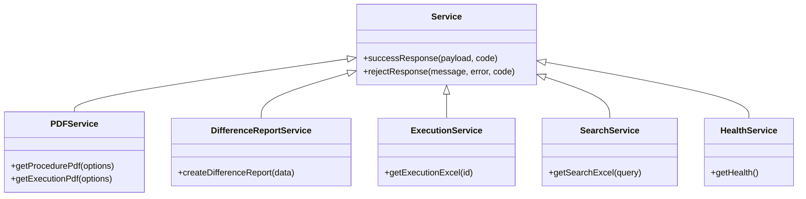
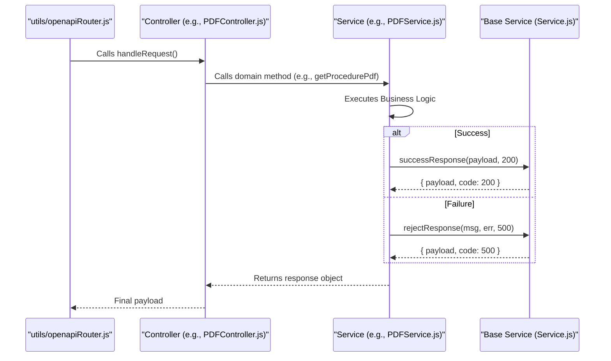

# Service Layer

Relevant source files

The following files were used as context for generating this wiki page:

- [server/services/Service.js](server/services/Service.js)
- [server/services/index.js](server/services/index.js)

The Service Layer contains the core business logic of the Ingenium Report Server. It is designed to be decoupled from the HTTP transport layer, ensuring that domain logic remains independent of the Express.js framework and OpenAPI routing mechanisms.

The architecture follows a pattern where each domain-specific service inherits from a base `Service` class, providing a consistent interface for returning data and handling errors to the [Controller Layer](#3).

### Service Architecture

The service layer is organized into five primary domain services, all of which are exported via a central index file `server/services/index.js` [server/services/index.js:1-14]().

#### Business Logic Separation
By encapsulating logic within services, the application separates concerns such as:
*   **Data Fetching:** Interacting with external Core and Search APIs.
*   **Report Generation:** Orchestrating PDF generation, Excel workbook creation, and HTML diffing.
*   **Asynchronous Processing:** Managing background jobs via BullMQ for long-running tasks.
*   **System Health:** Monitoring the status of internal and external dependencies.

### Base Service Class

The `Service` class in `server/services/Service.js` acts as the base class for all domain services. It provides static helper methods to normalize responses into a standard format that the [Base Controller](#3.1) can interpret [server/services/Service.js:1-20]().

*   **`successResponse(payload, code)`**: Wraps the result and an HTTP status code (defaulting to 200) into a consistent object [server/services/Service.js:17-19]().
*   **`rejectResponse(message, error, code)`**: Normalizes error messages and stack traces into a structured payload for error reporting [server/services/Service.js:2-15]().

### Domain Services Overview

The following diagram illustrates the relationship between the `Service` base class and its specialized implementations.

**Service Layer Class Hierarchy**

Sources: [server/services/Service.js:1-20](), [server/services/index.js:1-13]()

---

### PDF Generation Service
The `PDFService` handles the orchestration of PDF report generation. It communicates with the `proc_export` module to generate procedure and execution documents. It supports various options such as Table of Contents (TOC) levels and the inclusion of comments or all steps.

For details, see [PDF Generation Service](#4.1).

### Difference Report Service
The `DifferenceReportService` manages the asynchronous generation of "Diff" reports comparing two versions of a procedure. Due to the computational intensity of HTML diffing, this service utilizes **BullMQ** and **Redis** to queue jobs, which are then processed by background workers (`process_diff.js`).

For details, see [Difference Report Service](#4.2).

### Excel Export Services
Excel generation is split across two services depending on the data source:
*   **ExecutionService**: Generates detailed Excel workbooks for specific execution records.
*   **SearchService**: Exports search results into a tabular Excel format.

Both services utilize the `exceljs` library to build formatted workbooks and return them as buffer responses.

For details, see [Excel Export Services](#4.3).

### Health Service
The `HealthService` provides a standardized endpoint to monitor the status of the report server. It aggregates checks to determine if the service is operational, returning statuses such as `OK`, `ERROR`, or `UNKNOWN`.

For details, see [Health Service](#4.4).

### Data Flow: Controller to Service
The following diagram bridges the "Natural Language Space" of a user request to the "Code Entity Space" of the service layer, showing how the `openapiRouter` connects HTTP requests to specific service methods.

**Request Dispatch to Service Layer**

Sources: [server/services/Service.js:1-20](), [server/services/index.js:1-13]()
