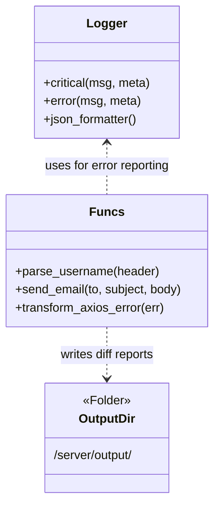

# Shared Utilities and Infrastructure

<details>
<summary>Relevant source files</summary>

The following files were used as context for generating this wiki page:

- [server/data/dummy.pdf](server/data/dummy.pdf)
- [server/funcs.js](server/funcs.js)
- [server/logger.js](server/logger.js)
- [server/output/.dummy](server/output/.dummy)

</details>


The Ingenium Report Server relies on a set of cross-cutting utilities and infrastructure components to ensure consistent behavior across the API, Service, and Worker layers. These utilities handle essential tasks such as structured logging, JWT-based identity extraction, SMTP communication, and error normalization.

### System Infrastructure Overview

The infrastructure layer is designed to be stateless and reusable. While most business logic resides in the services, these utilities provide the "glue" that connects the application to external systems (like SMTP servers or logging aggregators) and standardizes data formats.

#### Component Relationship
The following diagram illustrates how shared utilities interface with the rest of the system:

**Utility Integration Map**
```mermaid
graph TD
    subgraph "API & Service Layer"
        [Controller.js]
        [PDFService.js]
        [DifferenceReportService.js]
    end

    subgraph "Shared Utilities [Code Entity Space]"
        direction TB
        L["logger.js (Winston)"]
        F["funcs.js (Helpers)"]
        O["/server/output/ (Storage)"]
    end

    [Controller.js] -->|logs errors| L
    [DifferenceReportService.js] -->|calls send_email| F
    [PDFService.js] -->|logs trace| L
    [DifferenceReportService.js] -->|writes artifacts| O
    F -->|normalizes errors| [Controller.js]
```
Sources: [server/logger.js:46-51](), [server/funcs.js:35-49](), [server/funcs.js:51-99]()

---

### 5.1 Logger
The logging infrastructure is built on `winston` and provides a customized, structured output format. It is designed to facilitate easy ingestion by log management systems (like ELK or Splunk) by outputting logs as JSON strings.

*   **Custom Levels:** The system uses a 6-tier priority scale: `critical`, `error`, `warning`, `info`, `debug`, and `trace` [server/logger.js:37-41]().
*   **Environment Driven:** The log level is controlled via the `LOG_LEVEL` environment variable, defaulting to `debug` if not set [server/logger.js:48-48]().
*   **Structured Output:** Every log entry is processed by a `json_formatter` that attaches a timestamp and normalizes metadata/objects into a consistent JSON schema [server/logger.js:5-35]().

For details on log formats and level definitions, see [Logger](#5.1).

---

### 5.2 Utility Functions (funcs.js)
The `funcs.js` module contains stateless helper functions used throughout the application. These functions abstract complex operations like JWT verification and error mapping.

*   **Identity Management:** The `parse_username()` function decodes the `RS256` signed JWT from the Authorization header to identify the user performing the request [server/funcs.js:26-33]().
*   **Communication:** `send_email()` provides a wrapper around `nodemailer`, using SMTP configuration from `config.js` to send report notifications [server/funcs.js:35-49]().
*   **Error Normalization:** `transform_axios_error()` is a critical utility that takes raw errors from upstream APIs (like the Core API) and transforms them into a standardized `err_new` object with `message`, `details`, and `http_code_at_source` [server/funcs.js:51-99]().

For implementation details, see [Utility Functions (funcs.js)](#5.2).

---

### 5.3 Output Directory and Artifacts
The `/server/output/` directory serves as a transient storage area for generated report artifacts. 

*   **Persistence:** This directory is used by the `DifferenceReportService` to store PDF files before they are uploaded to the file server or sent via email.
*   **Placeholder:** The directory includes a `.dummy` file to ensure the folder structure is maintained in version control [server/output/.dummy:1-1]().
*   **Mocking:** For testing purposes, static assets like `dummy.pdf` are used to validate response streams and file handling [server/data/dummy.pdf:1-10]().

**Infrastructure Mapping**

Sources: [server/logger.js:1-53](), [server/funcs.js:1-101](), [server/output/.dummy:1-1]()
