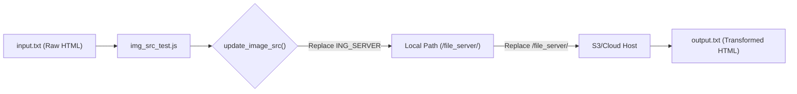

# Testing

<details>
<summary>Relevant source files</summary>

The following files were used as context for generating this wiki page:

- [server/tests/img_src_test.js](server/tests/img_src_test.js)
- [server/tests/input.txt](server/tests/input.txt)
- [server/tests/output.txt](server/tests/output.txt)
- [tests/config.py](tests/config.py)
- [tests/requirements.txt](tests/requirements.txt)
- [tests/test_ci_diff.py](tests/test_ci_diff.py)
- [tests/test_ci_health.py](tests/test_ci_health.py)
- [tests/test_ci_pdf.py](tests/test_ci_pdf.py)

</details>


The Ingenium Report Server employs a two-tier testing strategy to ensure both the correctness of internal logic and the stability of the deployed API. This strategy is split between high-level integration tests written in Python and targeted unit/functional tests written in Node.js.

## Testing Strategy Overview

The testing architecture is divided into two distinct directories based on the scope and language of the tests:

1.  **CI Integration Tests (`tests/`)**: A Python-based suite designed for Continuous Integration. These tests interact with a running instance of the server via HTTP, validating end-to-end workflows like PDF generation and health checks.
2.  **Server Unit Tests (`server/tests/`)**: Node.js scripts used to validate specific internal utilities, particularly the HTML and image source transformation logic used before rendering reports.

### Testing Architecture Mapping

The following diagram illustrates how the test suites interact with the system components.

**Test Suite to System Mapping**
```mermaid
graph TD
    subgraph "Python CI Suite (tests/)"
        [test_ci_health.py] -->|GET /health| [HealthController]
        [test_ci_pdf.py] -->|GET /pdf/...| [PDFController]
        [test_ci_diff.py] -->|GET /difference_report| [DifferenceReportController]
    end

    subgraph "Node.js Unit Tests (server/tests/)"
        [img_src_test.js] -->|Validates| [update_image_src]
        [input.txt] -.-> [img_src_test.js]
        [img_src_test.js] -.-> [output.txt]
    end

    subgraph "Ingenium Report Server"
        [HealthController]
        [PDFController]
        [DifferenceReportController]
        [update_image_src]
    end
```
Sources: [tests/test_ci_health.py:18-30](), [tests/test_ci_pdf.py:17-50](), [tests/test_ci_diff.py:17-30](), [server/tests/img_src_test.js:9-23]()

---

## Python CI Integration Tests

The integration tests are located in the root `tests/` directory. They utilize the `unittest` framework and `requests` library to simulate client behavior. These tests are intended to run against a live environment (e.g., local dev or staging) defined by the `REPORT_SERVICE_URL` environment variable.

### Key Components
*   **Configuration**: `tests/config.py` initializes the `shared_dict` from the `ingenium_client` library, setting the base `api_path` for all requests [tests/config.py:5-10]().
*   **Health Validation**: `test_ci_health.py` ensures the `/health` endpoint returns a `200 OK` status and a JSON body indicating the service is healthy [tests/test_ci_health.py:18-30]().
*   **Report Generation**: `test_ci_pdf.py` validates both procedure and execution PDF exports, writing the resulting binary content to local files for verification [tests/test_ci_pdf.py:17-49]().
*   **Asynchronous Jobs**: `test_ci_diff.py` triggers the difference report engine, asserting that the server returns a `202 Accepted` status, indicating the job was successfully queued [tests/test_ci_diff.py:17-28]().

For more details on setup, JWT authentication, and XML reporting, see [Python CI Integration Tests](#6.1).

**Sources:** [tests/config.py:1-11](), [tests/test_ci_health.py:11-33](), [tests/test_ci_pdf.py:10-55](), [tests/test_ci_diff.py:10-33]()

---

## Node.js Server Tests

The `server/tests/` directory contains Node.js scripts designed to test specific server-side logic in isolation. Currently, this tier focuses on the transformation of HTML content, specifically the remapping of image URLs.

### HTML Transformation Testing
The primary test script, `img_src_test.js`, validates the `update_image_src` function. This function is critical for ensuring that images hosted on internal or external file servers are correctly resolved when generating PDF reports.

| File | Role |
| :--- | :--- |
| `img_src_test.js` | Logic to read `input.txt`, apply `update_image_src()`, and write to `output.txt` [server/tests/img_src_test.js:15-23](). |
| `input.txt` | Fixture containing raw HTML with various `` tag source formats [server/tests/input.txt:1-13](). |
| `output.txt` | The expected output after remapping `ING_SERVER` and `/file_server/` paths to `FILE_SERVER_API_HOST` [server/tests/output.txt:1-13](). |

**Logic Flow for Image Source Transformation**

Sources: [server/tests/img_src_test.js:9-13](), [server/tests/img_src_test.js:17-21]()

For more details on fixture formats and the regex-like replacement logic, see [Node.js Server Tests](#6.2).

**Sources:** [server/tests/img_src_test.js:1-25](), [server/tests/input.txt:1-13](), [server/tests/output.txt:1-13]()
