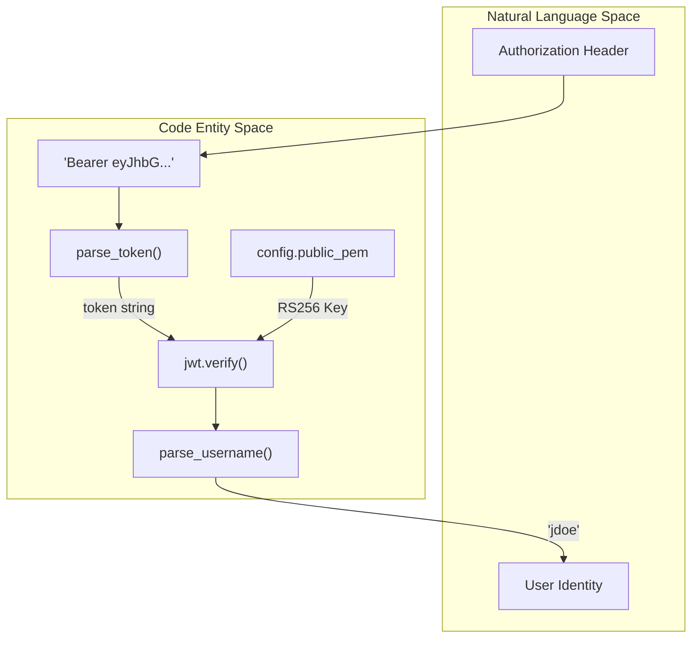
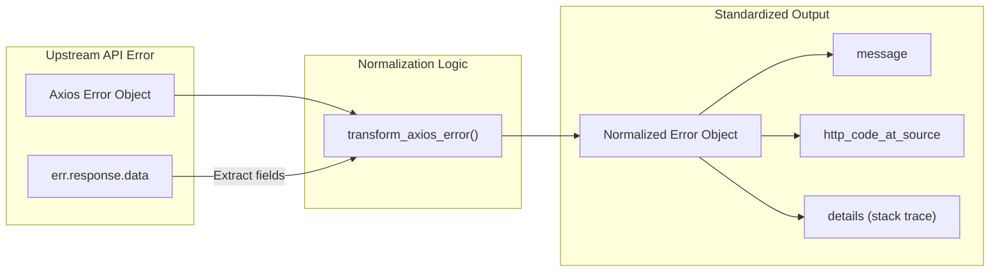

# Utility Functions (funcs.js)

Relevant source files

The following files were used as context for generating this wiki page:

- [server/config.js](server/config.js)
- [server/funcs.js](server/funcs.js)

The `funcs.js` file serves as a centralized utility module for the Ingenium Report Server. It provides essential helper functions for security (JWT parsing), communication (SMTP email), and error normalization (Axios error transformation). These utilities are used across various service layers to maintain consistency in how the application interacts with external entities and handles internal data.

### 1. JWT Decoding and Identity Extraction

The system uses `parse_username()` to extract user identity from the `Authorization` bearer token. This is critical for personalization features, such as determining the recipient of email notifications.

#### Implementation Details
- **`parse_token(key)`**: A private helper that splits the "Bearer <token>" string and retrieves the second part [server/funcs.js:14-24]().
- **`parse_username(authorization_header)`**: Uses the `jsonwebtoken` library to verify the token against the `config.public_pem` using the `RS256` algorithm [server/funcs.js:26-33](). It extracts the `username` field from the decoded payload.

#### Token Parsing Flow
The following diagram illustrates the flow from a raw HTTP header to a validated username string.

**Diagram: Identity Extraction Flow**

**Sources:**
- [server/funcs.js:14-33]()
- [server/config.js:22-22]()

---

### 2. SMTP Email Integration

The `send_email()` function handles asynchronous email notifications, primarily used by the `DifferenceReportService` to notify users when a background diff job is complete.

#### SMTP Configuration
The email transport is initialized using `nodemailer` with settings derived from the global configuration [server/funcs.js:4-11]():
- **Host**: `config.SMTP_HOST` [server/config.js:47-47]()
- **Port**: `config.SMTP_HOST_PORT` [server/config.js:49-49]()
- **TLS**: Configured to `rejectUnauthorized: false` to allow for internal self-signed certificates common in enterprise environments [server/funcs.js:8-10]().

#### Function: `send_email(to_username, subject, html_body)`
- **Recipient Construction**: Automatically appends the organization domain to the username (e.g., `user@ingenium-open.com`) [server/funcs.js:38-38]().
- **Sender**: Hardcoded to `Ingenium Report Service <do_not_reply@ingenium-open.com>` [server/funcs.js:37-37]().
- **Error Handling**: Catches exceptions from `transport.sendMail` and logs them via the system logger [server/funcs.js:43-48]().

**Sources:**
- [server/funcs.js:4-11]()
- [server/funcs.js:35-49]()
- [server/config.js:47-50]()

---

### 3. Axios Error Normalization

The `transform_axios_error()` function is a crucial utility for the Service Layer. Since the Report Server acts as an orchestrator calling the Core API and Search API, it must normalize various failure modes (network timeouts, 4xx/5xx responses, or malformed JSON) into a standard format that the `Controller` layer can return to the client.

#### Structured Error Object
The function produces an object with the following schema [server/funcs.js:52-58]():

| Property | Description |
| :--- | :--- |
| `message` | Human-readable error description. |
| `details` | Array containing stack traces or specific validation errors. |
| `error_type` | Category of error (e.g., Validation, Authentication). |
| `error_source` | The upstream service that generated the error. |
| `http_code_at_source` | The original HTTP status code from the upstream API. |

#### Transformation Logic
1. **Upstream Response**: If the error contains a `response` object (standard for Axios), it extracts the status code and attempts to parse the `data` body [server/funcs.js:60-63]().
2. **Body Parsing**: It checks if the upstream response is a simple string or a structured object containing `message`, `details`, or `error_type` [server/funcs.js:64-89]().
3. **Fallback**: If no message is found in the response, it falls back to the top-level error message [server/funcs.js:92-94](). If no details exist, it pushes the local execution stack trace into the `details` array for debugging [server/funcs.js:95-97]().

**Diagram: Error Normalization Mapping**

**Sources:**
- [server/funcs.js:51-99]()
