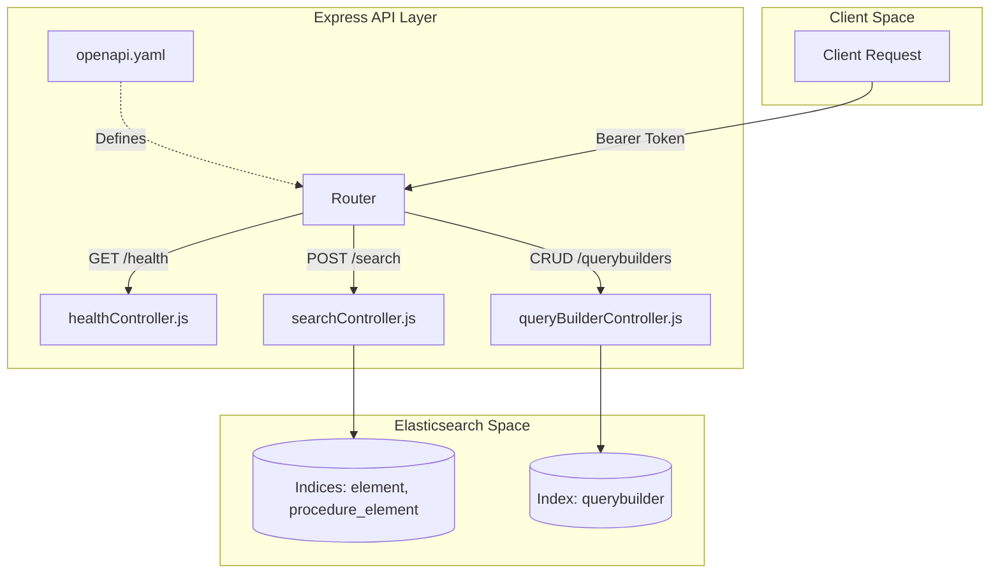

# Page: API Reference

# API Reference

<details>
<summary>Relevant source files</summary>

The following files were used as context for generating this wiki page:

- [README.md](README.md)
- [src/api/openapi.yaml](src/api/openapi.yaml)

</details>


The Ingenium Search Server exposes a RESTful API designed to facilitate complex search operations against Elasticsearch indices, manage saved search configurations, and provide service health monitoring. The API is formally defined using the OpenAPI 3.0 specification [src/api/openapi.yaml:1-5]().

All endpoints, with the exception of the health check and documentation, require authentication via a JSON Web Token (JWT) using the RS256 algorithm [README.md:174-183]().

### API Communication Flow

The following diagram illustrates the relationship between the API definitions, the routing layer, and the controller logic.

**API Request Lifecycle**

Sources: [src/api/openapi.yaml:9-141](), [README.md:238-250](), [README.md:126-133]()

---

### Health Endpoint
The health endpoint provides a simple liveness check for the service. It is the only endpoint that does not require a `Bearer` token in the Authorization header [README.md:183-184]().

*   **Path**: `GET /api/v1/health`
*   **Purpose**: Returns the operational status of the service.
*   **Controller**: `healthController.js`

For details, see [Health Endpoint](#3.1).

Sources: [src/api/openapi.yaml:10-24](), [README.md:87-88]()

---

### Search Endpoint
The search endpoint is the core functional component of the service, allowing clients to execute complex, multi-operator queries across one or more Elasticsearch indices [README.md:134-149]().

*   **Path**: `POST /api/v1/search`
*   **Purpose**: Execute structured queries using the `queryBuilderParams` schema.
*   **Key Feature**: Supports searching across specific indices (`element`, `procedure_element`) or an aggregate search using the `all` index parameter [README.md:168-170]().
*   **Controller**: `searchController.js`

For details, see [Search Endpoint](#3.2).

Sources: [src/api/openapi.yaml:115-141](), [README.md:96-97](), [README.md:151-172]()

---

### QueryBuilder Endpoints
These endpoints provide CRUD (Create, Read, Update, Delete) capabilities for saving and retrieving search configurations. Every saved query is automatically scoped to the `username` extracted from the authenticated user's JWT [README.md:181-182]().

*   **Paths**: 
    *   `GET /api/v1/querybuilders`
    *   `GET /api/v1/querybuilders/{id}`
    *   `POST /api/v1/querybuilders`
    *   `DELETE /api/v1/querybuilders/{id}`
*   **Purpose**: Manage persistent search "templates" or saved filters.
*   **Controller**: `queryBuilderController.js`

For details, see [QueryBuilder Endpoints](#3.3).

Sources: [src/api/openapi.yaml:25-114](), [README.md:90-94]()

---

### Global Error Handling
The API uses a standardized error response format defined in the OpenAPI schema. Unexpected errors or validation failures return an `Error` object [src/api/openapi.yaml:161-174]().

**Standard Error Schema**
| Field | Type | Description |
| :--- | :--- | :--- |
| `code` | integer | The HTTP status code (e.g., 401, 404, 500) |
| `message` | string | A human-readable description of the error |

**Common Status Codes**
*   `200/201`: Success
*   `401`: Unauthorized (Missing or invalid JWT)
*   `400`: Bad Request (Schema validation failed via `express-openapi-validator`)
*   `500`: Internal Server Error (Elasticsearch connection issues or runtime exceptions)

Sources: [src/api/openapi.yaml:143-149](), [src/api/openapi.yaml:161-174]()

---

### Code Mapping: Request to Logic
The following diagram bridges the Natural Language API concepts to the specific code entities that handle them.

**API to Controller Mapping**
```mermaid
classDiagram
    class "openapi.yaml" {
        /health
        /search
        /querybuilders
    }
    class healthController {
        +getHealth()
    }
    class searchController {
        +search()
        +buildQuery()
    }
    class queryBuilderController {
        +getQueryBuilders()
        +getQueryBuilderById()
        +saveQueryBuilder()
        +deleteQueryBuilder()
    }

    "openapi.yaml" ..> healthController : "GET /health"
    "openapi.yaml" ..> searchController : "POST /search"
    "openapi.yaml" ..> queryBuilderController : "CRUD /querybuilders"
```
Sources: [src/api/openapi.yaml:9-141](), [README.md:238-250]()
