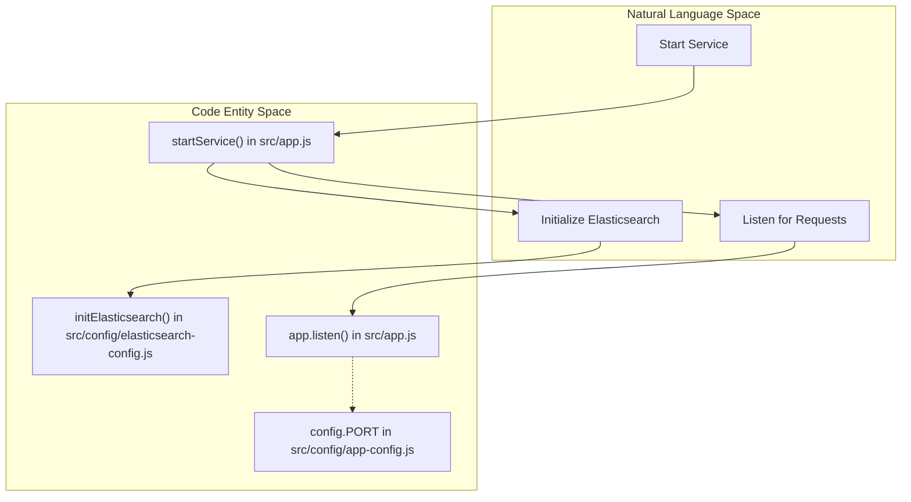
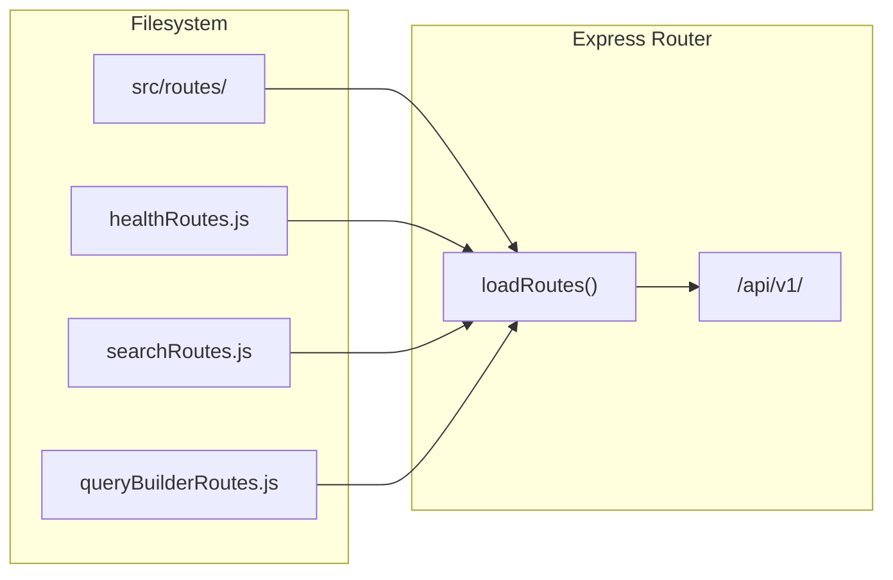

# Page: Application Bootstrap (app.js)

# Application Bootstrap (app.js)

Relevant source files

The following files were used as context for generating this wiki page:

- [src/api/openapi.yaml](src/api/openapi.yaml)
- [src/app.js](src/app.js)

The `src/app.js` file serves as the entry point for the Ingenium Search Server. It is responsible for initializing the Express application, configuring the middleware pipeline, dynamically loading API routes, and orchestrating the asynchronous startup sequence that includes establishing a connection to Elasticsearch.

## Startup Sequence (startService)

The application follows a strict startup sequence defined in the `startService()` function. The service ensures that the data persistence layer is ready before accepting any HTTP traffic.

### Process Flow: startService
1.  **Initialize Elasticsearch**: Calls `initElasticsearch()` to verify connectivity, create indices, and apply mappings [src/app.js:65-65]().
2.  **Start Express Server**: Once the database is ready, the Express app begins listening on the port defined in the configuration (defaulting to `3000`) [src/app.js:66-68]().
3.  **Logging**: A confirmation message is emitted via the internal logger [src/app.js:67-67]().

### Data Flow: Initialization to Execution
The following diagram illustrates the relationship between the startup logic and the core dependencies.

**Startup Logic to Code Entity Mapping**

Sources: [src/app.js:64-71](), [src/config/app-config.js:1-20]()

---

## Middleware Pipeline

The application utilizes a linear middleware stack. The order of registration is critical, as it ensures that requests are parsed, authenticated, and validated before reaching the controllers.

| Order | Middleware | Purpose | File Reference |
| :--- | :--- | :--- | :--- |
| 1 | `bodyParser.json()` | Parses incoming request bodies as JSON. | [src/app.js:29-29]() |
| 2 | `cors()` | Enables Cross-Origin Resource Sharing. | [src/app.js:32-32]() |
| 3 | `jwtAuth` | Validates RS256 JWTs against a public key. | [src/app.js:35-35]() |
| 4 | `addUsernameToResponse` | Extracts the username from the JWT and attaches it to `res.locals`. | [src/app.js:38-38]() |
| 5 | `OpenApiValidator` | Validates requests and responses against `openapi.yaml`. | [src/app.js:41-47]() |
| 6 | `Error Handler` | Catches and formats errors (e.g., validation or 500s). | [src/app.js:50-55]() |
| 7 | `Swagger UI` | Serves interactive documentation at `/api-docs`. | [src/app.js:58-58]() |

### Implementation Details
*   **JWT Auth**: The `jwtAuth` middleware is applied globally, though it is configured internally to exclude specific public routes like `/health` [src/app.js:35-35]().
*   **OpenAPI Validation**: The `express-openapi-validator` uses the `src/api/openapi.yaml` file to enforce strict schema compliance for both incoming payloads and outgoing responses [src/app.js:42-46]().
*   **Global Error Handler**: This middleware specifically handles errors thrown by the validator or controllers, returning a standardized JSON response containing the error message and any specific validation errors [src/app.js:50-55]().

Sources: [src/app.js:29-58](), [src/middlewares/jwtAuth.js:1-20](), [src/middlewares/addUsernameToResponse.js:1-10]()

---

## Dynamic Route Loading

Instead of manually importing every route file, `app.js` implements a dynamic loader via the `loadRoutes()` function.

### Function: loadRoutes(app)
This function performs the following steps:
1.  Identifies the `src/routes` directory [src/app.js:19-19]().
2.  Reads all files in that directory [src/app.js:20-20]().
3.  Filters for JavaScript files (`.js`) [src/app.js:21-21]().
4.  Mounts each route module under the versioned prefix: `/api/${config.API_VERSION}` [src/app.js:23-23]().

**Route Loading Entity Mapping**

### OpenAPI Specification Integration
The server loads the `openapi.yaml` specification using `yamljs` [src/app.js:13-16](). This document serves two purposes:
1.  **Validation**: Powering the `OpenApiValidator` middleware [src/app.js:43-43]().
2.  **Documentation**: Providing the schema for the Swagger UI served at `/api-docs` [src/app.js:58-58]().

Sources: [src/app.js:18-26](), [src/app.js:13-16](), [src/api/openapi.yaml:1-250]()
