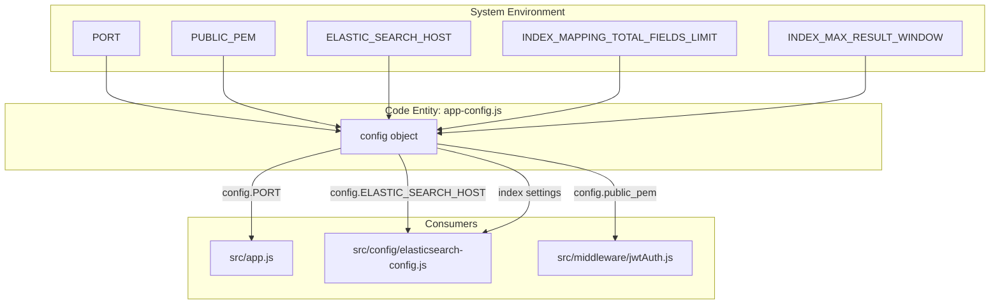
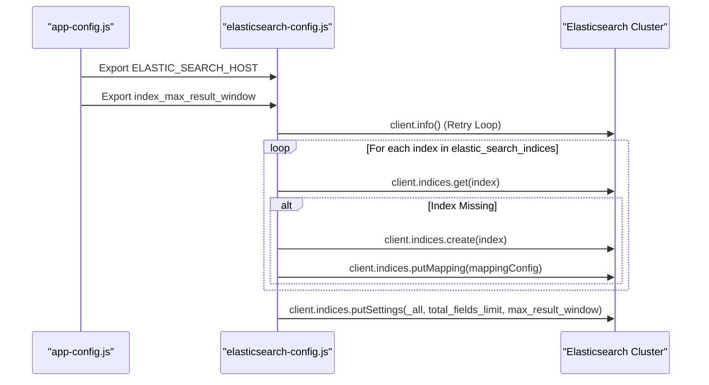

# Page: Configuration Reference

# Configuration Reference

Relevant source files

The following files were used as context for generating this wiki page:

- [src/config/app-config.js](src/config/app-config.js)
- [src/config/elasticsearch-config.js](src/config/elasticsearch-config.js)
- [src/config/mapping-config.js](src/config/mapping-config.js)

The Ingenium Search Server relies on environment variables for runtime configuration. These variables control networking, security via JWT verification, and critical Elasticsearch performance and schema settings. The primary entry point for these configurations is `src/config/app-config.js`.

## Configuration Loading Process

The application initializes its configuration by reading from `process.env`. The `app-config.js` module exports a `config` object that is used throughout the service, including the Express application and the Elasticsearch client initialization.

### Configuration Data Flow
The following diagram illustrates how environment variables flow from the system environment into the application modules.

**Diagram: Configuration Injection Flow**

**Sources:** [src/config/app-config.js:1-17](), [src/config/elasticsearch-config.js:1-8]()

## Environment Variables Reference

| Variable | Description | Default Value | Implementation Detail |
| :--- | :--- | :--- | :--- |
| `PORT` | The port on which the Express server listens. | `3025` | Parsed as integer; falls back to default if `NaN`. |
| `PUBLIC_PEM` | The RSA public key (PEM format) used to verify RS256 JWT tokens. | `''` (Empty string) | Used by `express-jwt` in the authentication middleware. |
| `ELASTIC_SEARCH_HOST` | The URL of the Elasticsearch cluster. | `http://127.0.0.1:19200` | Used to instantiate the `@elastic/elasticsearch` `Client`. |
| `INDEX_MAPPING_TOTAL_FIELDS_LIMIT` | Maximum number of fields allowed in an index. | `20000` | Applied via `client.indices.putSettings` to `_all` indices. |
| `INDEX_MAX_RESULT_WINDOW` | Maximum number of search hits reachable via offset. | `20000000` | Controls deep pagination limits in Elasticsearch. |

**Sources:** [src/config/app-config.js:3-13](), [src/config/elasticsearch-config.js:69-77]()

## Elasticsearch Initialization and Settings

The `src/config/elasticsearch-config.js` file contains the `initElasticsearch` function, which applies the configuration settings to the cluster during the bootstrap phase.

### Index Lifecycle and Settings Application
When the service starts, it iterates through the indices defined in `config.elastic_search_indices` (`syncdata`, `querybuilder`, `element`, `procedure_element`) and ensures they are configured correctly.

1.  **Connection Retry**: The system attempts to connect to `ELASTIC_SEARCH_HOST` up to 20 times with a 5-second delay between attempts [src/config/elasticsearch-config.js:11-28]().
2.  **Index Creation**: If an index does not exist, it is created using `client.indices.create` [src/config/elasticsearch-config.js:30-51]().
3.  **Mapping Application**: The `mappingConfig.mappings` from `src/config/mapping-config.js` are applied to every index [src/config/elasticsearch-config.js:54-66]().
4.  **Global Settings Update**: The service calls `client.indices.putSettings` on the `_all` alias to set `index.mapping.total_fields.limit` and `index.max_result_window` [src/config/elasticsearch-config.js:70-82]().

**Diagram: Elasticsearch Config Application**

**Sources:** [src/config/elasticsearch-config.js:10-83](), [src/config/app-config.js:15-15]()

## Mapping Configuration (`mapping-config.js`)

The service enforces specific data types for date and numeric fields to ensure query consistency across all indices. 

### Key Mappings
*   **Dates**: Fields such as `time_started`, `time_updated`, `time_completed`, and `time_saved` are explicitly mapped to the `date` type with the `strict_date_optional_time` format [src/config/mapping-config.js:37-48, 55-62]().
*   **Numeric**: Version numbers and durations (e.g., `reference_procedure_version`, `timeout`, `lookback`) are mapped to `long` [src/config/mapping-config.js:6-17, 67-69]().
*   **Dynamic Templates**: A template named `string_as_wildcard` is defined to map any unknown `string` type fields to the Elasticsearch `wildcard` type, enabling efficient pattern matching [src/config/mapping-config.js:113-122]().

**Sources:** [src/config/mapping-config.js:1-125]()
