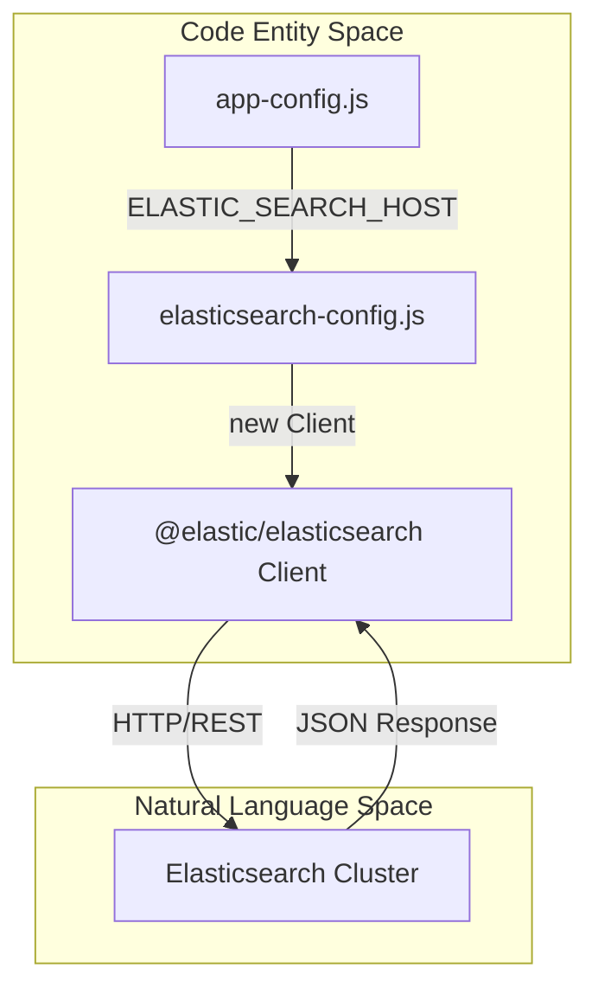
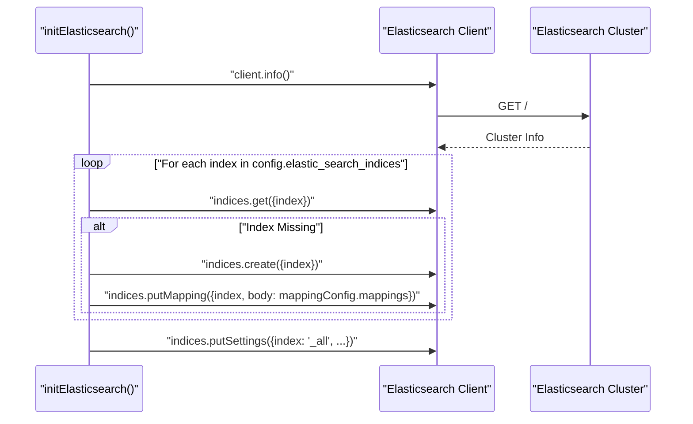

# Page: Elasticsearch Integration

# Elasticsearch Integration

Relevant source files

The following files were used as context for generating this wiki page:

- [src/config/app-config.js](src/config/app-config.js)
- [src/config/elasticsearch-config.js](src/config/elasticsearch-config.js)

The Ingenium Search Server relies on Elasticsearch as its primary data store and search engine. This integration is managed through a dedicated configuration module that handles the connection lifecycle, index provisioning, and schema enforcement during the service bootstrap process.

### Connection and Client Setup

The service utilizes the official `@elastic/elasticsearch` library to interact with the cluster [src/config/elasticsearch-config.js:1-1](). The `Client` instance is initialized using the `ELASTIC_SEARCH_HOST` environment variable, which defaults to `http://127.0.0.1:19200` [src/config/app-config.js:9-9]().

#### Elasticsearch Connection Flow
This diagram illustrates how the `elasticsearch-config.js` module bridges the application configuration to the physical Elasticsearch cluster.

**Sources:** [src/config/app-config.js:9-9](), [src/config/elasticsearch-config.js:6-8]()

---

### Startup and Initialization Routine

The `initElasticsearch()` function is responsible for ensuring the search cluster is ready before the API begins accepting requests. This routine includes a robust retry mechanism to handle scenarios where the Elasticsearch container or service might still be starting up.

1.  **Retry Logic**: The service attempts to connect to the cluster up to 20 times with a 5-second delay between attempts [src/config/elasticsearch-config.js:11-26](). If the cluster is unreachable after these trials, the process exits with an error.
2.  **Index Verification**: The service iterates through a predefined list of required indices: `syncdata`, `querybuilder`, `element`, and `procedure_element` [src/config/app-config.js:15-15]().
3.  **Creation and Mapping**: For any missing index, the service creates it and immediately applies the shared mapping configuration defined in `mapping-config.js` [src/config/elasticsearch-config.js:43-66]().
4.  **Global Settings**: Finally, the service updates the settings for all indices (`_all`) to adjust limits for total fields and the maximum result window [src/config/elasticsearch-config.js:70-82]().

For a deep dive into the retry loop and specific index creation steps, see **[Index Management and Startup](#5.1)**.

**Sources:** [src/config/elasticsearch-config.js:10-83](), [src/config/app-config.js:11-15]()

---

### Index Schema and Mapping

The server enforces a specific schema to ensure that complex data types (like dates and nested objects) are searchable and sortable. 

-   **Dynamic Templates**: A fallback mechanism maps unspecified string fields to the `wildcard` type, enabling efficient pattern matching [src/config/mapping-config.js]().
-   **Explicit Mappings**: Specific fields, particularly those related to procedure execution metadata and timestamps, are explicitly typed as `date` or `long` to prevent Elasticsearch from incorrectly inferring types during ingestion [src/config/mapping-config.js]().

#### Index Initialization Sequence
This diagram maps the startup sequence from the `initElasticsearch()` function to the resulting Elasticsearch state.

**Sources:** [src/config/elasticsearch-config.js:10-83](), [src/config/app-config.js:15-15]()

For detailed documentation on the field types and the wildcard mapping strategy, see **[Index Mapping Configuration](#5.2)**.

---

### Related Pages
- **[Index Management and Startup](#5.1)**: Details on the connection retry loop and index lifecycle.
- **[Index Mapping Configuration](#5.2)**: Detailed schema definitions for dates, numbers, and dynamic templates.
