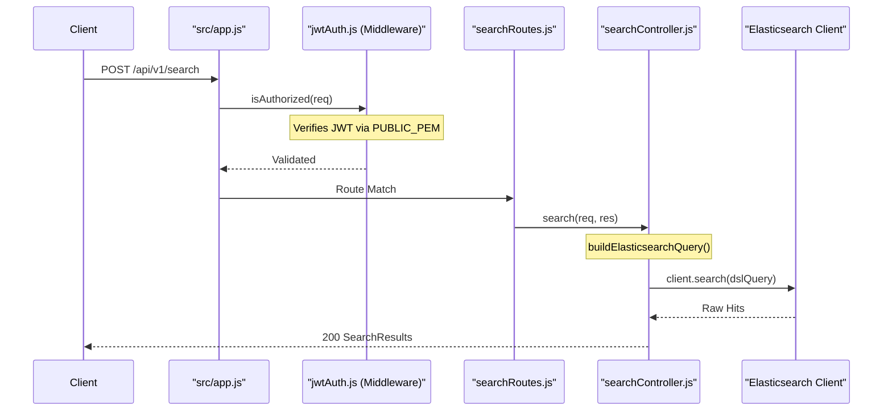
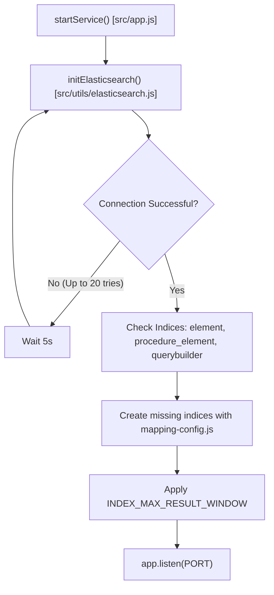

# Page: Getting Started

# Getting Started

<details>
<summary>Relevant source files</summary>

The following files were used as context for generating this wiki page:

- [.gitignore](.gitignore)
- [Dockerfile](Dockerfile)
- [package-lock.json](package-lock.json)
- [package.json](package.json)

</details>


This page provides a comprehensive guide for setting up the Ingenium Search Server. This microservice provides advanced search capabilities over Elasticsearch using a custom query builder engine, secured by JWT authentication.

## Prerequisites

Before setting up the service, ensure your environment meets the following requirements:

*   **Node.js**: Version `>=14.0.0` [package.json:33-34]()
*   **npm**: Version `>=6.0.0` [package.json:35-36]()
*   **Elasticsearch**: A running instance of Elasticsearch (tested with version 8.x) [package.json:38-38]()
*   **Public Key**: An RS256 PEM-formatted public key for JWT verification [src/config/app-config.js:20-20]()

## Environment Variables

The application is configured primarily through environment variables. These are processed in `src/config/app-config.js`.

| Variable | Description | Default |
| :--- | :--- | :--- |
| `PORT` | The port the Express server listens on. | `3025` |
| `PUBLIC_PEM` | The RS256 public key used to verify incoming JWTs. | `undefined` (Required) |
| `ELASTIC_SEARCH_HOST` | The URL of the Elasticsearch instance. | `http://localhost:9200` |
| `INDEX_MAPPING_TOTAL_FIELDS_LIMIT` | Maximum number of fields in an index. | `10000` |
| `INDEX_MAX_RESULT_WINDOW` | Maximum number of results returned by a query. | `20000` |

Sources: `src/config/app-config.js`

## Local Setup

To run the service locally for development:

1.  **Install Dependencies**:
    ```bash
    npm install
    ```
    This installs the core dependencies including `express`, `@elastic/elasticsearch`, and `express-jwt` [package.json:37-49]().

2.  **Configure Environment**:
    Create a `.env` file in the root directory (note that `.env` is ignored by git [ .gitignore:72-72]()).
    ```env
    PORT=3025
    ELASTIC_SEARCH_HOST=http://localhost:9200
    PUBLIC_PEM="-----BEGIN PUBLIC KEY-----\n...\n-----END PUBLIC KEY-----"
    ```

3.  **Run the Service**:
    *   **Production mode**: `npm start` (runs `node src/app.js`) [package.json:7-7]()
    *   **Development mode**: `npm run dev` (uses `nodemon` for hot reloading) [package.json:8-8]()

## Docker Usage

The service includes a `Dockerfile` for containerized deployment.

1.  **Build the Image**:
    ```bash
    docker build -t ingenium-search-server .
    ```
    The build uses `node:14.20.0` as the base image [Dockerfile:2-2](), sets the working directory to `/app` [Dockerfile:5-5](), and installs dependencies via `npm install` [Dockerfile:11-11]().

2.  **Run the Container**:
    ```bash
    docker run -p 3025:3025 \
      -e PUBLIC_PEM="your_key_here" \
      -e ELASTIC_SEARCH_HOST="http://host.docker.internal:9200" \
      ingenium-search-server
    ```
    The container exposes port `3025` [Dockerfile:17-17]().

## System Data Flow

The following diagram illustrates the lifecycle of a request from the client through the system's internal entities to Elasticsearch.

### Request Lifecycle and Code Entities

Sources: `src/app.js`, `src/routes/searchRoutes.js`, `src/controllers/searchController.js`, `src/middleware/jwtAuth.js`

## Service Initialization

When `startService()` is called in `src/app.js`, the system performs a sequence of checks to ensure connectivity and data integrity.

### Startup Logic and Index Initialization

Sources: `src/app.js`, `src/utils/elasticsearch.js`, `src/config/mapping-config.js`

## Available Scripts

The following scripts are defined in `package.json` [package.json:6-10]():

| Script | Command | Purpose |
| :--- | :--- | :--- |
| `start` | `node src/app.js` | Starts the production server. |
| `dev` | `nodemon src/app.js` | Starts the server with `nodemon` for automatic restarts on file changes. |
| `test` | `echo "Error: no test specified"` | Placeholder for the test suite. |

Sources: `package.json`
