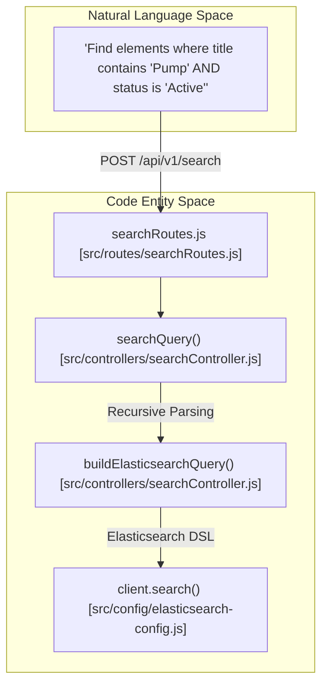
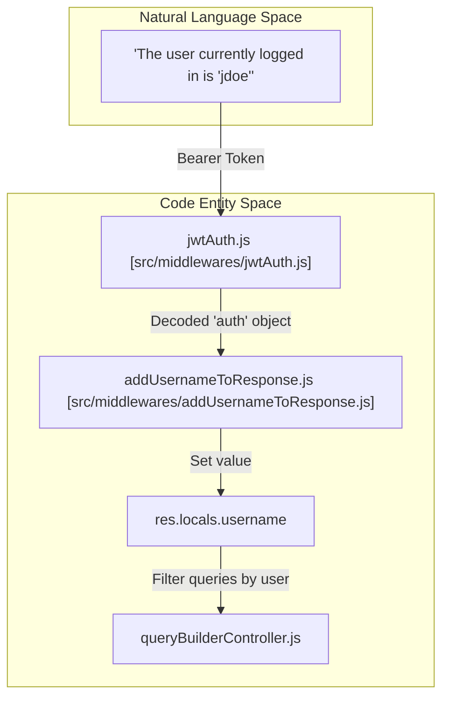

# Page: Glossary

# Glossary

Relevant source files

The following files were used as context for generating this wiki page:

- [README.md](README.md)
- [package.json](package.json)
- [search_examples/dynamic_mapping_example.py](search_examples/dynamic_mapping_example.py)
- [src/api/openapi.yaml](src/api/openapi.yaml)
- [src/config/mapping-config.js](src/config/mapping-config.js)
- [src/controllers/searchController.js](src/controllers/searchController.js)
- [src/middlewares/jwtAuth.js](src/middlewares/jwtAuth.js)

This page provides definitions for codebase-specific terms, domain concepts, and technical abstractions used within the Ingenium Search Server.

## Domain Concepts

### Query Builder Params
A structured JSON object used to represent complex logical queries. It consists of a `condition` (AND/OR) and an array of `rules`. Rules can be simple field comparisons or nested `queryBuilderParams` objects for recursive logic.
*   **Implementation**: Parsed by `buildElasticsearchQuery` in [src/controllers/searchController.js:4-100]().
*   **Structure**: Defined in the OpenAPI schema as `QueryBuilderParams` [src/api/openapi.yaml:245-246]().

### Multi-Index Search
The ability to execute a single search request across multiple Elasticsearch indices. In this system, specifying `all` as the index target automatically expands to search both `procedure_element` and `element` indices.
*   **Logic**: Handled in `searchQuery` [src/controllers/searchController.js:144-144]().

### Wildcard Mapping
A specific Elasticsearch field type (`wildcard`) used for optimized grep-like pattern matching. The server configures a `dynamic_template` to treat all incoming string fields as `wildcard` unless explicitly mapped otherwise.
*   **Configuration**: [src/config/mapping-config.js:113-122]().

---

## Codebase Terminology

### Operator Mapping
The process of translating human-readable operators (e.g., `>=`, `!=`) into Elasticsearch DSL clauses (e.g., `range`, `must_not`).

| Operator | Internal Name | Elasticsearch DSL | Code Pointer |
| :--- | :--- | :--- | :--- |
| `=` | `match_wildcard` | `wildcard` (with `*value*`) | [src/controllers/searchController.js:104-105]() |
| `==` | `match` | `match` | [src/controllers/searchController.js:106-107]() |
| `>`, `>=`, `<`, `<=` | `range` | `range` (`gt`, `gte`, `lt`, `lte`) | [src/controllers/searchController.js:108-112]() |
| `!=` | `not_match_wildcard` | `bool.must_not` + `wildcard` | [src/controllers/searchController.js:113-114]() |
| `!==` | `not_match` | `bool.must_not` + `match` | [src/controllers/searchController.js:115-116]() |

### User-Scoped Queries
Data entities stored in the `querybuilder` index that are associated with a specific user. The `username` is extracted from the JWT and used to filter or tag these records.
*   **Controller**: `queryBuilderController.js` uses `res.locals.username` to scope requests.
*   **Middleware**: `addUsernameToResponse.js` populates the username from the `auth` property.

---

## Technical Architecture Diagrams

### Natural Language to Code Entity Space: Search Execution
This diagram bridges the conceptual search request to the specific code entities that process it.

**Sources**: [src/controllers/searchController.js:4-100](), [src/controllers/searchController.js:139-170]().

### Natural Language to Code Entity Space: Authentication & Identity
This diagram shows how a user's identity moves from a JWT token into the application context.

**Sources**: [src/middlewares/jwtAuth.js:4-10](), [package.json:42-44]().

---

## System Abbreviations

| Abbreviation | Full Term | Description |
| :--- | :--- | :--- |
| **DSL** | Domain Specific Language | The JSON-based query language used by Elasticsearch [src/controllers/searchController.js:150-152](). |
| **JWT** | JSON Web Token | Used for RS256-signed authentication [src/middlewares/jwtAuth.js:6](). |
| **PEM** | Privacy-Enhanced Mail | Format used for the `PUBLIC_PEM` environment variable to verify tokens [src/config/app-config.js](). |
| **EVR** | Engineering Vehicle Record | Referenced in search examples regarding nested step data [search_examples/step_example.py](). |

**Sources**:
- [src/controllers/searchController.js:4-173]()
- [src/config/mapping-config.js:1-124]()
- [src/middlewares/jwtAuth.js:1-10]()
- [src/api/openapi.yaml:1-250]()
- [package.json:1-53]()