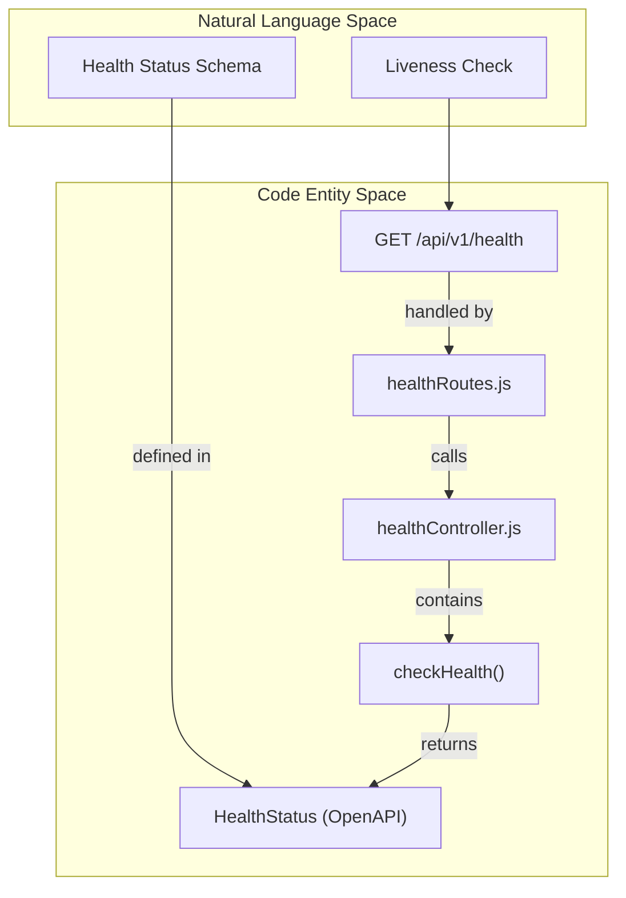
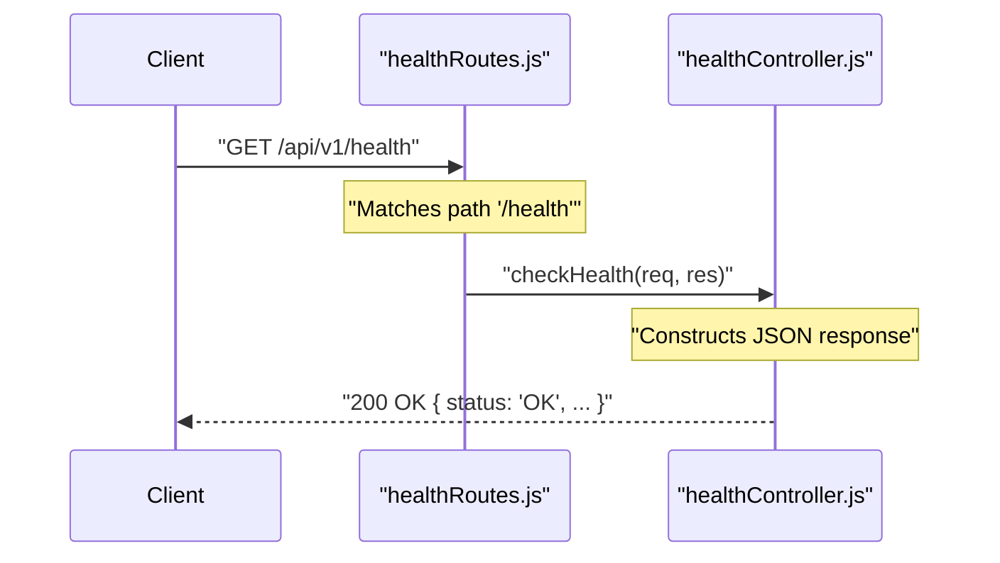

# Page: Health Endpoint

# Health Endpoint

<details>
<summary>Relevant source files</summary>

The following files were used as context for generating this wiki page:

- [src/api/openapi.yaml](src/api/openapi.yaml)
- [src/controllers/healthController.js](src/controllers/healthController.js)
- [src/routes/healthRoutes.js](src/routes/healthRoutes.js)

</details>


The Health Endpoint provides a simple liveness check for the Ingenium Search Server. It is used by orchestrators (like Docker or Kubernetes) and monitoring tools to verify that the API service is up and responding to requests.

## Purpose and Scope

The `GET /api/v1/health` endpoint serves as a diagnostic tool to confirm the operational status of the Express application. Unlike search or query builder endpoints, it does not interact with Elasticsearch or require a database connection to return a success status. Its primary role is to validate that the routing middleware and controller logic are functioning correctly.

Sources: [src/api/openapi.yaml:10-15](), [src/controllers/healthController.js:1-3]()

## Request and Response Schema

The endpoint is defined in the OpenAPI specification under the `Health` tag.

### HTTP Request
- **Method**: `GET`
- **Path**: `/api/v1/health`
- **Authentication**: Exempt (Public)

### Response Schema (`HealthStatus`)
The response returns a `200 OK` status code with a JSON body adhering to the `HealthStatus` schema.

| Property | Type | Example | Description |
| :--- | :--- | :--- | :--- |
| `status` | string | "OK" | The current status of the service. |
| `message` | string | "Service is running" | A human-readable description of the status. |

Sources: [src/api/openapi.yaml:10-22](), [src/api/openapi.yaml:151-159]()

## Implementation Details

The health check logic is decoupled into a standard Express router and controller pattern.

### Controller Logic
The `healthController.js` contains the `checkHealth` function. This function is an asynchronous handler that immediately terminates the request-response cycle by sending a JSON payload.

```javascript
exports.checkHealth = async (req, res) => {
    res.status(200).json({ status: 'OK', message: 'Service is running' });
};
```
Sources: [src/controllers/healthController.js:1-3]()

### Routing and Authentication Exemption
The route is registered in `healthRoutes.js` and mapped to the `/health` path. While most endpoints in the Ingenium Search Server are protected by JWT authentication (RS256), the health endpoint is specifically exempted in the global middleware configuration to allow external monitoring services to probe the service without providing credentials.

Sources: [src/routes/healthRoutes.js:1-8]()

## Data Flow and Code Mapping

The following diagrams illustrate how the "Health Check" concept maps to specific code entities and the flow of a request through the system.

### Health Check: Code Entity Mapping
This diagram maps the logical components of the health check to their physical file locations and function names.


Sources: [src/routes/healthRoutes.js:6-6](), [src/controllers/healthController.js:1-1](), [src/api/openapi.yaml:151-151]()

### Request Lifecycle: Health Check
This diagram shows the execution flow when a client hits the health endpoint.


Sources: [src/routes/healthRoutes.js:6-6](), [src/controllers/healthController.js:1-3]()
