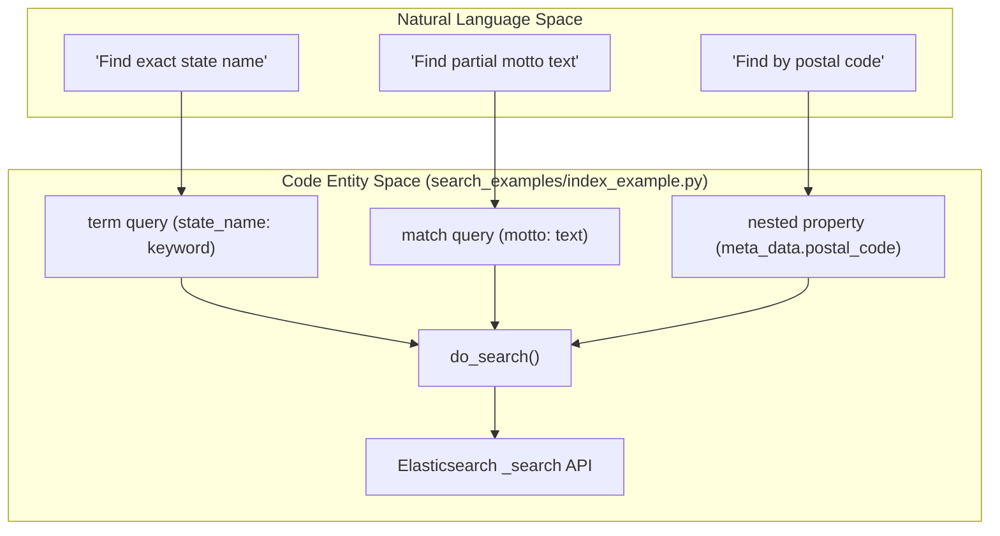
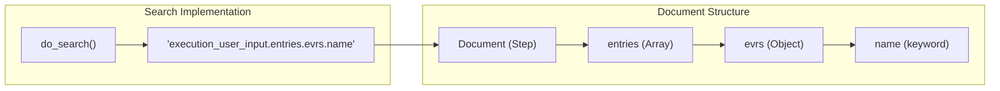
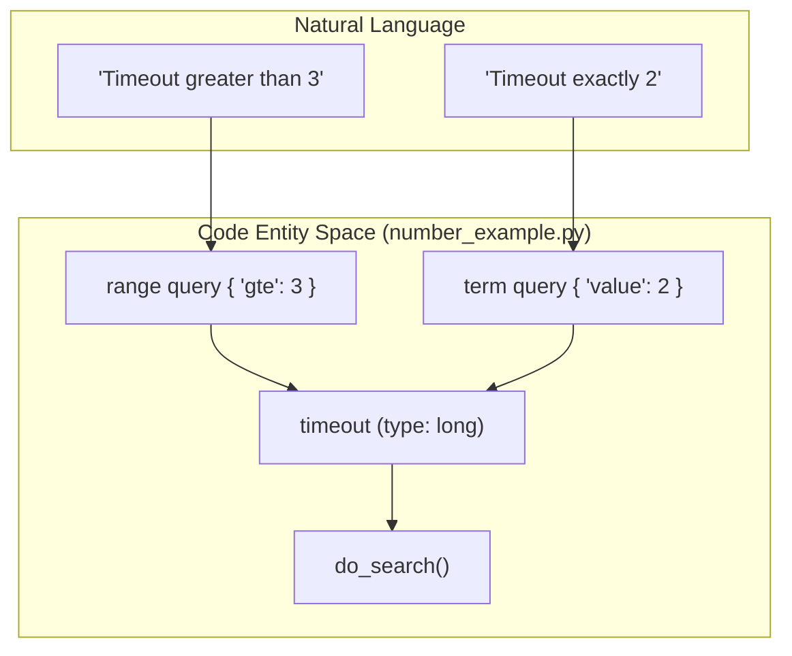

# Page: Index and Mapping Examples

# Index and Mapping Examples

Relevant source files

The following files were used as context for generating this wiki page:

- [search_examples/index_example.py](search_examples/index_example.py)
- [search_examples/number_example.py](search_examples/number_example.py)
- [search_examples/number_example2.py](search_examples/number_example2.py)
- [search_examples/step_example.py](search_examples/step_example.py)

This page provides a detailed technical breakdown of the search examples found in the `search_examples/` directory. These Python scripts demonstrate the Elasticsearch index lifecycle, field mapping strategies (keyword, text, wildcard, and numeric), and complex query patterns including nested property access and array-based document structures.

## Index Lifecycle and Field Types

The `index_example.py` script serves as a foundational guide for managing Elasticsearch indices and understanding how different field types affect search behavior.

### Implementation Details
The script demonstrates the following operations:
*   **Index Creation**: Uses `PUT /{index}` to initialize a new index [search_examples/index_example.py:42-44]().
*   **Mapping Updates**: Uses `PUT /{index}/_mapping` to define or update field types without replacing the entire index [search_examples/index_example.py:56-58]().
*   **Document Creation**: Uses `PUT /{index}/_create/{id}` to ingest data [search_examples/index_example.py:102-104]().

### Mapping Strategies
The examples highlight three primary field types:
| Field Type | Behavior | Usage in Examples |
| :--- | :--- | :--- |
| `keyword` | Exact match, case-sensitive by default. | `state_name`, `postal_code` [search_examples/index_example.py:50-52, 82-84]() |
| `text` | Full-text search, tokenized. | `motto` [search_examples/index_example.py:65-67]() |
| `wildcard` | Optimized for grep-like wildcard queries. | Demonstrated in query patterns [search_examples/index_example.py:203-213]() |

### Logic Flow: Index Lifecycle
The following diagram illustrates the flow from defining a mapping to executing various query types.

**Index Lifecycle and Query Mapping**

Sources: [search_examples/index_example.py:24-30](), [search_examples/index_example.py:48-54](), [search_examples/index_example.py:78-88](), [search_examples/index_example.py:138-146]()

---

## Nested Structures and EVR Querying

The `step_example.py` script demonstrates how to handle complex, nested JSON documents, specifically focusing on procedure steps that contain arrays of entries and Event Record (EVR) data.

### Nested Property Access
Elasticsearch allows querying deeply nested fields using dot notation. The script defines a mapping where `execution_user_input` contains an array of `entries`, which in turn contains `evrs` [search_examples/step_example.py:73-99]().

### Key Query Patterns
*   **Array Matching**: Querying `execution_user_input.entries.data_path` returns the parent document if any element in the array matches the criteria [search_examples/step_example.py:197-202]().
*   **Wildcard on Nested Strings**: Using the `wildcard` field type for `command_string2` allows efficient partial matching within nested arrays [search_examples/step_example.py:86-88]().
*   **EVR Specifics**: Accessing `execution_user_input.entries.evrs.name` demonstrates three levels of nesting [search_examples/step_example.py:89-95]().

**Data Structure to Query Mapping**

Sources: [search_examples/step_example.py:116-137](), [search_examples/step_example.py:252-258]()

---

## Numeric Mapping and Range Queries

`number_example.py` and `number_example2.py` focus on the distinction between `long` and `keyword` types for numeric data and the resulting impact on range queries.

### Implementation of Numeric Fields
The scripts explicitly map fields like `timeout` as `long` to enable mathematical comparisons [search_examples/number_example.py:72-74](). Conversely, `timeout2` is mapped as a `keyword` to demonstrate that while it can store numbers, it does not support numeric range logic in the same way [search_examples/number_example.py:75-77]().

### Comparison Logic
| Operator | DSL Clause | Field Type Required |
| :--- | :--- | :--- |
| Exact Match | `term` | `long` or `keyword` [search_examples/number_example.py:212-218]() |
| Greater Than/Equal | `range` + `gte` | `long` [search_examples/number_example.py:228-232]() |
| Filtering | `bool` + `filter` | `long` [search_examples/number_example.py:243-253]() |

### Empty Value Handling
`number_example2.py` demonstrates that if a field is mapped as `long`, an empty string `""` passed during ingestion will result in the field not being indexed for that document, rather than causing a mapping explosion or error [search_examples/number_example2.py:141-153]().

**Numeric Search Flow**

Sources: [search_examples/number_example.py:72-74](), [search_examples/number_example.py:211-219](), [search_examples/number_example.py:226-234](), [search_examples/number_example2.py:75-76]()
