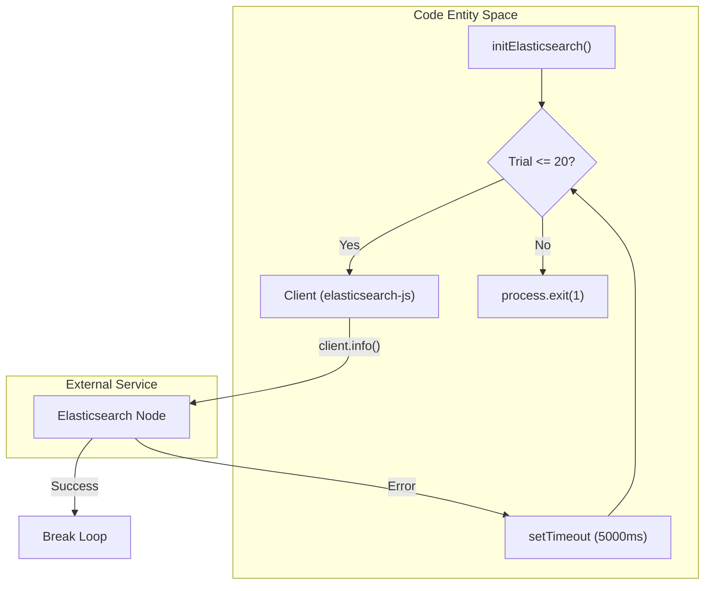
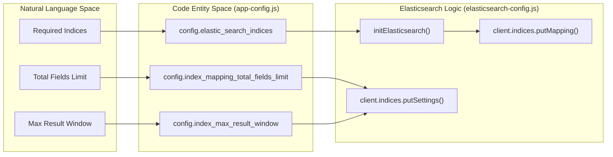

# Page: Index Management and Startup

# Index Management and Startup

Relevant source files

The following files were used as context for generating this wiki page:

- [src/config/app-config.js](src/config/app-config.js)
- [src/config/elasticsearch-config.js](src/config/elasticsearch-config.js)

The Ingenium Search Server relies on a robust startup sequence to ensure that the underlying Elasticsearch cluster is available and correctly configured before the service begins processing requests. This management logic is primarily encapsulated in the `initElasticsearch()` function, which handles connection resilience, index lifecycle management, and the application of global configuration settings.

## Startup Sequence and Retry Logic

Upon service initialization, the system enters a connection retry loop to establish communication with the Elasticsearch node defined in `config.ELASTIC_SEARCH_HOST` [src/config/elasticsearch-config.js:7-9](). The startup process is designed to be resilient to transient network failures or delays in the Elasticsearch container's availability.

### Connection Retry Mechanism
The `initElasticsearch()` function implements a loop that attempts to connect to the cluster up to 20 times [src/config/elasticsearch-config.js:11-13](). 

*   **Trial Limit**: 20 attempts [src/config/elasticsearch-config.js:11]().
*   **Delay**: 5 seconds between each attempt [src/config/elasticsearch-config.js:26]().
*   **Validation**: The connection is verified using `client.info()`. If successful, the loop breaks [src/config/elasticsearch-config.js:17-19]().
*   **Failure**: If all 20 trials fail, the service logs an error and terminates with `process.exit(1)` [src/config/elasticsearch-config.js:22-24]().

### Connection Lifecycle Diagram
The following diagram illustrates the transition from the `initElasticsearch` function to the external Elasticsearch service.

**Startup Connection Flow**

Sources: [src/config/elasticsearch-config.js:10-28]()

## Index Creation and Mapping

Once a connection is established, the service iterates through a list of required indices defined in the application configuration: `syncdata`, `querybuilder`, `element`, and `procedure_element` [src/config/app-config.js:15]().

### Automatic Index Initialization
For each index in the configuration, the server performs the following checks and actions:

1.  **Existence Check**: The server calls `client.indices.get()` to determine if the index already exists [src/config/elasticsearch-config.js:33](). If it exists, the initialization for that specific index is skipped [src/config/elasticsearch-config.js:35]().
2.  **Creation**: If the index is missing, it is created using `client.indices.create()` [src/config/elasticsearch-config.js:45]().
3.  **Mapping Application**: After creation, the service applies a standardized schema via `client.indices.putMapping()` [src/config/elasticsearch-config.js:57-60](). The mappings are imported from `mappingConfig.mappings` [src/config/elasticsearch-config.js:4]().

### Managed Indices
| Index Name | Purpose |
| :--- | :--- |
| `syncdata` | General storage for synchronized data from external sources. |
| `querybuilder` | Storage for saved search configurations and user-defined rules. |
| `element` | Searchable index for standard data elements. |
| `procedure_element` | Specialized index for elements associated with procedures. |

Sources: [src/config/app-config.js:15](), [src/config/elasticsearch-config.js:30-67]()

## Global Index Settings

After ensuring all indices exist and have mappings applied, the service configures global settings across the cluster using the `_all` index alias [src/config/elasticsearch-config.js:72](). These settings are critical for handling large datasets and complex schemas typical of Ingenium data.

### Configuration Parameters
The settings are derived from environment variables via `app-config.js`:

*   **Total Fields Limit (`index.mapping.total_fields.limit`)**: Controls the maximum number of fields allowed in an index. Defaults to **20,000** [src/config/app-config.js:11](). This high limit accommodates the dynamic nature of the ingested data.
*   **Max Result Window (`index.max_result_window`)**: Defines the maximum number of hits allowed for pagination. Defaults to **20,000,000** [src/config/app-config.js:13]().

### Index Management Mapping
The following diagram bridges the configuration variables to the internal logic that applies them to the Elasticsearch cluster.

**Index Configuration Mapping**

Sources: [src/config/app-config.js:11-15](), [src/config/elasticsearch-config.js:71-77]()

## Error Handling and Exit States

The initialization process is "fail-fast." If any critical step fails—such as index creation, mapping application, or settings updates—the service logs the error to the console and terminates immediately [src/config/elasticsearch-config.js:50, 65, 81](). This prevents the Express server from starting in an inconsistent state where searches might fail or return incomplete results due to missing indices or incorrect mappings.

Sources: [src/config/elasticsearch-config.js:47-82]()
