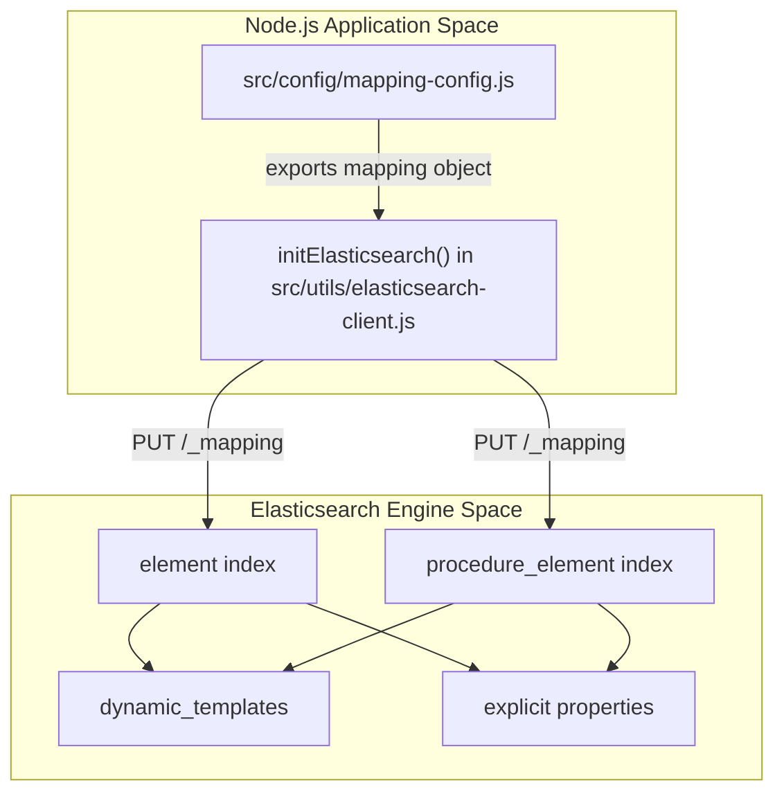
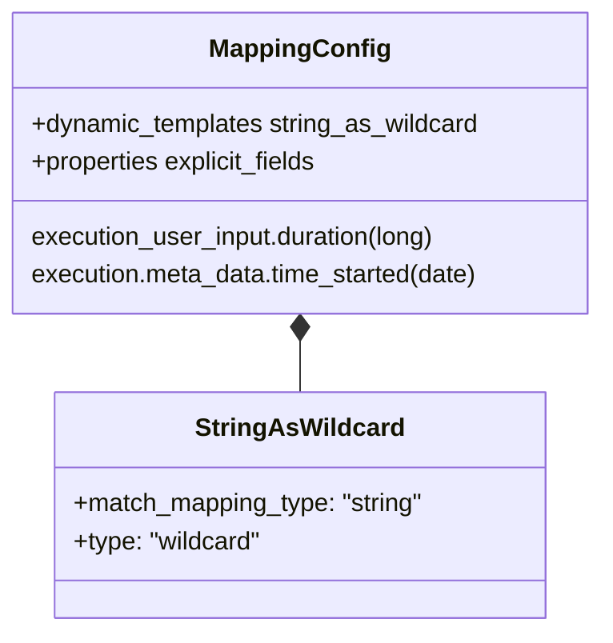

# Page: Index Mapping Configuration

# Index Mapping Configuration

Relevant source files

The following files were used as context for generating this wiki page:

- [src/config/mapping-config.js](src/config/mapping-config.js)

This page documents the Elasticsearch index mapping schema used by the Ingenium Search Server. The configuration is centralized in `src/config/mapping-config.js` and is applied to indices during the application bootstrap process to ensure consistent data typing, efficient numeric storage, and optimized string searching via wildcard fields.

## Purpose and Scope

The index mapping configuration serves three primary technical goals:
1.  **Strict Temporal Handling**: Explicitly defining date fields and their formats to prevent ingestion errors and enable accurate range queries.
2.  **Numeric Precision**: Ensuring identifiers and duration metrics are stored as `long` types for optimized indexing and sorting.
3.  **Dynamic String Normalization**: Implementing a `dynamic_template` that defaults all unmapped string fields to the `wildcard` type, facilitating high-performance partial matching across diverse metadata.

Sources: [src/config/mapping-config.js:1-125]()

## Data Flow: Mapping Application

The mapping configuration is imported and applied during the Elasticsearch initialization sequence. The server checks for the existence of required indices and applies these predefined properties to ensure the schema is uniform across `element`, `procedure_element`, `syncdata`, and `querybuilder` indices.

### System Entity Mapping
The following diagram illustrates how the `mapping-config.js` object is utilized by the initialization logic to configure the Elasticsearch cluster.

**Mapping Application Lifecycle**

Sources: [src/config/mapping-config.js:1-124]()

## Explicit Field Mappings

### Date Fields
To support precise time-series analysis and search, several fields are explicitly mapped to the `date` type using the `strict_date_optional_time` format. This ensures that ISO 8601 strings are correctly parsed.

| Object Path | Field Name | Type | Format |
| :--- | :--- | :--- | :--- |
| `execution.meta_data` | `time_started`, `time_updated`, `time_completed` | `date` | `strict_date_optional_time` |
| `procedureDetails` | `time_created`, `time_saved` | `date` | `strict_date_optional_time` |
| `procedureVersionDetails` | `time_saved`, `time_versioned` | `date` | `strict_date_optional_time` |
| `executionDetails` | `time_completed`, `time_started` | `date` | `strict_date_optional_time` |
| `executionDetails.transitions` | `time_updated` | `date` | `strict_date_optional_time` |
| `venueDetails.venue_status` | `started_on` | `date` | `strict_date_optional_time` |

Sources: [src/config/mapping-config.js:33-111]()

### Numeric Fields
Fields representing versions, durations, or timeouts are mapped to `long` to avoid the overhead of floating-point math and to ensure large integer values are not truncated.

| Object Path | Field Name | Type |
| :--- | :--- | :--- |
| `execution_user_input` | `reference_procedure_version`, `duration`, `timeout`, `lookback` | `long` |
| `authoring_user_input` | `reference_procedure_version`, `timeout`, `lookback` | `long` |
| `procedureVersionDetails` | `version` | `long` |

Sources: [src/config/mapping-config.js:4-32](), [src/config/mapping-config.js:65-78]()

## Dynamic Templates

The configuration includes a `dynamic_templates` block named `string_as_wildcard`. This is a critical component of the search engine's flexibility.

### Wildcard Type Strategy
Instead of the standard Elasticsearch `text` or `keyword` types, this server maps all previously unspecified strings to the `wildcard` type. This is optimized for:
*   Searching for substrings within large values.
*   Applying regular expressions.
*   Maintaining high performance for leading wildcard queries (e.g., `*suffix`).

**Code-to-Schema Mapping**

Sources: [src/config/mapping-config.js:113-122]()

## Implementation Details

The configuration is exported as a standard CommonJS module. The structure follows the Elasticsearch `_mapping` API format precisely:

1.  **Properties**: Located at `mappings.properties`, this defines the explicit schema for known nested objects like `execution` and `procedureDetails`. [src/config/mapping-config.js:2-112]()
2.  **Dynamic Templates**: Located at `mappings.dynamic_templates`, this array contains the `string_as_wildcard` rule. [src/config/mapping-config.js:113-122]()

This centralized definition ensures that when the `initElasticsearch` function runs, it can iterate through indices and apply a consistent schema, reducing the risk of "mapping explosions" or type conflicts when new data fields are ingested dynamically.

Sources: [src/config/mapping-config.js:1-125]()
