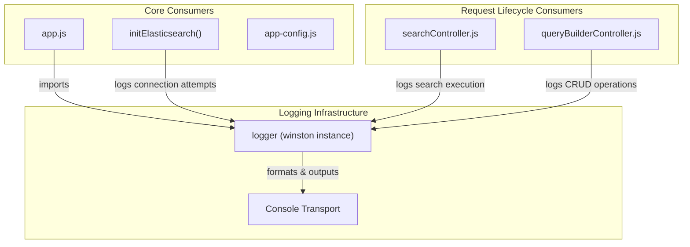
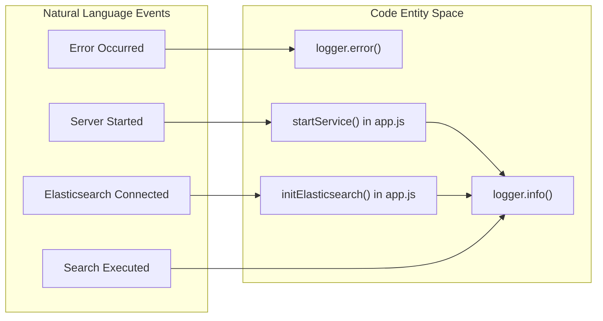

# Page: Logging

# Logging

Relevant source files

The following files were used as context for generating this wiki page:

- [src/utils/logger.js](src/utils/logger.js)

The Ingenium Search Server utilizes a centralized logging utility based on the `winston` library to provide structured, timestamped, and colorized output to the system console. This utility is used across the application to track service initialization, request processing, and error states.

## Implementation Details

The logger is defined in `src/utils/logger.js` and provides a singleton instance configured with specific formatting and transport layers.

### Logger Configuration
The `winston.createLogger` instance is configured with the following properties:

| Property | Value | Description |
| :--- | :--- | :--- |
| **Default Level** | `info` | Minimum level of messages to log [src/utils/logger.js:4-4](). |
| **Format** | `combine` | Merges `timestamp()` and a custom `printf` template [src/utils/logger.js:5-10](). |
| **Timestamp** | ISO 8601 | Automatically prepended to every log entry [src/utils/logger.js:6-6](). |
| **Transport** | `Console` | Output is directed to `stdout` [src/utils/logger.js:12-18](). |

### Custom Formatting
The logger applies two different formatting strategies depending on the context:
1.  **Base Format**: Used for internal processing, it combines a timestamp with the log level (converted to uppercase) and the message string: `[timestamp] LEVEL: message` [src/utils/logger.js:7-9]().
2.  **Transport Format**: Specifically for the console, it applies `winston.format.colorize()` and `winston.format.simple()` to ensure logs are readable and visually distinct in a terminal environment [src/utils/logger.js:13-16]().

### Logging Data Flow
The following diagram illustrates how the `logger` is initialized and consumed by various components.

**Logger Entity and Consumer Relationship**

**Sources:** [src/utils/logger.js:3-21](), [src/app.js:1-20](), [src/config/app-config.js:1-10]()

---

## Usage Across the System

The logger is imported as a standard module: `const logger = require('../utils/logger');`.

### 1. Service Initialization
During the bootstrap phase in `app.js`, the logger tracks the startup sequence, including environment variable loading and port binding.
*   **Startup Notification**: Logs the port the server is listening on [src/app.js:58-58]().
*   **Elasticsearch Setup**: In `initElasticsearch()`, the logger tracks connection retries and index creation status [src/app.js:28-44]().

### 2. Request Handling
Controllers use the logger to provide visibility into incoming requests and backend interactions.
*   **Search Operations**: Logs the execution of search queries against Elasticsearch.
*   **Query Builder**: Logs when users create, update, or delete saved query configurations.

### 3. Error Tracking
The logger is the primary mechanism for capturing stack traces and error messages in catch blocks, ensuring that failures in the Elasticsearch client or middleware are visible in the server logs.

**Natural Language to Code Entity Mapping: Logging Events**

**Sources:** [src/utils/logger.js:1-21](), [src/app.js:25-60]()

## Log Level Summary
While the logger is initialized at the `info` level [src/utils/logger.js:4-4](), it supports standard Winston levels:

*   `error`: Used for critical failures (e.g., Elasticsearch connection failure after max retries).
*   `warn`: Used for non-critical issues or deprecations.
*   `info`: Default level for operational messages (e.g., "Server running on port 3000").
*   `debug`: Used for verbose output during development (e.g., raw Elasticsearch DSL queries).

**Sources:** [src/utils/logger.js:1-21]()
