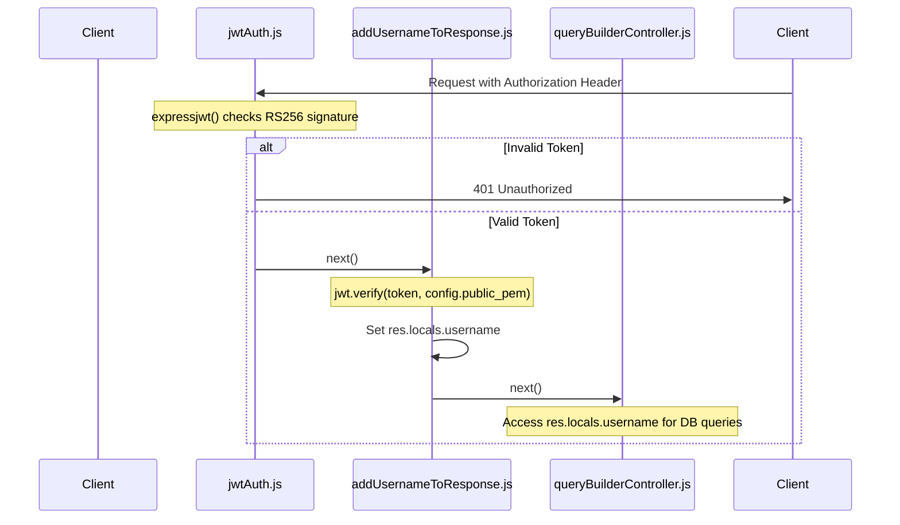

# Page: Middleware Layer

# Middleware Layer

<details>
<summary>Relevant source files</summary>

The following files were used as context for generating this wiki page:

- [src/middlewares/addUsernameToResponse.js](src/middlewares/addUsernameToResponse.js)
- [src/middlewares/jwtAuth.js](src/middlewares/jwtAuth.js)

</details>


The middleware layer of the Ingenium Search Server provides essential security and context-enrichment services for the Express application. It consists of two primary custom modules that handle RS256 JWT verification and the extraction of user identity for downstream business logic.

## JWT Authentication (jwtAuth.js)

The `jwtAuth` middleware is the primary security gatekeeper for the API. It utilizes the `express-jwt` library to validate incoming JSON Web Tokens (JWT) against a public RSA key.

### Implementation Details
The middleware is configured to use the `RS256` algorithm, which ensures that tokens were signed by a trusted private key, while the server only requires the public key for verification [src/middlewares/jwtAuth.js:4-6](). The public key is retrieved from the global configuration object `config.public_pem` [src/middlewares/jwtAuth.js:5]().

When a token is successfully validated, the decoded payload is attached to the request object under the property `auth` [src/middlewares/jwtAuth.js:7]().

### Excluded Routes
Certain endpoints are exempted from authentication to allow for system health monitoring and documentation access. The `.unless()` method is used to define these public paths [src/middlewares/jwtAuth.js:8]():
*   `/api/v1/health`: Used by orchestrators for liveness checks.
*   `/api-docs/`: Provides access to the Swagger/OpenAPI UI.

**Sources:**
* [src/middlewares/jwtAuth.js:1-10]()
* [src/config/app-config.js:1-20]() (referenced for `public_pem`)

---

## Username Context Extraction (addUsernameToResponse.js)

The `addUsernameToResponse` middleware acts as a bridge between the raw JWT token and the application's controllers. Its primary responsibility is to extract the `username` claim from the token and store it in `res.locals`.

### Data Flow and Logic
1.  **Header Extraction**: The middleware retrieves the `Authorization` header from the request [src/middlewares/addUsernameToResponse.js:6]().
2.  **Token Parsing**: It splits the `Bearer <token>` string to isolate the JWT [src/middlewares/addUsernameToResponse.js:9]().
3.  **Verification**: Using `jsonwebtoken.verify()`, it decodes the token using the `config.public_pem` [src/middlewares/addUsernameToResponse.js:12]().
4.  **Context Storage**: Upon successful verification, the `username` field from the decoded payload is assigned to `res.locals.username` [src/middlewares/addUsernameToResponse.js:13](). This ensures that downstream controllers (such as the Query Builder) can filter data based on the specific user's identity.
5.  **Error Handling**: If the token is malformed or invalid, the error is logged via the system `logger`, but the request is allowed to proceed to the next middleware via `next()` to avoid breaking the pipeline prematurely [src/middlewares/addUsernameToResponse.js:15-19]().

**Sources:**
* [src/middlewares/addUsernameToResponse.js:1-22]()
* [src/utils/logger.js:1-10]() (referenced for `logger.error`)

---

## Middleware Pipeline and Data Flow

The following diagrams illustrate how these modules interact within the Express request lifecycle and how code entities map to the logical authentication flow.

### Request Authentication Flow
This diagram shows the sequence of execution for an incoming request targeting a protected resource.


**Sources:**
* [src/middlewares/jwtAuth.js:4-8]()
* [src/middlewares/addUsernameToResponse.js:5-20]()

### Mapping Natural Language Space to Code Entities

The following tables and diagrams map logical security concepts to specific implementation entities in the codebase.

| Logical Concept | Code Entity | File Path |
| :--- | :--- | :--- |
| **Token Validation** | `jwtAuth` | [src/middlewares/jwtAuth.js:4]() |
| **Identity Extraction** | `addUsernameToResponse` | [src/middlewares/addUsernameToResponse.js:5]() |
| **Public Key Storage** | `config.public_pem` | [src/config/app-config.js:12]() |
| **User Identity Store** | `res.locals.username` | [src/middlewares/addUsernameToResponse.js:13]() |
| **Auth Property** | `req.auth` | [src/middlewares/jwtAuth.js:7]() |

```mermaid
graph TD
    subgraph "Authentication Logic"
        "JWT_Verification"["JWT Verification"] --> "jwtAuth_js"["jwtAuth.js"]
        "Identity_Context"["Identity Context"] --> "addUsernameToResponse_js"["addUsernameToResponse.js"]
    end

    subgraph "Code Entities"
        "jwtAuth_js" --> "expressjwt_fn"["expressjwt()"]
        "addUsernameToResponse_js" --> "jwt_verify_fn"["jwt.verify()"]
        "jwt_verify_fn" --> "res_locals"["res.locals.username"]
    end

    subgraph "Configuration"
        "expressjwt_fn" -- "uses" --> "config_public_pem"["config.public_pem"]
        "jwt_verify_fn" -- "uses" --> "config_public_pem"
    end
```
**Sources:**
* [src/middlewares/jwtAuth.js:1-10]()
* [src/middlewares/addUsernameToResponse.js:1-22]()
* [src/config/app-config.js:1-20]()
