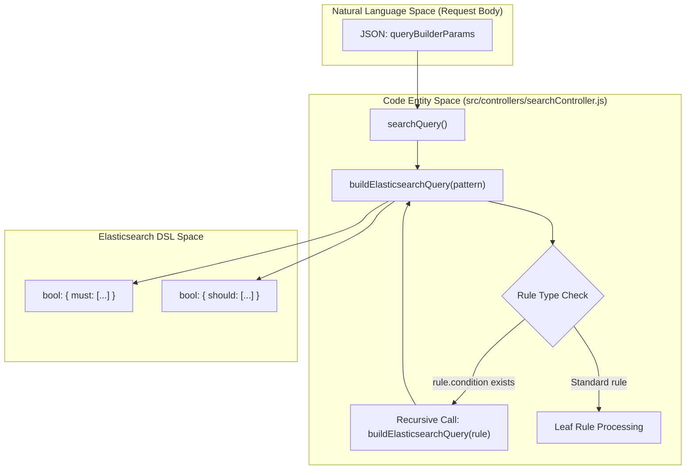
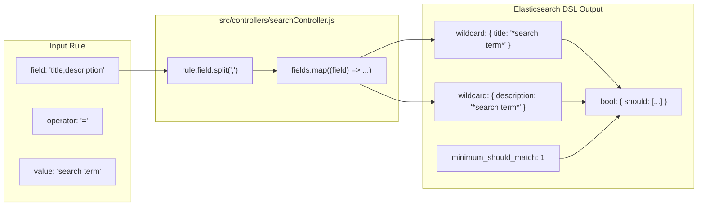

# Page: Nested Conditions and Multi-Field Queries

# Nested Conditions and Multi-Field Queries

Relevant source files

The following files were used as context for generating this wiki page:

- [README.md](README.md)
- [src/controllers/searchController.js](src/controllers/searchController.js)

This page details the implementation of the advanced search engine within the Ingenium Search Server. It focuses on how complex, hierarchical logical structures and multi-field targeting are translated from a high-level JSON request into Elasticsearch Domain Specific Language (DSL).

## Logical Grouping and Recursive Nesting

The core of the search engine is the `buildElasticsearchQuery` function, which recursively processes a `queryBuilderParams` object. This allows for unlimited nesting of logical groups (AND/OR) within a single search request [src/controllers/searchController.js:4-100]().

### Condition Mapping
The system maps high-level logical operators to Elasticsearch `bool` clauses:
*   **AND**: Maps to the `must` clause. All rules within this group must be satisfied [src/controllers/searchController.js:9-9]().
*   **OR**: Maps to the `should` clause. At least one rule within this group must be satisfied [src/controllers/searchController.js:9-9]().

### Recursive Implementation
The function checks each rule in a group. If a rule contains its own `condition` and `rules` array, the function calls itself recursively to generate a nested `bool` query [src/controllers/searchController.js:10-12]().

### Logic Flow: Natural Language to Elasticsearch DSL
The following diagram illustrates how the `searchController.js` logic transforms a nested user request into the structure required by the Elasticsearch `client.search` method.

**Query Transformation Flow**

**Sources:** [src/controllers/searchController.js:4-100](), [src/controllers/searchController.js:139-146]()

---

## Multi-Field Queries

The engine supports searching across multiple fields within a single rule. This is achieved by providing a comma-separated string in the `field` property of a rule [src/controllers/searchController.js:15-15]().

### Implementation Details
When a rule is processed, the `field` string is split by commas and trimmed into an array of field names [src/controllers/searchController.js:15-15](). The engine then generates specific clauses based on the operator:

1.  **Wildcard Matches (`=`, `!=`)**: For multi-field wildcard searches, the engine creates a `should` block (for `=`) or a `must_not` block (for `!=`) containing a `wildcard` clause for every field in the array [src/controllers/searchController.js:27-43](), [src/controllers/searchController.js:74-90]().
2.  **Exact Matches (`==`, `!==`)**: Similar to wildcards, it generates a list of `match` clauses across all specified fields [src/controllers/searchController.js:44-58](), [src/controllers/searchController.js:59-72]().
3.  **Minimum Should Match**: When performing a positive multi-field match (like `match` or `wildcard`), the engine sets `minimum_should_match: 1`. This ensures the document is returned if the value is found in **any** of the specified fields [src/controllers/searchController.js:56-56](), [src/controllers/searchController.js:88-88]().

**Multi-Field Logic Mapping**

**Sources:** [src/controllers/searchController.js:14-16](), [src/controllers/searchController.js:74-90]()

---

## Data Flow Summary

The following table summarizes how the query builder components interact to produce the final search request sent to the Elasticsearch cluster.

| Component | Role | Code Reference |
| :--- | :--- | :--- |
| **`searchQuery`** | Entry point; extracts params and executes search via `client.search`. | [src/controllers/searchController.js:139-170]() |
| **`buildElasticsearchQuery`** | Orchestrates recursion and logical grouping (`must`/`should`). | [src/controllers/searchController.js:4-100]() |
| **`getOperator`** | Maps string operators (e.g., `!=`) to internal logic types (e.g., `not_match_wildcard`). | [src/controllers/searchController.js:102-120]() |
| **`getComparisonOperator`** | Maps range operators (e.g., `>=`) to ES keywords (`gte`). | [src/controllers/searchController.js:122-135]() |

### Range Query Exception
Note that while most operators support multi-field queries, **Range Operators** (`>`, `>=`, `<`, `<=`) are currently implemented to target only the first field in the provided list [src/controllers/searchController.js:18-26]().

**Sources:** [src/controllers/searchController.js:1-174]()
