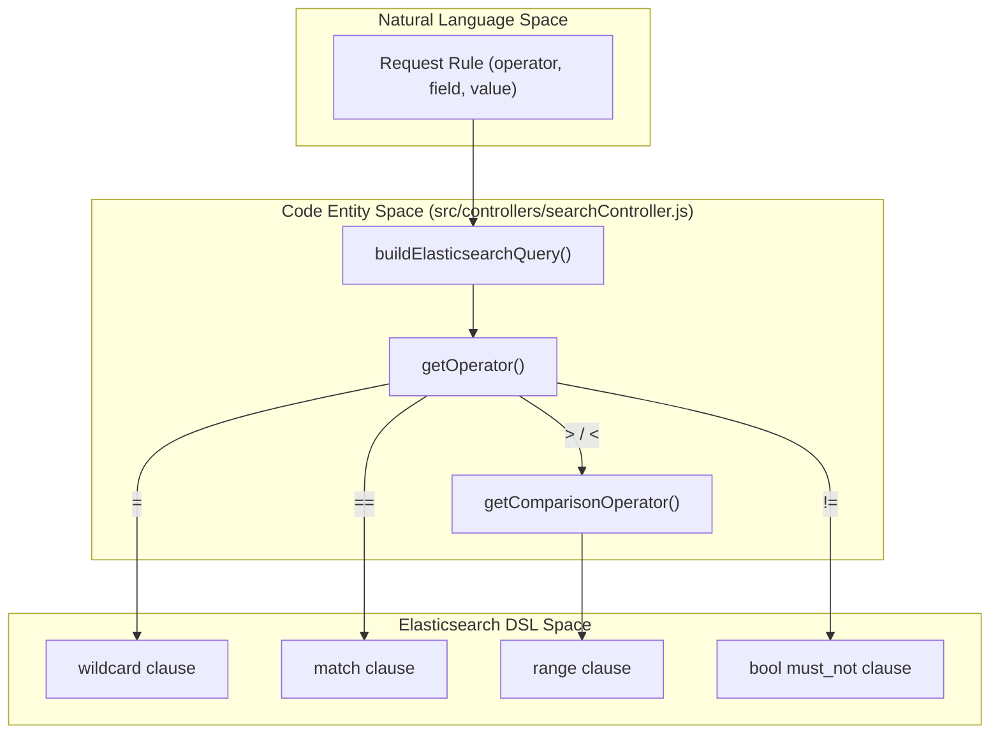
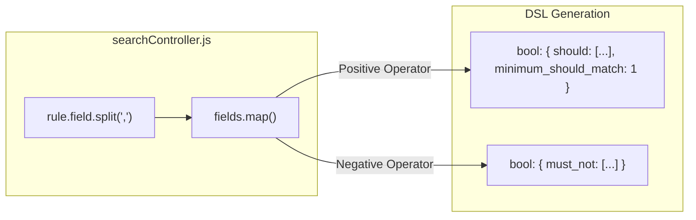

# Page: Operator Reference

# Operator Reference

Relevant source files

The following files were used as context for generating this wiki page:

- [src/controllers/searchController.js](src/controllers/searchController.js)

The Ingenium Search Server utilizes a custom query translation engine to convert natural language-style operators into structured Elasticsearch Domain Specific Language (DSL). This page provides a technical reference for the mapping logic, the specific operators supported, and the resulting query clauses.

## Overview of Operator Mapping

The translation process is centered in `src/controllers/searchController.js`. When a search request is received via the `searchQuery` function, the `queryBuilderParams` are passed to `buildElasticsearchQuery()`. This function iterates through the rules and determines the appropriate Elasticsearch clause based on two internal mapping functions:

1.  **`getOperator(operator)`**: Maps the input symbol (e.g., `!=`) to an internal strategy name (e.g., `not_match_wildcard`) [src/controllers/searchController.js:102-120]().
2.  **`getComparisonOperator(operator)`**: Maps range-based symbols to Elasticsearch-specific keys like `gt`, `gte`, `lt`, or `lte` [src/controllers/searchController.js:122-135]().

### Logic Flow: From Request to DSL

The following diagram illustrates how the `searchController.js` logic transforms a rule into an Elasticsearch query.

**Query Operator Translation Flow**

Sources: [src/controllers/searchController.js:4-100](), [src/controllers/searchController.js:102-135]()

---

## Supported Operators

The system supports seven primary operators categorized into wildcard matches, exact matches, and range comparisons.

### 1. Wildcard Match (`=`)
Maps to `match_wildcard` internally [src/controllers/searchController.js:104-105](). This is the default behavior if no operator is specified [src/controllers/searchController.js:117-118]().
*   **Behavior**: Performs a case-insensitive search with leading and trailing asterisks (`*value*`).
*   **DSL Clause**: Uses the `wildcard` query with `case_insensitive: true` and `constant_score` rewrite [src/controllers/searchController.js:75-81]().

### 2. Exact Match (`==`)
Maps to `match` internally [src/controllers/searchController.js:106-107]().
*   **Behavior**: Standard Elasticsearch full-text or keyword match depending on the field mapping.
*   **DSL Clause**: Uses the `match` query [src/controllers/searchController.js:45-50]().

### 3. Range Operators (`>`, `>=`, `<`, `<=`)
Map to `range` internally [src/controllers/searchController.js:108-112]().
*   **Behavior**: Performs numeric or chronological comparisons.
*   **DSL Mapping**:
    *   `>` → `gt` (Greater Than)
    *   `>=` → `gte` (Greater Than or Equal)
    *   `<` → `lt` (Less Than)
    *   `<=` → `lte` (Less Than or Equal)
*   **DSL Clause**: Uses the `range` query [src/controllers/searchController.js:20-26]().

### 4. Negated Wildcard (`!=`)
Maps to `not_match_wildcard` internally [src/controllers/searchController.js:113-114]().
*   **Behavior**: Excludes documents where the field matches the wildcard pattern `*value*`.
*   **DSL Clause**: Wraps a `wildcard` query inside a `bool` -> `must_not` block [src/controllers/searchController.js:28-42]().

### 5. Negated Exact (`!==`)
Maps to `not_match` internally [src/controllers/searchController.js:115-116]().
*   **Behavior**: Excludes documents where the field exactly matches the provided value.
*   **DSL Clause**: Wraps a `match` query inside a `bool` -> `must_not` block [src/controllers/searchController.js:60-71]().

---

## Technical Mapping Table

The following table summarizes the relationship between the API input, the internal logic, and the generated Elasticsearch JSON.

| Input Operator | Internal Strategy | ES DSL Type | ES Key/Option |
| :--- | :--- | :--- | :--- |
| `=` | `match_wildcard` | `wildcard` | `*value*`, `case_insensitive: true` |
| `==` | `match` | `match` | `query: value` |
| `>` | `range` | `range` | `gt` |
| `>=` | `range` | `range` | `gte` |
| `<` | `range` | `range` | `lt` |
| `<=` | `range` | `range` | `lte` |
| `!=` | `not_match_wildcard` | `bool` -> `must_not` | `wildcard: *value*` |
| `!==` | `not_match` | `bool` -> `must_not` | `match: value` |

Sources: [src/controllers/searchController.js:18-91](), [src/controllers/searchController.js:102-135]()

---

## Multi-Field Application

When a rule contains comma-separated fields (e.g., `"field": "title, description"`), the operator logic is applied to every field mentioned.

*   **Positive Matches (`=`, `==`)**: The system creates a `bool` -> `should` block with a `minimum_should_match: 1` requirement. This effectively treats the multi-field query as an OR condition across those fields [src/controllers/searchController.js:54-57](), [src/controllers/searchController.js:86-89]().
*   **Negative Matches (`!=`, `!==`)**: The system creates a `bool` -> `must_not` block containing conditions for every field. This ensures the value is absent from all specified fields [src/controllers/searchController.js:40-42](), [src/controllers/searchController.js:69-71]().

**Multi-Field Logic Structure**

Sources: [src/controllers/searchController.js:15-16](), [src/controllers/searchController.js:44-91]()
