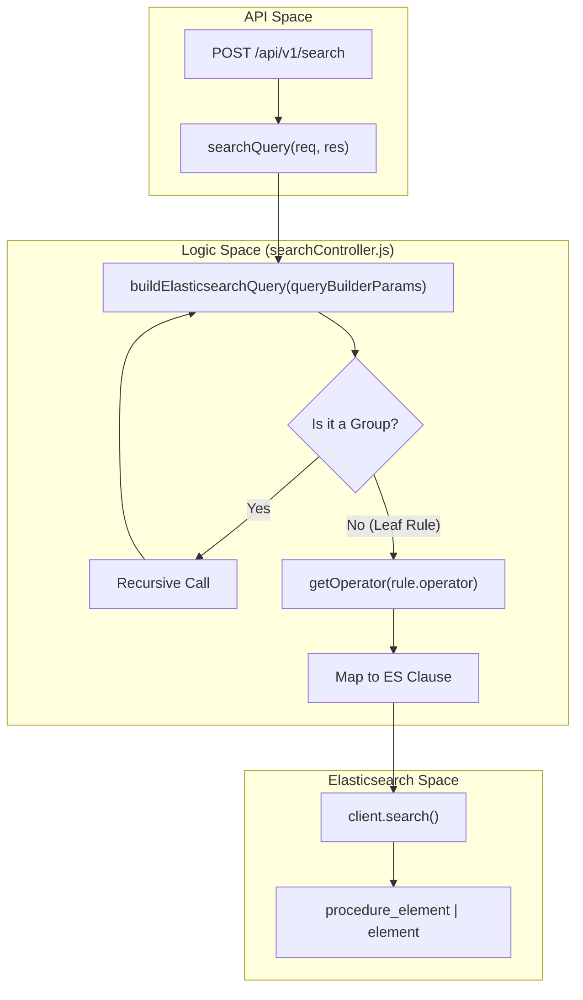
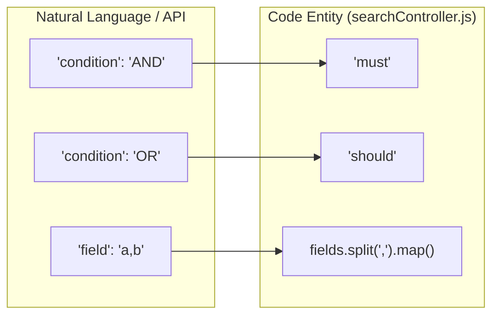

# Page: Query Builder Engine

# Query Builder Engine

Relevant source files

The following files were used as context for generating this wiki page:

- [README.md](README.md)
- [src/controllers/searchController.js](src/controllers/searchController.js)

The **Query Builder Engine** is the core logic responsible for transforming high-level, human-readable search parameters into complex Elasticsearch Domain Specific Language (DSL). This engine allows the Ingenium Search Server to support sophisticated filtering, including nested logical groups and multi-field matching, without requiring clients to understand Elasticsearch syntax.

The transformation logic resides primarily within `src/controllers/searchController.js` [src/controllers/searchController.js:4-100]().

### Core Transformation Logic

The engine processes a `queryBuilderParams` object, which consists of a logical `condition` (AND/OR) and an array of `rules`. Each rule can either be a leaf node (a specific field comparison) or a nested group of rules [src/controllers/searchController.js:10-12]().

#### Data Flow: From Request to DSL
The following diagram illustrates how the `searchQuery` function orchestrates the translation from an API request to an Elasticsearch execution.

**Search Request Processing Flow**

Sources: [src/controllers/searchController.js:4-100](), [src/controllers/searchController.js:139-155]()

### Operator Mapping

The engine supports a variety of operators that map to specific Elasticsearch query types. This mapping is handled by two internal helper functions: `getOperator()` and `getComparisonOperator()`.

| UI/API Operator | Internal Mapping | Elasticsearch Clause |
|:---|:---|:---|
| `=` | `match_wildcard` | `wildcard` (case-insensitive) |
| `==` | `match` | `match` |
| `!=` | `not_match_wildcard` | `bool.must_not` + `wildcard` |
| `!==` | `not_match` | `bool.must_not` + `match` |
| `>`, `>=`, `<`, `<=` | `range` | `range` (`gt`, `gte`, `lt`, `lte`) |

For details on how specific operators are handled and the resulting DSL structure, see **[Operator Reference](#4.1)**.

Sources: [src/controllers/searchController.js:102-135]()

### Logical Grouping and Multi-Field Support

The engine supports complex boolean logic by translating `AND` to `must` and `OR` to `should` within Elasticsearch `bool` queries [src/controllers/searchController.js:9-99]().

*   **Recursive Nesting**: The `buildElasticsearchQuery` function calls itself recursively when it encounters a rule that contains its own `condition` and `rules` array, allowing for infinite nesting depth [src/controllers/searchController.js:11-12]().
*   **Multi-Field Queries**: Rules can target multiple fields simultaneously by providing a comma-separated string (e.g., `"field": "title,description"`). The engine splits these and creates a combined `should` clause to match the value across any of the specified fields [src/controllers/searchController.js:15-16]().

For details on nesting and field splitting, see **[Nested Conditions and Multi-Field Queries](#4.2)**.

**Entity Mapping: API Params to Code Symbols**

Sources: [src/controllers/searchController.js:9-15](), [src/controllers/searchController.js:97]()

### Execution and Pagination

Once the DSL is constructed, the `searchQuery` controller executes the request using the Elasticsearch client. It handles index expansion (e.g., mapping `all` to both `procedure_element` and `element`) and applies pagination using `from` (offset) and `size` (limit) [src/controllers/searchController.js:141-155]().

Sources: [src/controllers/searchController.js:139-170]()

---

### Child Pages
*   **[Operator Reference](#4.1)** — Detailed reference for all supported query operators and their mapping functions.
*   **[Nested Conditions and Multi-Field Queries](#4.2)** — Explains logical grouping, recursion, and multi-field search implementation.
