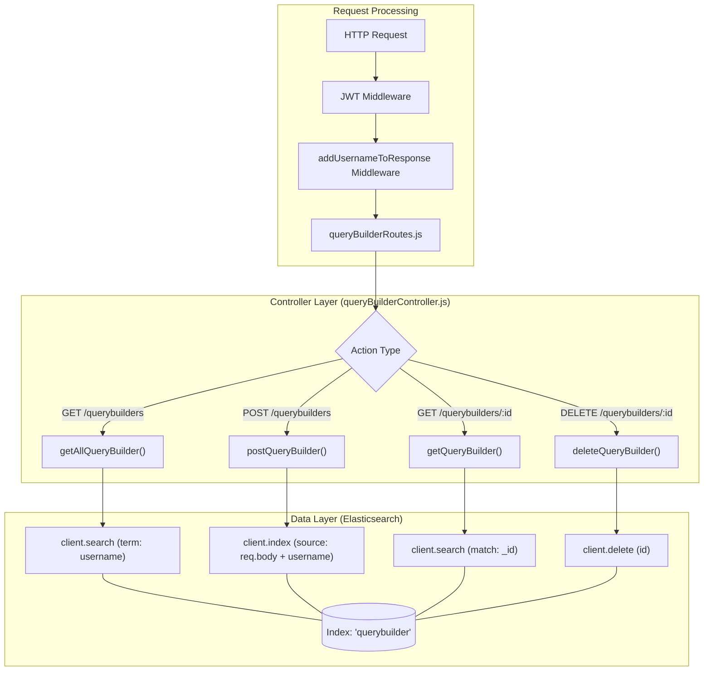
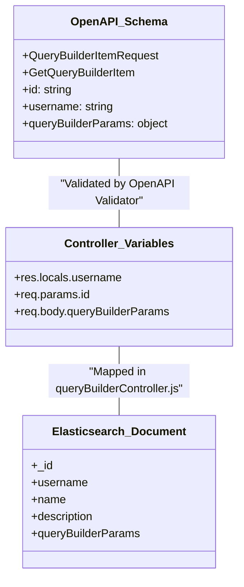

# Page: QueryBuilder Endpoints

# QueryBuilder Endpoints

Relevant source files

The following files were used as context for generating this wiki page:

- [src/api/openapi.yaml](src/api/openapi.yaml)
- [src/controllers/queryBuilderController.js](src/controllers/queryBuilderController.js)
- [src/routes/queryBuilderRoutes.js](src/routes/queryBuilderRoutes.js)

The QueryBuilder endpoints provide CRUD (Create, Read, Delete) functionality for managing saved search configurations. These configurations allow users to persist complex `queryBuilderParams` objects and reuse them across different search sessions. All operations are performed against the `querybuilder` index in Elasticsearch and are scoped to individual users based on JWT authentication.

## Endpoint Overview

The service exposes four primary routes for managing query builder items. These routes are registered in `src/routes/queryBuilderRoutes.js` and handled by `src/controllers/queryBuilderController.js`.

| Method | Path | Controller Function | Description |
| :--- | :--- | :--- | :--- |
| **GET** | `/querybuilders` | `getAllQueryBuilder` | Retrieves all saved queries for the authenticated user. |
| **GET** | `/querybuilders/{id}` | `getQueryBuilder` | Retrieves a specific saved query by its unique ID. |
| **POST** | `/querybuilders` | `postQueryBuilder` | Saves a new query configuration. |
| **DELETE** | `/querybuilders/{id}` | `deleteQueryBuilder` | Removes a saved query configuration. |

**Sources:** [src/routes/queryBuilderRoutes.js:5-11](), [src/controllers/queryBuilderController.js:4-92]()

## Data Flow and User Scoping

User scoping is enforced by extracting the `username` from the JWT token during the middleware phase and attaching it to `res.locals.username`. The `queryBuilderController.js` uses this value to filter results or tag new entries.

### Logic Flow Diagram
The following diagram illustrates how a request flows from the API route to the Elasticsearch `querybuilder` index.

**Request Lifecycle: QueryBuilder CRUD**

**Sources:** [src/controllers/queryBuilderController.js:5-16](), [src/controllers/queryBuilderController.js:60-70](), [src/routes/queryBuilderRoutes.js:5-11]()

## Implementation Details

### GET /querybuilders
Retrieves a list of all query builder items associated with the user's username.

*   **Implementation**: It performs a `term` query on the `username` field in the `querybuilder` index [src/controllers/queryBuilderController.js:7-16]().
*   **Response Mapping**: The Elasticsearch `_id` is mapped to an `id` field in the response object, combined with the document's `_source` [src/controllers/queryBuilderController.js:17-22]().

### GET /querybuilders/{id}
Retrieves a single query builder item by its Elasticsearch document ID.

*   **Implementation**: Uses a `match` query against the `_id` field [src/controllers/queryBuilderController.js:34-43]().
*   **Note**: Unlike `getAllQueryBuilder`, this specific implementation in the controller does not explicitly filter by `username` in the query DSL, relying instead on the unique document ID [src/controllers/queryBuilderController.js:38-40]().

### POST /querybuilders
Saves a new configuration to the `querybuilder` index.

*   **Request Body**: Requires `name`, `description`, and `queryBuilderParams` [src/api/openapi.yaml:193-208]().
*   **Username Injection**: The controller automatically injects `res.locals.username` into the document before indexing it in Elasticsearch [src/controllers/queryBuilderController.js:60-70]().
*   **Response**: Returns the created ID along with the submitted data [src/controllers/queryBuilderController.js:72]().

### DELETE /querybuilders/{id}
Deletes a saved item from the index.

*   **Implementation**: Calls `client.delete` using the provided ID from the path parameters [src/controllers/queryBuilderController.js:82-85]().

**Sources:** [src/controllers/queryBuilderController.js:4-92](), [src/api/openapi.yaml:25-114]()

## Schema Mapping

The following diagram bridges the OpenAPI definitions with the Controller logic and Elasticsearch fields.

**Entity Mapping: API to Code to Storage**

**Sources:** [src/api/openapi.yaml:175-227](), [src/controllers/queryBuilderController.js:59-70]()

## Error Handling
All controller functions are wrapped in `try...catch` blocks. If an error occurs during an Elasticsearch operation:
1.  The error is logged via `logger.error` [src/controllers/queryBuilderController.js:26]().
2.  A `500 Internal Server Error` status is returned with a JSON body containing the error message [src/controllers/queryBuilderController.js:27]().

**Sources:** [src/controllers/queryBuilderController.js:25-28](), [src/controllers/queryBuilderController.js:88-91]()
