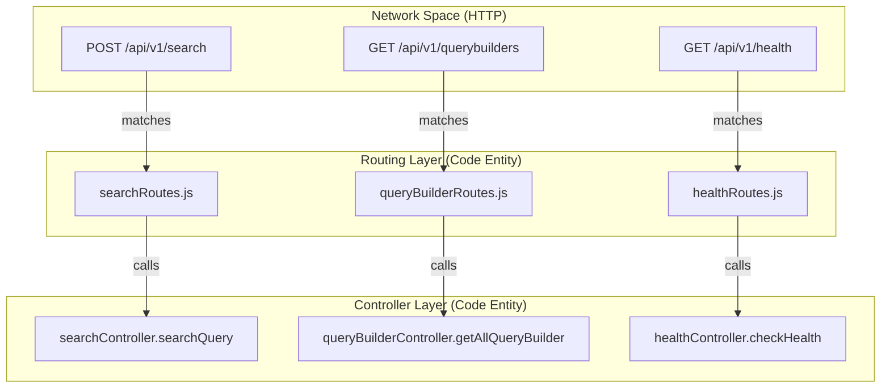
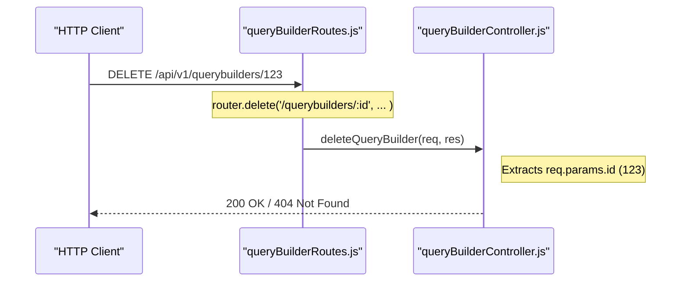

# Page: Routing Layer

# Routing Layer

Relevant source files

The following files were used as context for generating this wiki page:

- [src/routes/healthRoutes.js](src/routes/healthRoutes.js)
- [src/routes/queryBuilderRoutes.js](src/routes/queryBuilderRoutes.js)
- [src/routes/searchRoutes.js](src/routes/searchRoutes.js)

The Routing Layer in the Ingenium Search Server is responsible for defining the application's API surface area and mapping incoming HTTP requests to specific controller logic. All routes are prefixed with `/api/v1` and are organized into functional modules based on the resource they manage: health status, search operations, and query builder persistence.

## Dynamic Route Loading

Routes are not manually registered one-by-one in the main application file. Instead, `src/app.js` employs a dynamic loading mechanism that iterates through the `src/routes` directory.

1.  The application uses `fs.readdirSync` to scan the `src/routes` folder [src/app.js:63-64]().
2.  For every file found, it uses `require` to import the router module [src/app.js:65-66]().
3.  Each router is mounted under the `/api/v1` base path using `app.use('/api/v1', route)` [src/app.js:66-66]().

This architecture ensures that adding new API capabilities only requires creating a new file in the `src/routes` directory without modifying the core bootstrap logic.

**Sources:** [src/app.js:62-67]()

---

## Route Modules

The system defines three primary route modules, each utilizing the `express.Router` class to encapsulate path definitions.

### 1. Health Routes
The `healthRoutes.js` module provides a single endpoint used for liveness and readiness checks. It is the only route typically exempted from JWT authentication in the middleware layer.

| Method | Path | Controller Function | Description |
| :--- | :--- | :--- | :--- |
| `GET` | `/health` | `healthController.checkHealth` | Returns the system status. |

**Sources:** [src/routes/healthRoutes.js:1-8]()

### 2. Search Routes
The `searchRoutes.js` module handles the core functionality of the server: executing complex queries against Elasticsearch.

| Method | Path | Controller Function | Description |
| :--- | :--- | :--- | :--- |
| `POST` | `/search` | `searchController.searchQuery` | Processes a JSON query body to return search results. |

**Sources:** [src/routes/searchRoutes.js:1-9]()

### 3. Query Builder Routes
The `queryBuilderRoutes.js` module manages the CRUD (Create, Read, Delete) operations for saved search configurations stored in the `querybuilder` index.

| Method | Path | Controller Function | Description |
| :--- | :--- | :--- | :--- |
| `GET` | `/querybuilders` | `getAllQueryBuilder` | Retrieves all saved queries for the authenticated user. |
| `GET` | `/querybuilders/:id` | `getQueryBuilder` | Retrieves a specific saved query by its ID. |
| `POST` | `/querybuilders` | `postQueryBuilder` | Saves a new query configuration. |
| `DELETE` | `/querybuilders/:id` | `deleteQueryBuilder` | Removes a saved query configuration. |

**Sources:** [src/routes/queryBuilderRoutes.js:1-14]()

---

## Request Mapping Diagrams

The following diagrams illustrate how HTTP requests transition from the network layer into the specific code entities within the routing and controller layers.

### Route to Controller Mapping
This diagram maps the "Natural Language" intent of a request to the specific Express Router and Controller functions.

**Sources:** [src/routes/searchRoutes.js:6-6](), [src/routes/queryBuilderRoutes.js:5-11](), [src/routes/healthRoutes.js:6-6]()

### Data Flow: Query Builder Operations
This diagram tracks how a request for a specific resource ID is handled by the routing parameters and passed to the controller logic.

**Sources:** [src/routes/queryBuilderRoutes.js:11-11]()

---

## Technical Implementation Details

### Router Initialization
Each route file follows a standard pattern:
1.  Import `express`.
2.  Initialize `express.Router()`.
3.  Import the required controller functions.
4.  Define the mapping between the path/verb and the function.
5.  Export the router instance.

### URL Prefixing
While the route files define paths like `/search` [src/routes/searchRoutes.js:6-6]() or `/health` [src/routes/healthRoutes.js:6-6](), the actual network path is determined by the mounting logic in `src/app.js`. The use of `app.use('/api/v1', route)` [src/app.js:66-66]() ensures a consistent versioned API structure across all modules.

**Sources:** [src/app.js:66-66](), [src/routes/searchRoutes.js:1-9](), [src/routes/queryBuilderRoutes.js:1-14]()
