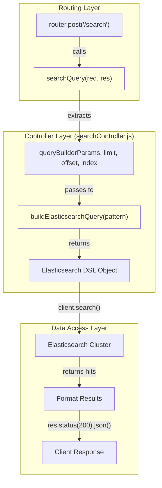
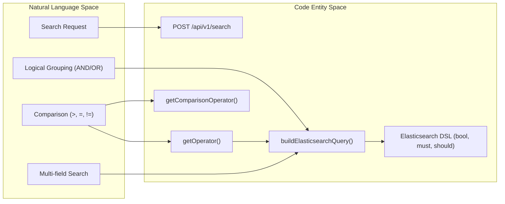

# Page: Search Endpoint

# Search Endpoint

Relevant source files

The following files were used as context for generating this wiki page:

- [src/api/openapi.yaml](src/api/openapi.yaml)
- [src/controllers/searchController.js](src/controllers/searchController.js)
- [src/routes/searchRoutes.js](src/routes/searchRoutes.js)

The Search Endpoint provides a robust interface for performing complex queries against Elasticsearch indices using a structured parameter format. It is the primary gateway for data discovery within the Ingenium Search Server, abstracting the complexity of Elasticsearch Query DSL behind a recursive query builder logic.

## Endpoint Specification

The endpoint is defined as a `POST` request to `/api/v1/search` [src/api/openapi.yaml:115-116](). It requires a Bearer Token for authentication [src/api/openapi.yaml:120]().

### Request Body (SearchInput)
The request body must be a JSON object containing the following properties:

| Property | Type | Required | Description |
| :--- | :--- | :--- | :--- |
| `queryBuilderParams` | `object` | Yes | A structured object containing nested rules and conditions [src/api/openapi.yaml:245-246](). |
| `limit` | `number` | No | The number of results to return (pageSize) [src/controllers/searchController.js:141-143](). |
| `offset` | `number` | No | The starting point for pagination [src/controllers/searchController.js:141-153](). |
| `index` | `string` | No | The specific index to search or 'all' for multi-index expansion [src/controllers/searchController.js:141-144](). |

### Response Schema (SearchResults)
A successful request returns a `200 OK` status with the following structure [src/controllers/searchController.js:165]():

| Field | Type | Description |
| :--- | :--- | :--- |
| `total` | `number` | Total number of documents matching the query [src/controllers/searchController.js:157](). |
| `results` | `array` | List of document objects, including the `id` (from `_id`) and the full `_source` [src/controllers/searchController.js:158-163](). |

**Sources:** [src/api/openapi.yaml:115-141](), [src/controllers/searchController.js:139-170]()

---

## Data Flow and Delegation

When a request hits the search route, it is routed via `searchRoutes.js` to the `searchQuery` function in the controller [src/routes/searchRoutes.js:6](). The controller acts as an orchestrator between the incoming HTTP request and the Elasticsearch client.

### Multi-Index Behavior
The `index` parameter supports a special value `'all'`. If provided, the controller expands this to target both the `procedure_element` and `element` indices simultaneously [src/controllers/searchController.js:144]().

### Search Request Lifecycle
The following diagram illustrates how the `searchController.js` processes a request from the `express.Router` to the `elasticsearch-config` client.

**Diagram: Search Request Flow**

**Sources:** [src/routes/searchRoutes.js:1-10](), [src/controllers/searchController.js:139-170]()

---

## Query Builder Implementation

The core logic resides in `buildElasticsearchQuery` [src/controllers/searchController.js:4-100](). This function recursively translates the `queryBuilderParams` into an Elasticsearch `bool` query.

### Logical Mapping
The builder maps top-level conditions to Elasticsearch boolean clauses [src/controllers/searchController.js:9]():
*   **AND** maps to `must`.
*   **OR** maps to `should`.

### Rule Processing
Each rule within the `queryBuilderParams` is evaluated based on its operator:

1.  **Field Splitting**: The `rule.field` string is split by commas, allowing a single rule to target multiple fields [src/controllers/searchController.js:15]().
2.  **Operator Resolution**: The `getOperator` helper maps shorthand symbols (e.g., `==`, `!=`, `>`) to internal logic types [src/controllers/searchController.js:102-120]().
3.  **DSL Generation**:
    *   **Range Queries**: Operators `>`, `>=`, `<`, `<=` use the `range` DSL [src/controllers/searchController.js:18-26]().
    *   **Wildcard Queries**: The `=` and `!=` operators wrap values in `*` and use `wildcard` queries with `case_insensitive: true` [src/controllers/searchController.js:27-43, 73-91]().
    *   **Exact Match**: `==` and `!==` use the `match` DSL [src/controllers/searchController.js:44-72]().

**Diagram: Natural Language to Code Entity Space**
This diagram maps the Search Request concepts to the specific code entities that handle them.

**Sources:** [src/controllers/searchController.js:4-135]()

## Implementation Details

### Multi-Field Support
If a user provides a field string like `"name, description"`, the controller splits this into an array `['name', 'description']` [src/controllers/searchController.js:15](). For `match` or `wildcard` operators, this results in a `bool` query with a `should` clause containing a sub-query for every field, effectively performing a logical OR across the specified fields [src/controllers/searchController.js:45-58, 74-90]().

### Recursion
The `buildElasticsearchQuery` function checks if a rule contains its own `condition` and `rules` array [src/controllers/searchController.js:11](). If so, it calls itself recursively [src/controllers/searchController.js:12](), allowing for deeply nested complex boolean logic (e.g., `(A AND B) OR (C AND D)`).

**Sources:** [src/controllers/searchController.js:10-100]()
