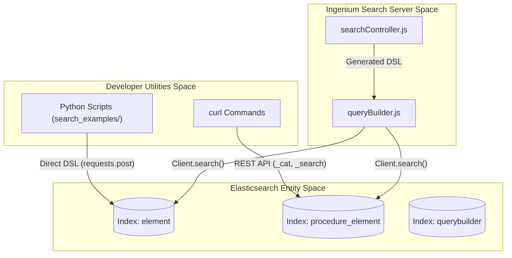

# Page: Search Examples and Developer Utilities

# Search Examples and Developer Utilities

Relevant source files

The following files were used as context for generating this wiki page:

- [search_examples/curl_examples.txt](search_examples/curl_examples.txt)
- [search_examples/delete_indices.py](search_examples/delete_indices.py)
- [search_examples/get_elem_by_id.py](search_examples/get_elem_by_id.py)
- [search_examples/query.py](search_examples/query.py)

The `search_examples/` directory serves as a sandbox for developers to test, explore, and validate Elasticsearch capabilities outside the main application logic. It contains a collection of Python scripts and raw `curl` commands that demonstrate how the system handles complex data types—such as nested objects, dates, and numeric ranges—and how the underlying `wildcard` and `keyword` mappings behave under different query patterns.

### Developer Tooling Overview

The utility scripts provide direct access to the Elasticsearch cluster, bypassing the Express API layer. This is particularly useful for debugging index mappings, verifying data ingestion formats, and testing raw Elasticsearch DSL queries.

*   **Cluster Management**: Scripts like `delete_indices.py` allow for rapid resetting of the local environment by targeting core indices like `element` and `procedure_element` [search_examples/delete_indices.py:8-13]().
*   **Direct Querying**: The `query.py` script provides templates for `query_string` searches against specific fields like `elem_id`, `title`, or `status` [search_examples/query.py:12-46]().
*   **Document Retrieval**: Utilities like `get_elem_by_id.py` demonstrate how to fetch specific documents directly from the `element` index using their unique identifiers [search_examples/get_elem_by_id.py:5-8]().
*   **CLI Quick-Reference**: `curl_examples.txt` provides a "cheat sheet" for common administrative tasks, such as checking cluster health or listing indices [search_examples/curl_examples.txt:1-5]().

### Conceptual Bridge: Developer Intent to Code Execution

The following diagram illustrates how developer-driven scripts interact with the Elasticsearch environment compared to the standard application flow.

**Direct vs. API-Mediated Search Flow**

**Sources:** [search_examples/query.py:49-54](), [search_examples/delete_indices.py:8-13](), [search_examples/curl_examples.txt:1-5]()

### Index and Mapping Examples
This category focuses on the structural definition of data. It explores how different Elasticsearch field types (e.g., `wildcard` vs `keyword`) affect search results and how nested structures—like arrays of steps or EVR data—are indexed and queried. These examples are foundational for understanding the `mapping-config.js` logic used in the main application.

For details, see **[Index and Mapping Examples (#6.1)]()**.

### Date and Timezone Examples
Handling temporal data is a critical aspect of the Ingenium Search Server. These examples demonstrate the ingestion of various date formats (ISO 8601, Unix epochs), the behavior of `dynamic_templates` for automatic date detection, and how the system handles timezones during range queries.

For details, see **[Date and Timezone Examples (#6.2)]()**.

### Data Interaction Summary

The table below summarizes the primary developer utilities and their targets within the `Elasticsearch` instance.

| Script / Utility | Target Index | Primary Action | Purpose |
| :--- | :--- | :--- | :--- |
| `delete_indices.py` | `syncdata`, `querybuilder`, `element`, `procedure_element` | `DELETE` | Environment reset and cleanup [search_examples/delete_indices.py:9-13](). |
| `query.py` | `element` | `POST /_search` | Testing `query_string` DSL logic [search_examples/query.py:49-54](). |
| `get_elem_by_id.py` | `element` | `GET /_doc/{id}` | Direct document retrieval by UUID [search_examples/get_elem_by_id.py:6-8](). |
| `curl_examples.txt` | N/A | `GET /_cat`, `GET /_cluster` | Cluster health and index metadata inspection [search_examples/curl_examples.txt:1-3](). |

**Sources:** [search_examples/delete_indices.py:1-16](), [search_examples/query.py:1-58](), [search_examples/get_elem_by_id.py:1-12](), [search_examples/curl_examples.txt:1-11]()
