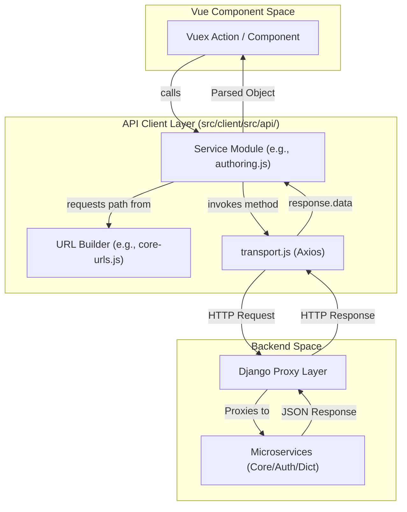
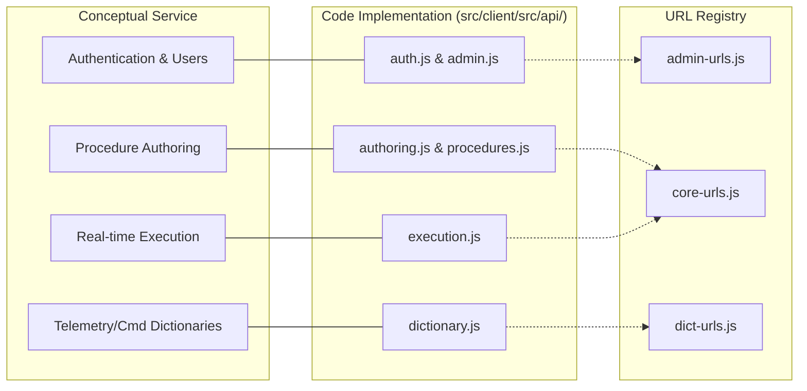

# API Client Layer

Relevant source files

The following files were used as context for generating this wiki page:

- [src/client/src/api/admin-urls.js](src/client/src/api/admin-urls.js)
- [src/client/src/api/admin.js](src/client/src/api/admin.js)
- [src/client/src/api/auth.js](src/client/src/api/auth.js)
- [src/client/src/api/authoring.js](src/client/src/api/authoring.js)
- [src/client/src/api/comments.js](src/client/src/api/comments.js)
- [src/client/src/api/core-urls.js](src/client/src/api/core-urls.js)
- [src/client/src/api/dict-urls.js](src/client/src/api/dict-urls.js)
- [src/client/src/api/dictionary.js](src/client/src/api/dictionary.js)
- [src/client/src/api/execution.js](src/client/src/api/execution.js)
- [src/client/src/api/procedures.js](src/client/src/api/procedures.js)
- [src/client/src/api/report-urls.js](src/client/src/api/report-urls.js)
- [src/client/src/api/report.js](src/client/src/api/report.js)
- [src/client/src/api/search-url.js](src/client/src/api/search-url.js)
- [src/client/src/api/search.js](src/client/src/api/search.js)
- [src/client/src/api/transport.js](src/client/src/api/transport.js)
- [src/client/src/api/venue-config-urls.js](src/client/src/api/venue-config-urls.js)
- [src/client/src/api/venue.js](src/client/src/api/venue.js)

The API Client Layer provides a structured interface for the Vue.js frontend to communicate with various backend microservices (Core, Auth, Dictionary, Report, etc.). It abstracts HTTP communication details using a centralized Axios instance and organizes endpoint definitions into service-specific modules.

## Architecture Overview

The layer is divided into three primary components:
1.  **Transport Engine**: A configured Axios instance for handling request/response lifecycle.
2.  **URL Builders**: Functional modules that generate dynamic URL paths based on resource IDs and versions.
3.  **Service Clients**: High-level `async` functions that execute business logic requests and return parsed data.

### Data Flow Diagram
This diagram illustrates how a frontend component interacts with the API layer to retrieve data from a backend service.

**API Communication Flow**

**Sources:** [src/client/src/api/transport.js:1-20](), [src/client/src/api/authoring.js:1-15](), [src/client/src/api/core-urls.js:1-15]()

---

## Transport Engine (`transport.js`)

The `transport.js` file exports a customized Axios instance used by all service modules. It handles global configurations such as base headers and interceptors for error handling or authentication token injection.

Key features include:
*   **Standard Methods**: Wraps `get`, `post`, `put`, `patch`, and `delete`.
*   **Error Handling**: Service modules typically wrap transport calls in `try/catch` blocks, logging errors to the console or passing them to utility functions like `parseAxiosError` [src/client/src/api/authoring.js:113-115]().
*   **Request Cancellation**: Supports `AbortSignal` for timeouts and manual cancellation via `newAbortSignal` [src/client/src/api/execution.js:74-80]().

**Sources:** [src/client/src/api/transport.js:1-10](), [src/client/src/api/authoring.js:1-5]()

---

## URL Definition Files

URL builders centralize the routing logic for different microservices. They are typically organized by the service they target and use versioned prefixes (e.g., `/core_server/api/v5`).

### Key URL Modules

| File | Service Target | Prefix Variable | Key URL Objects |
| :--- | :--- | :--- | :--- |
| `core-urls.js` | Core Service | `coreServerUrl` [src/client/src/api/core-urls.js:3]() | `coreProcedureUrls`, `coreExecutionUrls`, `coreVenueUrls` |
| `dict-urls.js` | Dictionary Service | `dictUrl` [src/client/src/api/dict-urls.js:3]() | `dictionaryUrls`, `dictionaryFlightUrls`, `customScriptsUrls` |
| `admin-urls.js` | Auth/Admin Service | `authServerUrl` [src/client/src/api/admin-urls.js:3]() | `authUrls` |
| `report-urls.js` | Report Service | `reportUrl` [src/client/src/api/report-urls.js:3]() | `reportUrls` |

**Example Implementation:**
The `coreExecutionUrls.base` function handles both collection and instance endpoints:
`return coreServerUrl + "/executions" + (executionId && "/" + executionId);` [src/client/src/api/core-urls.js:32-34]()

---

## Service API Modules

Service modules export asynchronous functions that correspond to specific backend actions.

### Authoring and Procedures
The `authoring.js` and `procedures.js` modules manage the lifecycle of spacecraft procedures.

*   **`getProcedure(procedureId)`**: Retrieves metadata for a specific procedure [src/client/src/api/authoring.js:6-15]().
*   **`getProcedureVersions(procedureId, ...)`**: Fetches the version history, extracting the total count from the `x-total-count` header [src/client/src/api/authoring.js:17-31]().
*   **`lockProcedure(procedureId, lockedBy, ...)`**: Performs a `PATCH` request to the core service to prevent concurrent editing [src/client/src/api/authoring.js:103-116]().

### Execution and As-Run
The `execution.js` module handles real-time execution data and control.

*   **`fetchExecutions(queryParams)`**: Supports complex filtering and sorting by converting frontend camelCase parameters to backend snake_case using `toSnakeCase` [src/client/src/api/execution.js:5-17]().
*   **`moveExecutionElement(...)`**: Dispatches a `POST` request to `/elements/move` to reorder steps within an active execution [src/client/src/api/execution.js:146-160]().
*   **`haltExecution(executionId)`**: Triggers the `/halt` endpoint to stop a running procedure [src/client/src/api/core-urls.js:131-133]().

### Dictionary and Configuration
The `dictionary.js` module interacts with the `dict_server` to fetch telemetry and command definitions.

*   **`getFlightCmds(params)`**: Queries command stems from the flight dictionary, supporting pagination and "wildcard" searches [src/client/src/api/dictionary.js:83-115]().
*   **`getSseDictionaries(params)`**: Retrieves available SSE (Support System Equipment) dictionary versions [src/client/src/api/dictionary.js:47-75]().

**Sources:** [src/client/src/api/authoring.js:1-150](), [src/client/src/api/execution.js:1-150](), [src/client/src/api/dictionary.js:1-120]()

---

## Entity Mapping: Code to Natural Language

This diagram bridges the conceptual "Service" names used in documentation with the specific JavaScript entities implemented in the codebase.

**Service Entity Mapping**

**Sources:** [src/client/src/api/admin.js:1-5](), [src/client/src/api/authoring.js:1-5](), [src/client/src/api/dictionary.js:1-10](), [src/client/src/api/execution.js:1-5]()

---

## Specialized API Modules

### Admin and Auth
*   **`getLdapUsers(userName)`**: Interfaces with `/auth_server/api/v2/ldap/users` to search the institutional directory [src/client/src/api/auth.js:30-45]().
*   **`editRole(role_id, role)`**: Updates permission sets for Ingenium roles [src/client/src/api/admin.js:69-82]().

### Comments
The `comments.js` module manages conversations attached to specific procedure elements. It differentiates between **Execution** comments and **Procedure** (Authoring) comments by using different URL builders:
*   `coreExecutionUrls.conversation(...)` [src/client/src/api/comments.js:7]()
*   `coreProcedureUrls.conversation(...)` [src/client/src/api/comments.js:18]()

### Reporting
The `report.js` module handles binary data downloads (PDF and Excel).
*   **`getExecutionInPdf(executionId)`**: Requests a PDF blob by setting `responseType: 'arraybuffer'` in the Axios config [src/client/src/api/report.js:30-42]().
*   **`getDifferenceReport(...)`**: Compares two procedure versions and returns a JSON diff [src/client/src/api/report.js:57-72]().

**Sources:** [src/client/src/api/auth.js:1-75](), [src/client/src/api/comments.js:1-50](), [src/client/src/api/report.js:1-83]()
