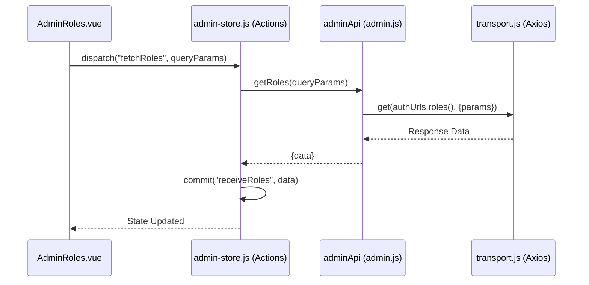
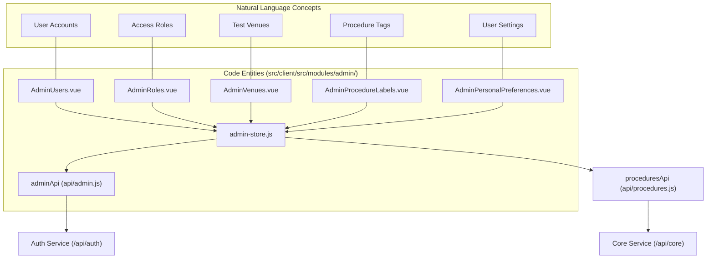

# Admin Module

Relevant source files

The following files were used as context for generating this wiki page:

- [src/client/src/api/admin.js](src/client/src/api/admin.js)
- [src/client/src/modules/admin/AdminRouter.vue](src/client/src/modules/admin/AdminRouter.vue)
- [src/client/src/modules/admin/Sidebar.vue](src/client/src/modules/admin/Sidebar.vue)
- [src/client/src/modules/admin/admin-store.js](src/client/src/modules/admin/admin-store.js)
- [src/client/src/modules/admin/admin.js](src/client/src/modules/admin/admin.js)
- [src/client/src/modules/admin/permissions/AddRoleModal.vue](src/client/src/modules/admin/permissions/AddRoleModal.vue)
- [src/client/src/modules/admin/permissions/AdminGroups.vue](src/client/src/modules/admin/permissions/AdminGroups.vue)
- [src/client/src/modules/admin/permissions/AdminRoles.vue](src/client/src/modules/admin/permissions/AdminRoles.vue)
- [src/client/src/modules/admin/permissions/AdminUsers.vue](src/client/src/modules/admin/permissions/AdminUsers.vue)
- [src/client/src/modules/admin/permissions/RoleActionsDropdown.vue](src/client/src/modules/admin/permissions/RoleActionsDropdown.vue)
- [src/client/src/modules/admin/preferences/AdminPersonalPreferences.vue](src/client/src/modules/admin/preferences/AdminPersonalPreferences.vue)
- [src/client/src/modules/admin/procedureLabels/AddProcedureLabelModal.vue](src/client/src/modules/admin/procedureLabels/AddProcedureLabelModal.vue)
- [src/client/src/modules/admin/procedureLabels/AdminProcedureLabels.vue](src/client/src/modules/admin/procedureLabels/AdminProcedureLabels.vue)
- [src/client/src/modules/admin/venue-groups/AdminVenueGroups.vue](src/client/src/modules/admin/venue-groups/AdminVenueGroups.vue)
- [src/client/src/modules/admin/venues/AdminVenues.vue](src/client/src/modules/admin/venues/AdminVenues.vue)
- [src/client/src/modules/admin/venues/ChangeStatusModal.vue](src/client/src/modules/admin/venues/ChangeStatusModal.vue)

The Admin Module provides the administrative interface for managing system entities including users, roles, permissions, venues, venue groups, and procedure labels. It is implemented as a Vue.js Single Page Application (SPA) that communicates with backend services via the Django proxy layer.

## Architecture and Routing

The module is initialized in `admin.js`, which sets up the `VueRouter` and attaches the `admin-store.js` to the Vue instance [src/client/src/modules/admin/admin.js:16-52](). The `AdminRouter.vue` serves as the top-level entry point, rendering components based on the current URL path [src/client/src/modules/admin/AdminRouter.vue:1-3]().

### Sidebar Navigation
The `Sidebar.vue` component provides the primary navigation for the administrative sub-sections, organized into three categories: Manage, Permissions, and Preferences [src/client/src/modules/admin/Sidebar.vue:3-49]().

| Section | Route | Component |
| :--- | :--- | :--- |
| Venue Groups | `/admin/venue_groups` | `AdminVenueGroups` |
| Venues | `/admin/venues` | `AdminVenues` |
| Procedure Labels | `/admin/procedurelabels` | `AdminProcedureLabels` |
| Users | `/admin/permissions/users` | `AdminUsers` |
| Roles | `/admin/permissions/roles` | `AdminRoles` |
| Personal Prefs | `/admin/preferences/personal` | `AdminPersonalPreferences` |

**Sources:** [src/client/src/modules/admin/admin.js:18-51](), [src/client/src/modules/admin/Sidebar.vue:8-48]()

## State Management (admin-store.js)

The `admin-store.js` manages the global state for administrative entities. It handles asynchronous API calls to various backend services (Auth, Core, Venue) and commits the results to the Vuex state.

### Key State Properties
- `users`: Array of user objects fetched from the Auth service [src/client/src/modules/admin/admin-store.js:12]().
- `roles`: Array of role objects, augmented with `venueGroupName` via getters [src/client/src/modules/admin/admin-store.js:16, 28-34]().
- `permissionIdToName` / `permissionNameToId`: Lookup maps for translating between permission IDs and human-readable strings [src/client/src/modules/admin/admin-store.js:14-15]().
- `labels`: Array of procedure labels [src/client/src/modules/admin/admin-store.js:20]().

### Data Flow: Fetching Roles
The following diagram illustrates the flow from a UI component to the API layer for role management.

**Role Management Data Flow**

**Sources:** [src/client/src/modules/admin/admin-store.js:83-86](), [src/client/src/api/admin.js:32-37](), [src/client/src/modules/admin/permissions/AdminRoles.vue:117]()

## Permissions Management

### Users and Groups
- **AdminUsers.vue**: Displays a list of users using the `IngTable` component. It supports searching by username and filtering by login status [src/client/src/modules/admin/permissions/AdminUsers.vue:13-26](). It fetches data via the `tableCallback` which triggers the `fetchUsers` action [src/client/src/modules/admin/permissions/AdminUsers.vue:91-120]().
- **AdminGroups.vue**: A placeholder for managing user groups, currently displaying static data [src/client/src/modules/admin/permissions/AdminGroups.vue:43-54]().

### Roles and Permissions
The `AdminRoles.vue` component allows administrators to create, update, and delete roles.

- **AddRoleModal.vue**: A complex modal for role configuration. It allows:
    - Selecting a **Venue Group**: Restricts the role to specific venues for execution permissions [src/client/src/modules/admin/permissions/AddRoleModal.vue:10-25]().
    - **Permission Selection**: Toggles specific permissions like `admin`, `author`, or `execute:sit` based on whether a venue group is selected [src/client/src/modules/admin/permissions/AddRoleModal.vue:46-91]().
    - **LDAP Group Mapping**: Uses `vue-typeahead-bootstrap` to search and associate LDAP groups with the role [src/client/src/modules/admin/permissions/AddRoleModal.vue:100-119]().
- **RoleActionsDropdown.vue**: Provides "Update" and "Delete" actions within the `IngTable` rows [src/client/src/modules/admin/permissions/RoleActionsDropdown.vue:8-22]().

**Sources:** [src/client/src/modules/admin/permissions/AdminRoles.vue:139-171](), [src/client/src/modules/admin/permissions/AddRoleModal.vue:1-129](), [src/client/src/modules/admin/permissions/AdminUsers.vue:50-75]()

## Venue and Venue Group Management

Administrative components for venues interface with the `venueApi`.

- **AdminVenueGroups**: Manages logical groupings of venues. Uses `venueApi.createVenueGroup` and `venueApi.editVenueGroup` via store actions [src/client/src/modules/admin/admin-store.js:44-49]().
- **AdminVenues**: Manages individual venue configurations.
- **ChangeStatusModal**: Allows administrators to force-close, suspend, or change the operational status of a venue [src/client/src/modules/admin/admin-store.js:68-74]().

**Sources:** [src/client/src/modules/admin/admin-store.js:44-74](), [src/client/src/api/venue.js]()

## Procedure Labels

Procedure labels are managed through `AdminProcedureLabels.vue`. These labels are used to categorize procedures within the authoring module.

- **AddProcedureLabelModal.vue**: Provides the interface for creating new labels. It validates that both `name` and `description` are present before allowing submission [src/client/src/modules/admin/procedureLabels/AddProcedureLabelModal.vue:67-73]().
- **CRUD Operations**: The store provides `createLabel`, `getLabels`, and `deleteLabel` actions which wrap calls to `proceduresApi` [src/client/src/modules/admin/admin-store.js:53-64]().

**Sources:** [src/client/src/modules/admin/procedureLabels/AddProcedureLabelModal.vue:91-104](), [src/client/src/modules/admin/admin-store.js:53-64]()

## Personal Preferences

The `AdminPersonalPreferences.vue` component allows users to toggle client-side settings.

- **Debug Mode**: Toggling this setting updates the `debugEnabled` state in Vuex and persists the preference to `localStorage` under the key `PERSONAL_PREFERENCES` [src/client/src/modules/admin/admin-store.js:96-105](). This ensures the setting survives page refreshes [src/client/src/modules/admin/admin-store.js:106-114]().

**Sources:** [src/client/src/modules/admin/preferences/AdminPersonalPreferences.vue:12-19](), [src/client/src/modules/admin/admin-store.js:8-114]()

## Entity Relationship Mapping

The following diagram maps the logical administrative concepts to their corresponding code entities.

**Admin Entity to Code Mapping**

**Sources:** [src/client/src/modules/admin/admin.js:6-12](), [src/client/src/modules/admin/admin-store.js:3-6](), [src/client/src/api/admin.js:84-92]()
