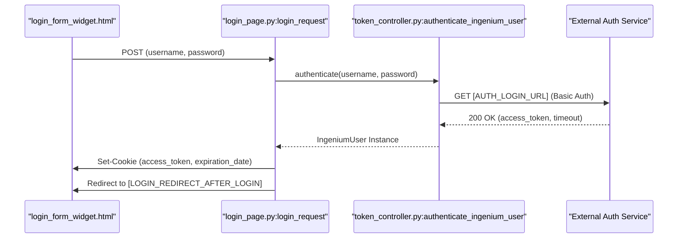
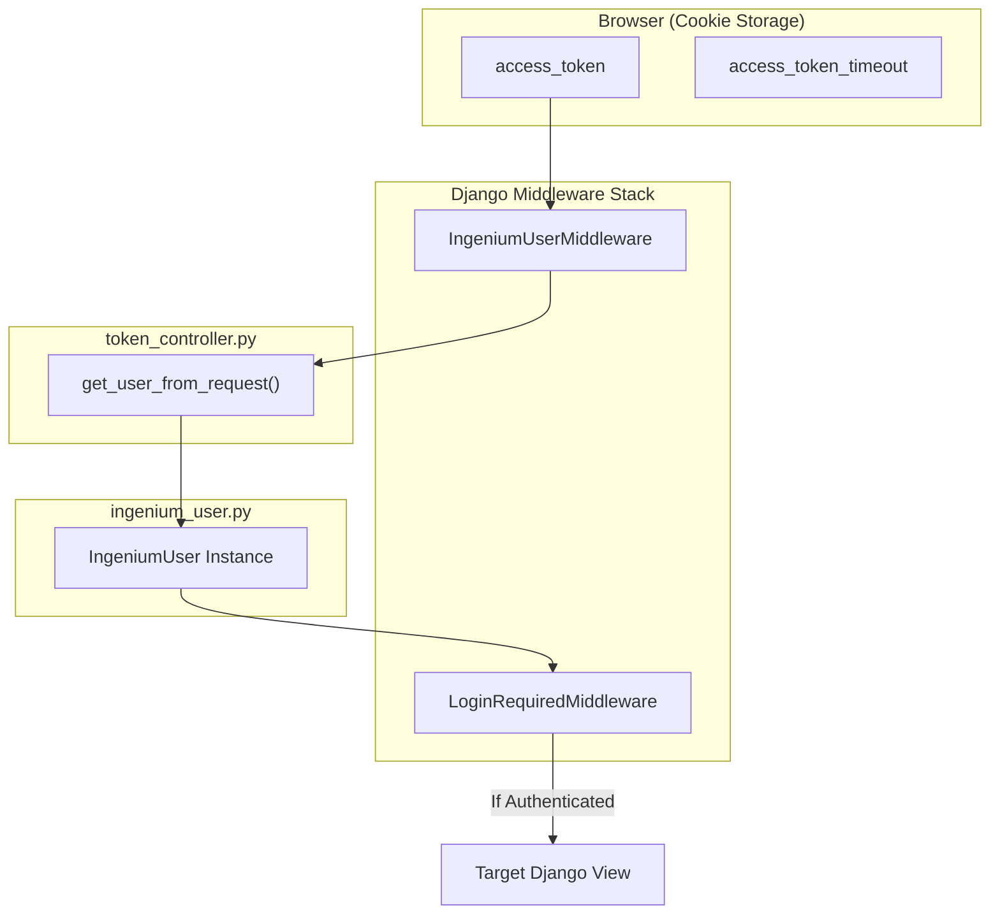

# Authentication and Session Management

Relevant source files

The following files were used as context for generating this wiki page:

- [src/apps/ingenium_login/__init__.py](src/apps/ingenium_login/__init__.py)
- [src/apps/ingenium_login/templates/ingenium_login/login_form_widget.html](src/apps/ingenium_login/templates/ingenium_login/login_form_widget.html)
- [src/apps/ingenium_login/urls.py](src/apps/ingenium_login/urls.py)
- [src/apps/ingenium_login/views/__init__.py](src/apps/ingenium_login/views/__init__.py)
- [src/apps/ingenium_login/views/login_page.py](src/apps/ingenium_login/views/login_page.py)
- [src/apps/ingenium_login/views/token_controller.py](src/apps/ingenium_login/views/token_controller.py)

The Ingenium UI authentication system is a stateless, JWT-based architecture that utilizes Django as a thin proxy for an external Authentication Service. Instead of using a local database for user records, the system stores JSON Web Tokens (JWT) in browser cookies and reconstructs user sessions on every request via custom middleware and backends.

## Authentication Flow

The authentication flow begins with the `login_request` view, which gathers credentials and communicates with the backend Auth Service.

### Data Flow: Login and Token Storage
1.  **Credential Submission**: The user submits a JPL Username and password (or RSA token) via the `login_form_widget.html` [src/apps/ingenium_login/templates/ingenium_login/login_form_widget.html:1-29]().
2.  **Authentication Backend**: The `login_request` view calls Django's `authenticate()` [src/apps/ingenium_login/views/login_page.py:64-64](), which invokes the `IngeniumUserBackend`.
3.  **External Auth Request**: `authenticate_ingenium_user` executes a GET request to the `AUTH_LOGIN_URL` using HTTP Basic Auth [src/apps/ingenium_login/views/token_controller.py:37-51]().
4.  **Cookie Persistence**: Upon success, the `login_request` view sets three critical cookies: `access_token`, `access_token_timeout`, and `expiration_date` [src/apps/ingenium_login/views/login_page.py:72-74]().

### Diagram: Authentication Sequence
This diagram maps the sequence of operations from the UI to the backend controllers and external services.

**Sources:** [src/apps/ingenium_login/views/login_page.py:47-76](), [src/apps/ingenium_login/views/token_controller.py:37-67]()

---

## User Models

Ingenium UI implements two custom user classes to represent the session state without a persistent database backing.

### `IngeniumUser`
This class represents an authenticated user. It encapsulates the JWT access token and metadata.
*   **Storage**: Does not persist in a database; it is instantiated per-request from cookie data [src/apps/ingenium_login/views/token_controller.py:28-32]().
*   **Token Management**: Provides methods like `get_token()` and `get_access_expiration()` used by the login view [src/apps/ingenium_login/views/login_page.py:72-74]().

### `IngeniumAnonymousUser`
Used when no `access_token` cookie is present in the request [src/apps/ingenium_login/views/token_controller.py:34-34](). It mirrors the interface of `IngeniumUser` but returns `False` for `is_authenticated()`.

**Sources:** [src/apps/ingenium_login/views/token_controller.py:19-34](), [src/ingenium/views/ingenium_user.py]() (referenced in imports)

---

## Middleware and Session Management

The system uses three primary middleware components to manage the lifecycle of a user session.

| Middleware | Responsibility |
| :--- | :--- |
| `IngeniumUserMiddleware` | Extracts the `access_token` from cookies and attaches an `IngeniumUser` object to `request.user`. |
| `IngeniumSessionMiddleware` | Manages session-specific data and ensures the Django session is synchronized with the JWT state. |
| `LoginRequiredMiddleware` | Enforces that all requests (except those to the login/logout URLs) originate from authenticated users. |

### Token Renewal
Tokens are renewed via the `renew_token_request` view [src/apps/ingenium_login/views/login_page.py:19-20]().
*   The controller sends the current token to `AUTH_REFRESH_TOKEN_URL` [src/apps/ingenium_login/views/token_controller.py:111-119]().
*   If successful, it decodes the new JWT using `AUTH_PUBLIC_PEM` to update the `expiration_date` cookie [src/apps/ingenium_login/views/token_controller.py:91-97]().
*   If the refresh fails (HTTP 403), the user is forcibly redirected to the logout view [src/apps/ingenium_login/views/token_controller.py:100-104]().

**Sources:** [src/apps/ingenium_login/views/token_controller.py:79-124](), [src/apps/ingenium_login/views/login_page.py:19-20]()

---

## Logout and Session Termination

The `logout_request` view performs a clean termination of both the local Django session and the external service sessions.

1.  **External Invalidation**: It calls `AUTH_LOGOUT_URL` with the user's current token to invalidate the JWT on the server side [src/apps/ingenium_login/views/login_page.py:32-32]().
2.  **Cookie Deletion**: Explicitly deletes `access_token` and `access_token_timeout` cookies [src/apps/ingenium_login/views/login_page.py:37-38]().
3.  **Session Flush**: Clears the Django `request.session` [src/apps/ingenium_login/views/login_page.py:41-42]().

### Diagram: Session Reconstruction and Middleware
This diagram shows how the system bridges the "Cookie Space" to the "Code Entity Space" during a standard request.

**Sources:** [src/apps/ingenium_login/views/token_controller.py:19-34](), [src/apps/ingenium_login/views/login_page.py:23-44]()

## URL Configuration

Authentication routes are defined in `apps.ingenium_login.urls`:

*   `/login/`: `login_request` [src/apps/ingenium_login/urls.py:6-6]()
*   `/logout/`: `logout_request` [src/apps/ingenium_login/urls.py:7-7]()
*   `/renew/`: `renew_token_request` [src/apps/ingenium_login/urls.py:8-8]()

**Sources:** [src/apps/ingenium_login/urls.py:5-9]()
