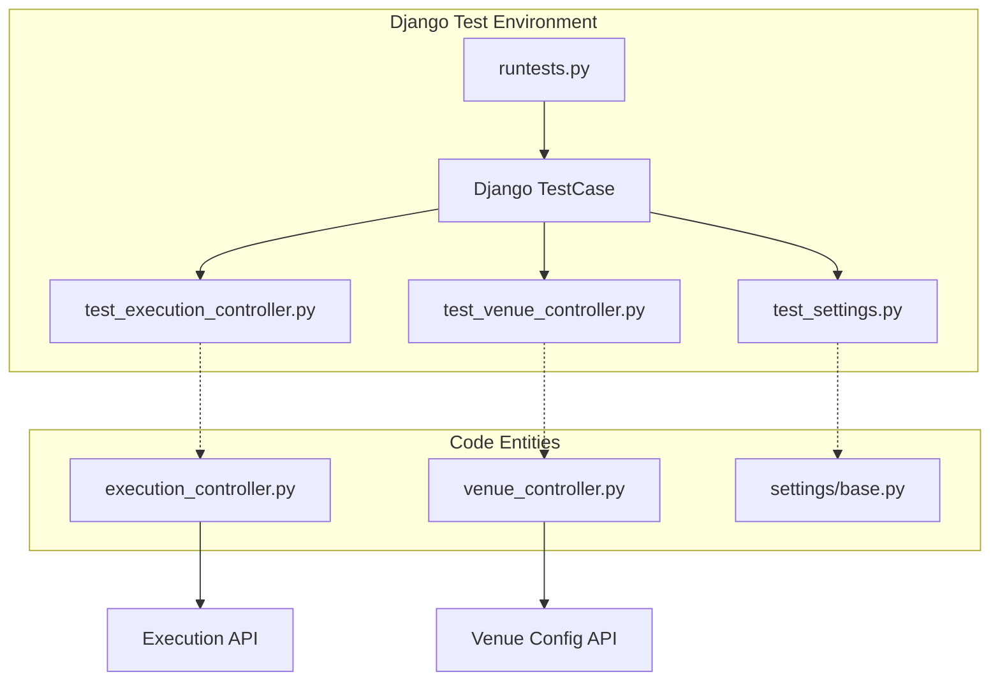
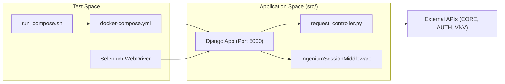

# Backend and Integration Tests

<details>
<summary>Relevant source files</summary>

The following files were used as context for generating this wiki page:

- [README.md](README.md)
- [config/requirements.txt](config/requirements.txt)

</details>


This page documents the testing infrastructure for the Ingenium UI Django backend and the legacy integration tests. The testing suite is designed to validate the orchestration logic of the Django proxy layer, verify session management, and ensure correct integration between the UI and backend microservices.

## Overview of Testing Layers

The Ingenium UI testing strategy for the backend consists of two primary components:
1.  **Django Backend Tests**: Unit and integration tests for Python controllers, models, and settings located in `src/tests/`.
2.  **Legacy Selenium UI Tests**: End-to-end browser-based tests located in `src/tests/ui/` that validate critical user flows like dashboard navigation and session expiration.

### Core Test Execution Flow

The backend testing environment is typically managed via Docker to ensure consistency across development and CI environments.

| Component | Path | Description |
| :--- | :--- | :--- |
| **Test Runner** | `src/tests/runtests.py` | Main entry point for executing Django-based tests. |
| **Integration Runner** | `src/tests/run_compose.sh` | Script to orchestrate tests using `docker-compose`. |
| **Controller Tests** | `src/tests/test_execution_controller.py` | Validates execution-related proxy logic. |
| **Venue Tests** | `src/tests/test_venue_controller.py` | Validates venue management and configuration logic. |
| **UI Integration** | `src/tests/ui/` | Selenium-based test cases for browser interaction. |

Sources: [README.md:134-153](), [config/requirements.txt:3-10]()

## Django Backend Tests

Backend tests utilize the standard Django testing framework. Since the backend acts as a thin proxy, these tests focus on ensuring that requests are correctly formatted before being sent to external services (Core, Auth, Venue Config) and that responses are handled appropriately.

### Execution and Venue Controllers
The controllers are tested to ensure that the AJAX views correctly interface with the `request_controller.py` helpers. 

*   **`test_execution_controller.py`**: Focuses on the lifecycle of procedure executions, including starting, stopping, and status retrieval.
*   **`test_venue_controller.py`**: Tests the retrieval of venue lists and the application of venue configurations.

### Settings Validation
**`test_settings.py`** ensures that the environment variable injection mechanism (defined in `settings/base.py`) correctly populates the API URL constants. This is critical because the UI relies on these variables to route requests to the correct microservices.


Sources: [README.md:172-177](), [config/requirements.txt:3-4]()

## Legacy Selenium Integration Tests

Located in `src/tests/ui/`, these tests use Selenium WebDriver to perform black-box testing against a running instance of the application.

### Key Test Cases
*   **`dashboard_test_case.py`**: Verifies that the dashboard correctly renders venue tiles and that filtering/pagination logic works as expected from a user perspective.
*   **`session_expiration_test_case.py`**: Specifically tests the `IngeniumSessionMiddleware` and `token_controller` logic by simulating token expiry and verifying that the user is redirected to the login page.
*   **Venue Configuration Tests**: Validates the UI's ability to modify venue settings and persist them through the backend proxy to the `VENUE_CONFIG_API_URL`.

Sources: [README.md:61-88](), [README.md:111-133]()

## Execution Environment

Tests can be executed locally or within a containerized environment.

### Docker-Compose Execution
The project provides a dedicated `docker-compose` configuration within `src/tests/` to spin up a headless testing environment. This is the preferred method for CI/CD pipelines.

**Execution Steps:**
1.  Navigate to the test directory: `cd src/tests`.
2.  Set required environment variables: `USERNAME`, `PASSWORD`, and `INGENIUM_SERVER`.
3.  Run the suite: `docker-compose up` or `bash run_compose.sh`.

### Local Execution
For local development, tests are run after activating the virtual environment and installing dependencies from `config/requirements.txt`.

```bash
# Activate environment
source ~/ingenium-env/bin/activate

# Run backend tests
python src/tests/runtests.py
```

### Dependency Mapping
The following diagram illustrates how the test infrastructure maps to the application components:


Sources: [README.md:92-95](), [README.md:142-151](), [config/requirements.txt:8-10]()

## Configuration for Testing
The tests rely on several environment variables that must be configured to point to valid service endpoints. These are typically defined in `settings/base.py` but can be overridden for testing purposes.

| Variable | Usage in Tests |
| :--- | :--- |
| `INGENIUM_SERVER` | The base URL of the UI instance being tested. |
| `TEST_USER` / `TEST_PASS` | Credentials used by Selenium to authenticate. |
| `JWT_SECRET` | Used to validate token handling in session tests. |
| `CORE_API_URL` | Pointed to a mock or test instance of the Core service. |

Sources: [README.md:63-88](), [README.md:115-120]()
