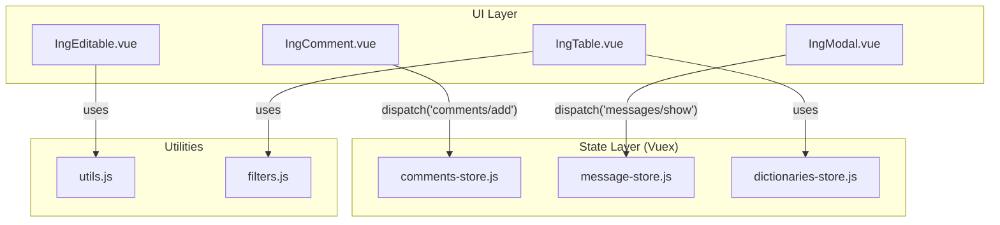
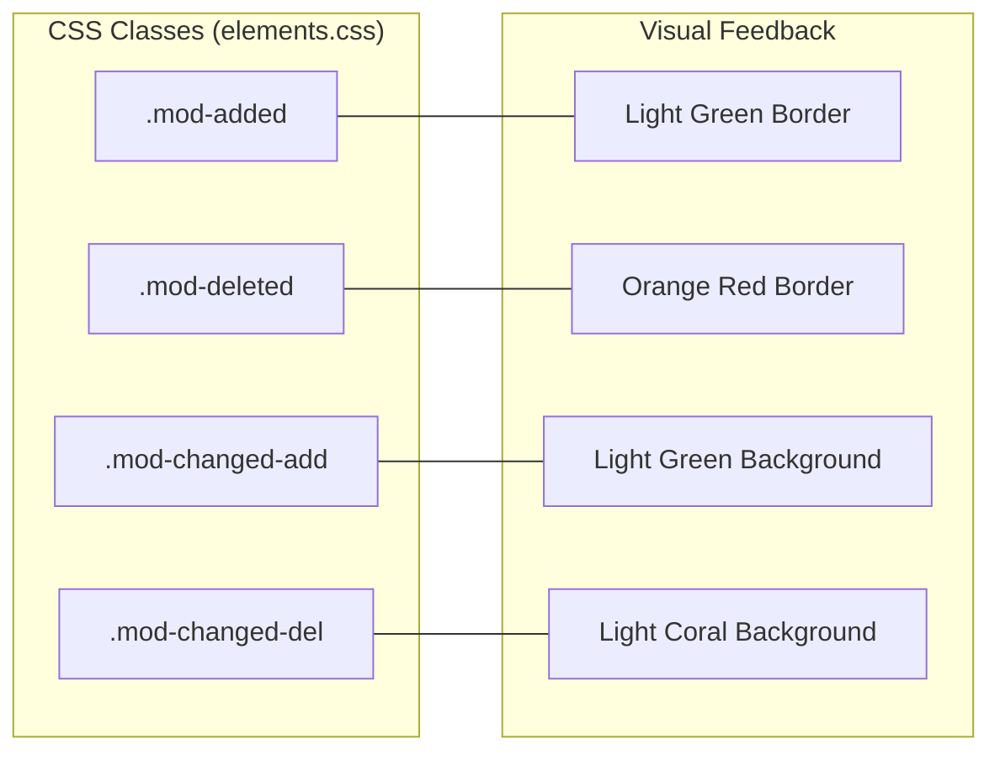

# Common Components and Shared Utilities

<details>
<summary>Relevant source files</summary>

The following files were used as context for generating this wiki page:

- [src/client/src/assets/logo.png](src/client/src/assets/logo.png)
- [src/client/src/assets/styles/elements.css](src/client/src/assets/styles/elements.css)
- [src/client/src/assets/styles/print.css](src/client/src/assets/styles/print.css)
- [src/client/src/assets/styles/sidepanel.css](src/client/src/assets/styles/sidepanel.css)

</details>


The `src/client/src/modules/common/` directory serves as the foundational library for the Ingenium UI. It provides a standardized set of Vue.js components, Vuex state modules, and JavaScript utilities that ensure behavioral and visual consistency across disparate SPA modules such as Authoring, Execution, and Admin.

## Shared UI Components

Ingenium utilizes a library of reusable Vue components to handle common UI patterns like data tables, modals, and rich-text editing.

### Data Display and Layout
*   **IngTable**: A standardized wrapper for displaying tabular data. It supports dynamic headers, slot-based cell rendering, and integrated pagination.
*   **IngModal**: The primary component for overlay dialogs. It manages its own visibility state and provides standard header/footer slots for consistency [src/client/src/modules/common/IngModal.vue]().
*   **Paginator**: A control component used by `IngTable` and other list views to manage page offsets and limit parameters [src/client/src/modules/common/Paginator.vue]().
*   **VenueStatusDot**: A visual indicator used to represent the current state of a Venue (e.g., Active, Suspended, or Force Closed) using standardized color coding.

### Form and Input Controls
*   **IngEditable**: A component that toggles between a display label and an input field, allowing for "click-to-edit" functionality without navigating away from the current context [src/client/src/modules/common/IngEditable.vue]().
*   **FroalaEdit**: A wrapper around the Froala WYSIWYG editor, customized for procedure authoring. It handles content sanitization and image upload integration.
*   **IngSpinner**: A standardized loading indicator used during asynchronous API calls to provide visual feedback to the user [src/client/src/modules/common/IngSpinner.vue]().

### Interaction and Feedback
*   **IngComment**: A specialized component for displaying and managing user comments on procedure elements or executions. It integrates with the `comments-store` to handle CRUD operations [src/client/src/modules/common/IngComment.vue]().

### Component Interaction Diagram
The following diagram illustrates how common components interact with shared state and utility layers.

**Common Component Data Flow**

Sources: [src/client/src/modules/common/IngModal.vue](), [src/client/src/modules/common/IngTable.vue](), [src/client/src/modules/common/IngComment.vue](), [src/client/src/modules/common/store/comments-store.js]().

## Shared Vuex Stores

Shared stores manage state that is required by multiple SPA modules or the global application shell.

### message-store.js
Manages global application notifications and error messages. It provides actions to show/hide alerts that appear in the top-level navigation or modal overlays.

### comments-store.js
Handles the state for element-level and procedure-level comments.
*   **State**: Stores a map of comments indexed by element ID or procedure ID.
*   **Actions**: `fetchComments`, `addComment`, `deleteComment`, and `updateComment`. These interact with the `comments.js` API client [src/client/src/modules/common/store/comments-store.js:1-50]().

### dictionaries-store.js
Caches dictionary data (e.g., SSE Dictionaries, Flight Dictionaries) used for command validation and auto-completion across the Authoring and Project Configuration modules.

## Utility Functions and Filters

The `utils/` directory contains logic-heavy functions that are abstracted away from Vue components to facilitate testing and reuse.

### utils.js
Contains general-purpose logic including:
*   **Date Formatting**: Helpers to convert timestamps into human-readable strings.
*   **Permission Checking**: Functions to verify if the current user has specific roles or permissions required for an action.
*   **Object Manipulation**: Deep cloning and comparison helpers.

### filters.js
Vue filters for template-level data transformation:
*   `formatDate`: Formats ISO strings into project-standard date formats.
*   `capitalize`: Standard string casing utility.
*   `truncate`: Shortens long text for table displays.

### hash-colors.js
A utility used to generate consistent, deterministic colors based on a string input (like a username or element ID). This is used in the UI to color-code user avatars or specific tags so they remain consistent across sessions.

## Directives and Mixins

*   **Directives**: Custom Vue directives for DOM-level interactions, such as `v-focus` (auto-focusing an input when a modal opens) or `v-tooltip` (integrating with Bootstrap tooltips).
*   **Mixins**: Shared logic for components, such as `PermissionsMixin` which injects a `hasPermission()` method into any component that includes it.

## Global Styles

Styles are organized to separate layout concerns from element-specific appearances.

| File | Purpose |
| :--- | :--- |
| `elements.css` | Defines visual states for procedure elements, including modification borders (`.mod-added`, `.mod-deleted`) and tooltip overrides [src/client/src/assets/styles/elements.css:1-36](). |
| `sidepanel.css` | Styles for the execution and as-run side panels, including "Redline" and "Blueline" toggle button appearances [src/client/src/assets/styles/sidepanel.css:1-101](). |
| `print.css` | Overrides for print-specific media queries to ensure procedure reports are legible when printed [src/client/src/assets/styles/print.css:1-3](). |

### Style State Mapping
The system uses specific CSS classes to visually represent the status of elements during procedure comparison or redlining.

**Element Modification Styling**

Sources: [src/client/src/assets/styles/elements.css:6-30]().

## Code Entity Mapping

**Utility and State Entity Relationship**
```mermaid
classDiagram
    class "comments-store.js" {
        +state comments
        +fetchComments()
        +addComment()
    }
    class "utils.js" {
        +formatDate()
        +checkPermission()
        +generateUUID()
    }
    class "IngComment.vue" {
        +commentData
        +onDelete()
        +onEdit()
    }
    class "comments.js (API)" {
        +getComments()
        +postComment()
    }

    "IngComment.vue" ..> "comments-store.js" : dispatches actions
    "comments-store.js" ..> "comments.js (API)" : calls transport
    "IngComment.vue" ..> "utils.js" : uses formatting
```
Sources: [src/client/src/modules/common/store/comments-store.js](), [src/client/src/modules/common/IngComment.vue]().

Sources:
* [src/client/src/modules/common/IngModal.vue]()
* [src/client/src/modules/common/IngTable.vue]()
* [src/client/src/modules/common/IngComment.vue]()
* [src/client/src/modules/common/IngEditable.vue]()
* [src/client/src/modules/common/Paginator.vue]()
* [src/client/src/modules/common/IngSpinner.vue]()
* [src/client/src/modules/common/store/comments-store.js]()
* [src/client/src/assets/styles/elements.css]()
* [src/client/src/assets/styles/sidepanel.css]()
* [src/client/src/assets/styles/print.css]()
