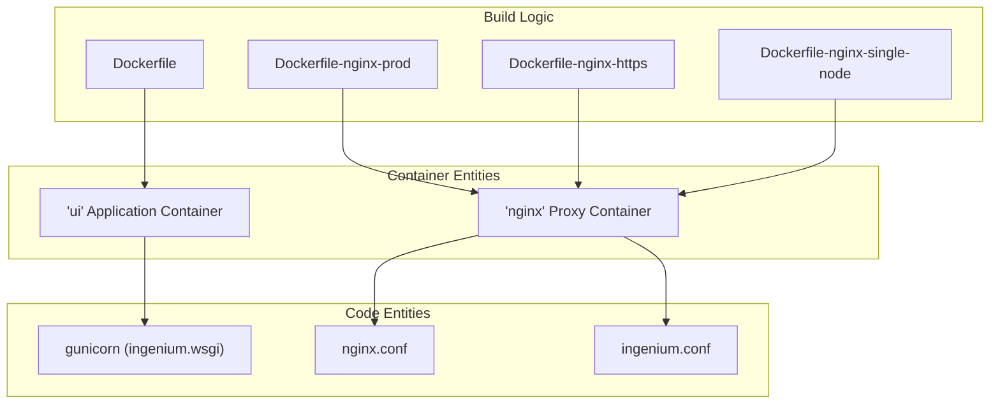
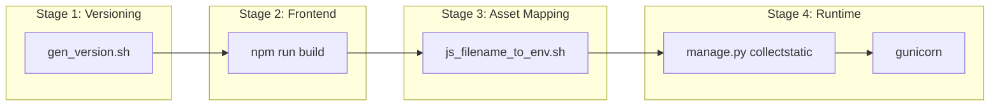

# Containerization and Deployment

Relevant source files

The following files were used as context for generating this wiki page:

- [Dockerfile](Dockerfile)
- [Dockerfile-nginx-https](Dockerfile-nginx-https)
- [Dockerfile-nginx-prod](Dockerfile-nginx-prod)
- [Dockerfile-nginx-single-node](Dockerfile-nginx-single-node)
- [Dockerfile-nginx-single-node-ui_dev](Dockerfile-nginx-single-node-ui_dev)

The Ingenium UI deployment strategy relies on a multi-container Docker architecture designed to support diverse environments, ranging from local development and single-node instances to production clusters (Docker Swarm). The system separates concerns into a Python/Django application container and an Nginx reverse proxy container, which handles static asset delivery and request routing to various backend microservices.

## High-Level Deployment Architecture

The deployment consists of two primary image types: the **UI (Application) Image** and the **Nginx (Proxy/Static) Image**. The UI image runs the Django backend using Gunicorn, while the Nginx image serves the compiled Vue.js SPA and proxies API requests to the appropriate internal or external services.

### Deployment Component Mapping

The following diagram maps the high-level deployment components to the specific Dockerfiles and configuration templates used to generate them.

**Deployment Entity Mapping**

Sources: [Dockerfile:1-3](), [Dockerfile-nginx-prod:1-1](), [Dockerfile-nginx-https:1-4](), [Dockerfile-nginx-single-node:1-4]()

---

## Docker Build Pipelines

The build process utilizes multi-stage Dockerfiles to optimize image size and security. The pipeline involves generating version strings from Git, compiling the Vue.js frontend, mapping hashed JavaScript filenames to environment variables for Django, and hardening the runtime environment.

Key aspects of the build pipeline include:
*   **Multi-Stage Compilation**: Using `node:8.11.1-alpine` to build the frontend and `python:3.8.2` for the backend and static file collection.
*   **Dynamic Asset Mapping**: The script `js_filename_to_env.sh` is used to identify hashed JS bundles and export their names as environment variables so Django can inject the correct `<script>` tags into templates.
*   **Security Hardening**: The application container creates a non-privileged `ingenium` user to run the Gunicorn process.

For details on specific build stages and security configurations, see [Docker Build Pipelines](#4.1).

### Build Stage Flow

Sources: [Dockerfile:5-11](), [Dockerfile:14-24](), [Dockerfile:29-35](), [Dockerfile:52-75]()

---

## Nginx Configuration and Runtime Scripts

Nginx serves as the entry point for all traffic. It is responsible for serving the static files collected by Django and the compiled Vue.js bundles. Crucially, it acts as a reverse proxy, routing `/api/` calls and other service-specific paths to the backend microservices (Core, Auth, Dictionary, etc.).

The configuration is dynamic:
*   **Template Substitution**: Scripts like `eval_file.sh` and `eval_file_prod.sh` perform environment variable substitution on Nginx `.template.conf` files at container startup.
*   **Environment Flexibility**: Different configurations exist for standard HTTP (`ingenium.conf`), HTTPS (`ingenium-https.conf`), and local development (`ingenium-single-node-ui_dev.template.conf`).
*   **Host Resolution**: For local development, `set_host_docker_internal.sh` ensures the container can resolve the host machine's IP.

For details on Nginx routing rules and template scripts, see [Nginx Configuration and Runtime Scripts](#4.2).

### Summary of Deployment Targets

| Target | Dockerfile | Primary Configuration | Port |
| :--- | :--- | :--- | :--- |
| **Production (Swarm)** | `Dockerfile-nginx-prod` | `ingenium.conf` | 8011 |
| **Production (HTTPS)** | `Dockerfile-nginx-https` | `ingenium-https.conf` | 443 |
| **Single Node** | `Dockerfile-nginx-single-node` | `ingenium-single-node.template.conf` | 80 |
| **UI Dev Proxy** | `Dockerfile-nginx-single-node-ui_dev` | `ingenium-single-node-ui_dev.template.conf` | 80 |

Sources: [Dockerfile-nginx-prod:39-43](), [Dockerfile-nginx-https:51-55](), [Dockerfile-nginx-single-node:65-69](), [Dockerfile-nginx-single-node-ui_dev:20-25]()
