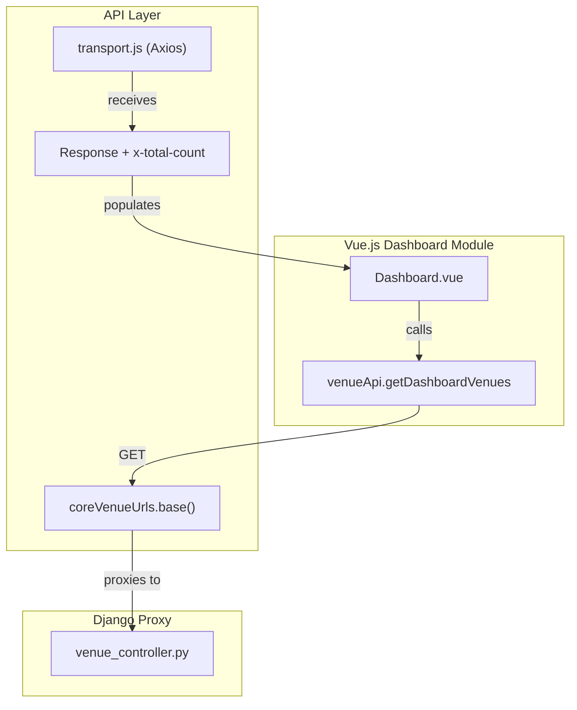
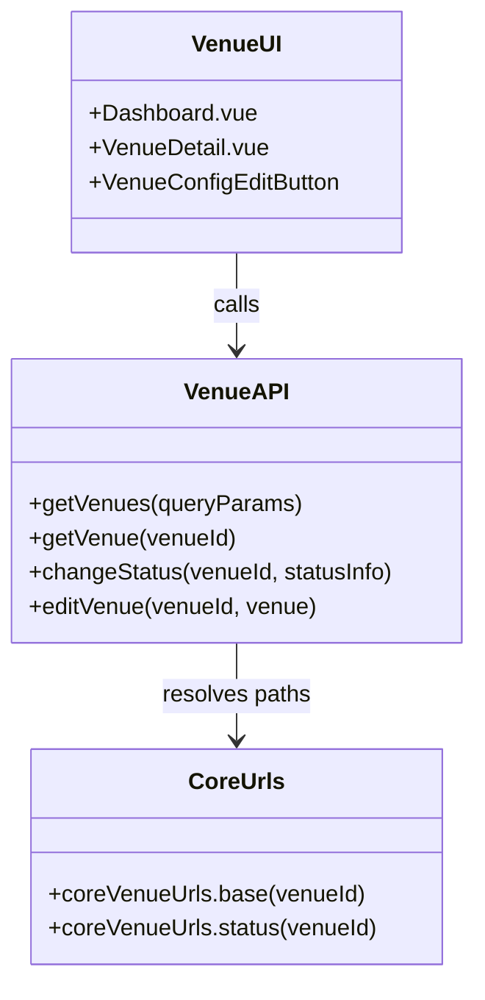

# Dashboard, Search, Reporting, and Other Modules

Relevant source files

The following files were used as context for generating this wiki page:

- [src/client/src/api/report-urls.js](src/client/src/api/report-urls.js)
- [src/client/src/api/report.js](src/client/src/api/report.js)
- [src/client/src/api/search-url.js](src/client/src/api/search-url.js)
- [src/client/src/api/search.js](src/client/src/api/search.js)
- [src/client/src/api/venue.js](src/client/src/api/venue.js)

This section documents the auxiliary frontend modules that support venue management, cross-system data retrieval, and document generation. These modules are built as independent Vue.js applications, each compiled into its own JavaScript bundle and served via Django templates.

## Dashboard Module

The Dashboard provides a high-level overview of system status through interactive venue tiles. It implements complex filtering, real-time status updates, and pagination for managing large sets of operational venues.

### Implementation and Data Flow
The Dashboard uses `venueApi.getDashboardVenues` to fetch venue data from the Core service [src/client/src/api/venue.js:62-74](). It processes the `x-total-count` header from the backend response to manage pagination [src/client/src/api/venue.js:53-54]().

### Key Components
- **Venue Tiles**: Visual representations of individual venues, displaying current status and active executions.
- **Filtering**: Allows users to narrow down venues by status, group, or name.
- **Pagination**: Handles the display of venue subsets to maintain performance.

### Dashboard Data Retrieval Flow
The following diagram illustrates how the Dashboard interacts with the API layer to populate the UI.

Title: Dashboard Data Retrieval

Sources: [src/client/src/api/venue.js:46-74](), [src/client/src/api/core-urls.js:3-3]()

## Search Module

The Search module provides an interface for querying historical data across procedures and executions using Elasticsearch. It supports building complex queries, saving search rules, and exporting results.

### Query Management
Users interact with the `QueryBuilder` to construct search parameters. These parameters can be persisted via `searchApi.saveQueryBuilder` [src/client/src/api/search.js:42-54](). The backend storage for these rules is accessed through the `/search_server/api/v1/querybuilders` endpoint [src/client/src/api/search-url.js:5-11]().

### Search Execution
Actual searches are performed by posting query objects to the `search` endpoint [src/client/src/api/search.js:70-82]().

| Function | Endpoint | Method | Purpose |
| :--- | :--- | :--- | :--- |
| `getAllQueryBuilder` | `/querybuilders` | GET | Retrieves all saved search rules [src/client/src/api/search.js:4-21]() |
| `saveQueryBuilder` | `/querybuilders` | POST | Persists a new search rule [src/client/src/api/search.js:42-54]() |
| `searchElasticService` | `/search` | POST | Executes the search against Elasticsearch [src/client/src/api/search.js:70-82]() |

Sources: [src/client/src/api/search.js:1-93](), [src/client/src/api/search-url.js:1-21]()

## Reporting Module

The Reporting module handles the generation of PDF and Excel documents for procedures, execution logs, and difference reports.

### Report Types and Formats
- **Execution Reports**: Generated as PDFs including comments and activity logs [src/client/src/api/report.js:30-42]().
- **Procedure Reports**: PDF exports of procedure definitions [src/client/src/api/report.js:44-54]().
- **Excel Exports**: Bulk execution data or search results exported in spreadsheet format [src/client/src/api/report.js:4-28]().
- **Difference Reports**: JSON-based comparison between two versions of a procedure or execution [src/client/src/api/report.js:57-72]().

### Technical Implementation
The module uses a specialized `arraybuffer` response type in Axios to handle binary file downloads for PDFs and Excel files [src/client/src/api/report.js:8-12](), [src/client/src/api/report.js:34-40]().

Sources: [src/client/src/api/report.js:1-82](), [src/client/src/api/report-urls.js:1-25]()

## Venue Detail and Project Config

These modules provide granular control over specific venues and project-wide settings.

### Venue Detail
The Venue Detail page provides a deep dive into a specific venue's state and history.
- **ExecutionHistoryTable**: Displays a paginated list of past executions performed on the venue.
- **VenueConfigEditButton**: Triggers the interface to modify venue-specific configurations.
- **Status Management**: Uses `venueApi.changeStatus` to transition venues between states (e.g., Active, Suspended) with a 10-second timeout for safety [src/client/src/api/venue.js:89-96]().

### Project Config
This module manages the underlying dictionaries and scripts that drive the automation.
- **Dictionaries**: Management of Flight and SSE (Special Support Equipment) dictionaries.
- **Custom Scripts**: Interface for uploading and managing scripts used by the `custom_script` element.
- **VIS (Venue Information Service)**: Configuration for external telemetry and command interfaces.

### System Mapping: Venue Management
This diagram maps the UI concepts to the underlying API and URL definitions.

Title: Venue Management Code Mapping

Sources: [src/client/src/api/venue.js:40-120](), [src/client/src/api/core-urls.js:1-10]()

## Header and Global Navigation

The Header is a persistent component across all SPA modules, providing:
- **Module Switching**: Navigation between Authoring, Executions, Dashboard, and Admin.
- **User Context**: Displays the currently logged-in user and provides logout functionality.
- **Venue Context**: Shows the currently selected venue (if applicable) and allows quick switching.

The navigation state is often synchronized with the Django session to ensure that the backend remains aware of the user's active context during proxied requests.

Sources: [src/client/src/api/venue.js:1-123](), [src/client/src/api/report.js:1-82](), [src/client/src/api/search.js:1-93]()
