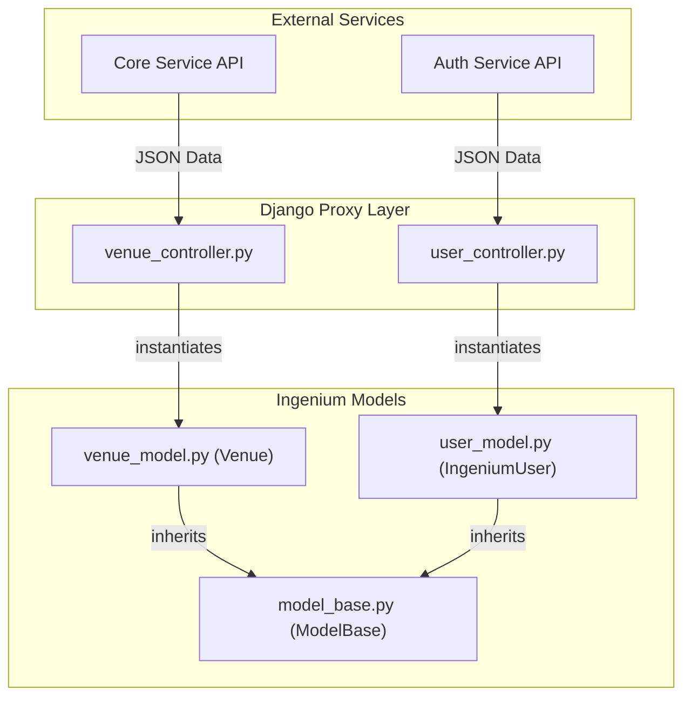
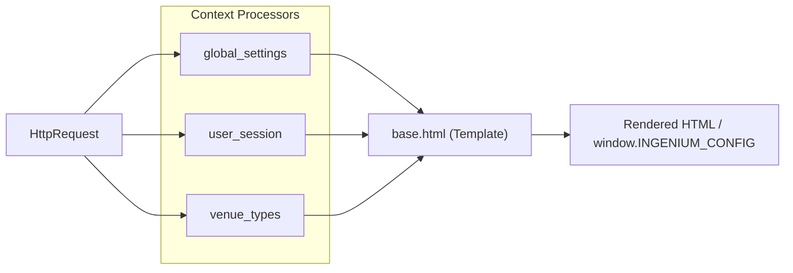

# Data Models and Context Processors

Relevant source files

The following files were used as context for generating this wiki page:

- [__init__.py](__init__.py)
- [_assets/wireframes/ingenium.bmpr](_assets/wireframes/ingenium.bmpr)

This page documents the Python-side data modeling and the context processor mechanism used in the Ingenium UI backend. While the application primarily functions as an orchestration layer that proxies requests to microservices, it maintains a robust set of internal Python models to represent domain entities (Procedures, Executions, Venues, etc.) and utilizes Django context processors to inject global state into the frontend templates.

## Model Architecture and Base Pattern

All domain models are located within the `ingenium_models/` directory. Rather than inheriting from `django.db.models.Model` (since the UI does not maintain its own primary database), these classes are standard Python objects designed to wrap JSON responses from the backend microservices.

### The ModelBase Pattern
The `ModelBase` class serves as the foundation for all domain entities. It provides a standardized constructor that maps dictionary keys (typically from API JSON responses) to object attributes.

*   **File:** `src/ingenium_models/model_base.py` [src/ingenium_models/model_base.py:1-20]()
*   **Implementation:** The `__init__` method iterates through a dictionary and sets attributes on the instance. If a key is not found, it defaults to `None`.

### IngeniumSettings Helper
The `IngeniumSettings` class provides a singleton-like interface for accessing environment-specific configurations and API endpoint definitions defined in the Django settings.

*   **File:** `src/ingenium_models/ingenium_settings.py` [src/ingenium_models/ingenium_settings.py:1-35]()

## Domain Models

The following table summarizes the key models used to represent system entities:

| Model Class | Source File | Description |
| :--- | :--- | :--- |
| `Procedure` | `src/ingenium_models/procedure_model.py` | Represents a spacecraft procedure, including metadata like `id`, `name`, `version`, and `status`. |
| `Execution` | `src/ingenium_models/execution_model.py` | Represents an active or historical procedure execution run. |
| `Venue` | `src/ingenium_models/venue_model.py` | Represents a test or flight venue (e.g., VAFB, JPL-Testbed). Includes `venue_type` and `status`. |
| `IngeniumUser` | `src/ingenium_models/user_model.py` | Represents an authenticated user, storing JWT tokens and profile information. |
| `Role` | `src/ingenium_models/role_model.py` | Represents a collection of permissions assigned to users. |
| `Dictionary` | `src/ingenium_models/dictionary_model.py` | Wraps telemetry and command dictionary definitions used during authoring. |
| `Verification` | `src/ingenium_models/verification_model.py` | Represents automated or manual verification steps within a procedure. |

### Data Flow: API to Model
The following diagram illustrates how raw JSON data from backend services is transformed into these Python entities.

**Entity Transformation Flow**

**Sources:** [src/ingenium_models/model_base.py:1-20](), [src/ingenium_models/venue_model.py:1-15](), [src/ingenium_models/user_model.py:1-25]()

## Context Processors

Context processors are functions that return a dictionary to be merged into the template context for every `HttpRequest`. Ingenium UI uses three primary processors to ensure the frontend SPA shell has access to critical configuration and session state.

### 1. Global Settings (`global_settings`)
This processor injects application-wide constants and environment variables into the templates. This includes the `SERVER_ENVIRONMENT` (e.g., 'local', 'prod') and the hashed filenames for Vue.js bundles.

*   **File:** `src/ingenium_ui/context_processors.py` [src/ingenium_ui/context_processors.py:10-25]()
*   **Key Data:** `JS_BUNDLE_NAMES`, `APP_VERSION`, `API_URLS`.

### 2. User Session (`user_session`)
Injects the current user's profile and authentication status. This allows templates to conditionally render navigation elements based on permissions.

*   **File:** `src/ingenium_ui/context_processors.py` [src/ingenium_ui/context_processors.py:28-40]()
*   **Key Data:** `request.user` (an instance of `IngeniumUser`), `is_authenticated`.

### 3. Venue Types (`venue_types`)
Injects a cached list of available venue types (e.g., "Flight", "Simulation") retrieved from the Venue Service. This is used by the dashboard and venue-creation modals.

*   **File:** `src/ingenium_ui/context_processors.py` [src/ingenium_ui/context_processors.py:43-55]()

### Context Injection Diagram
The following diagram maps the relationship between the Django request lifecycle and the injection of these data entities into the final HTML/JavaScript shell.

**Template Context Injection Architecture**

**Sources:** [src/ingenium_ui/context_processors.py:1-60](), [src/ingenium_models/ingenium_settings.py:1-20]()

## Implementation Details: `ingenium_models`

### Procedure Model Example
The `Procedure` model demonstrates how attributes are explicitly defined while still utilizing the `ModelBase` flexible initialization.

*   **Definition:** `src/ingenium_models/procedure_model.py` [src/ingenium_models/procedure_model.py:5-30]()
*   **Attributes:** Includes `procedure_id`, `version_number`, `steps`, and `author`.

### Execution Model Example
The `Execution` model tracks the state of a procedure as it runs through the engine.

*   **Definition:** `src/ingenium_models/execution_model.py` [src/ingenium_models/execution_model.py:5-25]()
*   **Attributes:** Includes `execution_id`, `start_time`, `end_time`, `current_step_index`, and `status` (e.g., RUNNING, PAUSED, COMPLETED).

**Sources:**
- `src/ingenium_models/model_base.py`
- `src/ingenium_models/ingenium_settings.py`
- `src/ingenium_models/procedure_model.py`
- `src/ingenium_models/execution_model.py`
- `src/ingenium_models/venue_model.py`
- `src/ingenium_ui/context_processors.py`
