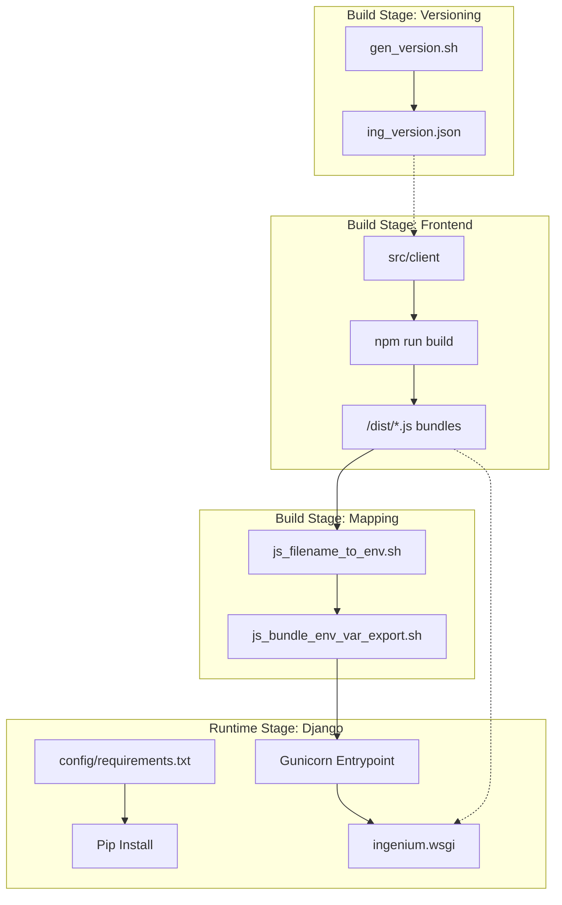
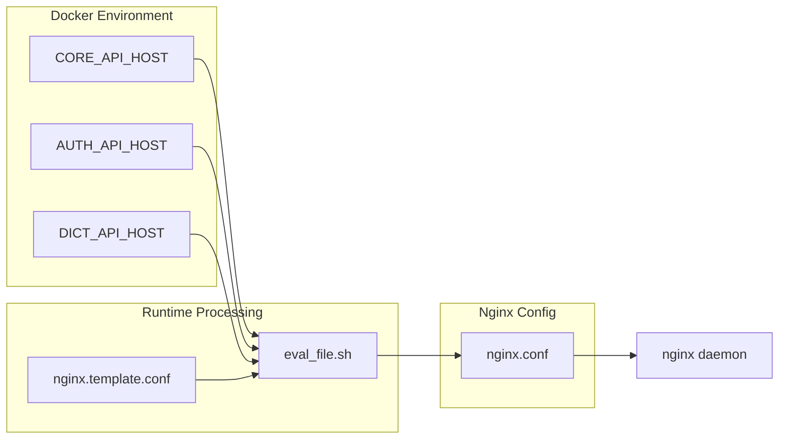

# Docker Build Pipelines

Relevant source files

The following files were used as context for generating this wiki page:

- [Dockerfile](Dockerfile)
- [Dockerfile-nginx-https](Dockerfile-nginx-https)
- [Dockerfile-nginx-prod](Dockerfile-nginx-prod)
- [Dockerfile-nginx-single-node](Dockerfile-nginx-single-node)
- [Dockerfile-nginx-single-node-ui_dev](Dockerfile-nginx-single-node-ui_dev)
- [gen_version.sh](gen_version.sh)
- [js_filename_to_env.sh](js_filename_to_env.sh)
- [package-lock.json](package-lock.json)

This page documents the containerization strategy for the Ingenium UI. The project utilizes a multi-stage Docker build process to handle Git versioning, frontend compilation, JS bundle mapping, and Python runtime configuration. Multiple Dockerfile variants exist to support different deployment targets ranging from production Swarm clusters to single-node environments and local development proxies.

## Main Application Pipeline

The primary `Dockerfile` produces the `ui` image containing the Django backend and the compiled Vue.js frontend. It follows a four-stage build process to ensure the final image is lean and secure.

### Stage 1: Versioning (`python` stage)
Uses a Python base image to execute `gen_version.sh`. This script parses the Git state to generate a version string saved to `src/client/src/assets/ing_version.json` [gen_version.sh:34-35]().
*   **Logic**: If the branch is modified, it appends `-MOD` to the hash [gen_version.sh:16-16]().
*   **Output**: A JSON file containing the version used by the UI for display.

### Stage 2: JS Compilation (`node` stage)
Compiles the Vue.js source into static bundles using `npm run build-single-node` [Dockerfile:24-24]().
*   **Optimization**: Runs `npm rebuild node-sass` to ensure binary compatibility within the Alpine environment [Dockerfile:22-22]().

### Stage 3: Bundle Mapping (`bash` stage)
Because Webpack generates hashed filenames (e.g., `authoring-a1b2c3-bundle.js`), the Django backend needs a way to know the exact filename to inject into templates.
*   **Script**: `js_filename_to_env.sh` scans the `/dist` directory [js_filename_to_env.sh:27-27]().
*   **Action**: It converts filenames into environment variables (e.g., `AUTHORING_JS_BUNDLE`) and writes them to `js_bundle_env_var_export.sh` [js_filename_to_env.sh:42-42]().

### Stage 4: Runtime (`ingenium` user stage)
The final stage prepares the Python 3.8 environment.
*   **Security**: Creates a system user `ingenium` with no login shell [Dockerfile:52-56]().
*   **Permissions**: The application root `/src` is owned by the `ingenium` user [Dockerfile:59-59]().
*   **Entrypoint**: Sources the `js_bundle_env_var_export.sh` script before starting Gunicorn to ensure the Django process has access to the correct JS bundle names [Dockerfile:74-75]().

### Data Flow: Code to Container
The following diagram illustrates how source code and scripts transition through the multi-stage build to form the final runtime environment.

"Build Pipeline Entity Mapping"

Sources: [Dockerfile:1-77](), [gen_version.sh:1-35](), [js_filename_to_env.sh:1-48]()

---

## Nginx Pipeline Variants

The project maintains several Nginx Dockerfiles tailored for specific network architectures and security requirements.

### Production and HTTPS Variants
*   **`Dockerfile-nginx-prod`**: Used for standard production deployments (e.g., Docker Swarm). It compiles the Node frontend, runs Django `collectstatic` to gather all assets, and serves them via Nginx on port 8011 [Dockerfile-nginx-prod:1-45]().
*   **`Dockerfile-nginx-https`**: Extends the production logic but configures Nginx for SSL on port 443. It uses `ingenium-https.conf` as a template [Dockerfile-nginx-https:52-56]().

### Single-Node Deployment
*   **`Dockerfile-nginx-single-node`**: Designed for standalone deployments where all services might reside on one host. It includes environment variables for all backend microservice hosts (Core, Auth, Dict, etc.) [Dockerfile-nginx-single-node:52-62]().
*   **Logic**: It uses `eval_file.sh` at runtime to perform variable substitution on `ingenium-single-node.template.conf`, allowing dynamic upstream routing based on environment variables [Dockerfile-nginx-single-node:67-67]().

### UI Development Proxy
*   **`Dockerfile-nginx-single-node-ui_dev`**: A specialized container for frontend developers. It does **not** serve static files. Instead, it acts as a reverse proxy to route API calls to backend services while the developer runs the Vue dev server locally [Dockerfile-nginx-single-node-ui_dev:1-3]().
*   **Feature**: Includes `set_host_docker_internal.sh` to resolve the host machine's IP, enabling the container to talk to services running outside of Docker [Dockerfile-nginx-single-node-ui_dev:21-21]().

### Comparison of Nginx Dockerfiles

| Dockerfile | Purpose | Port | Static Files | Key Config Template |
| :--- | :--- | :--- | :--- | :--- |
| `Dockerfile-nginx-prod` | Swarm Production | 8011 | Included | `ingenium.conf` |
| `Dockerfile-nginx-https` | Secure Production | 443 | Included | `ingenium-https.conf` |
| `Dockerfile-nginx-single-node` | Standalone App | 80 | Included | `ingenium-single-node.template.conf` |
| `Dockerfile-nginx-single-node-ui_dev` | Dev Proxy | 80 | No | `ingenium-single-node-ui_dev.template.conf` |

Sources: [Dockerfile-nginx-prod:1-46](), [Dockerfile-nginx-https:1-57](), [Dockerfile-nginx-single-node:1-70](), [Dockerfile-nginx-single-node-ui_dev:1-26]()

---

## Utility Scripts and Hardening

### Bundle Mapping Logic
The `js_filename_to_env.sh` script is critical for the Django/Vue integration. It parses files matching the `*bundle*` pattern [js_filename_to_env.sh:28-28]().
1.  It splits the filename by the `-` delimiter [js_filename_to_env.sh:29-29]().
2.  It reconstructs the base name (e.g., `authoring`) and converts it to uppercase [js_filename_to_env.sh:42-42]().
3.  It exports a variable like `AUTHORING_JS_BUNDLE=authoring-9283sh-bundle.js` which the Django `settings.py` later consumes to render `<script>` tags.

### Security Hardening
The main application image implements several security best practices:
*   **Non-root User**: The process runs as `APP_USER` (`ingenium`) [Dockerfile:46-46]().
*   **No Shell**: The user is created with `-s /usr/sbin/nologin` to prevent interactive shell access [Dockerfile:55-55]().
*   **Minimal Surface**: Alpine-based images are used for Node and Nginx stages to reduce the attack surface [Dockerfile:14-14](), [Dockerfile-nginx-prod:36-36]().

### Build-to-Runtime Variable Flow
The diagram below shows how environment variables defined in the Dockerfiles are propagated into the Nginx configuration templates.

"Environment Variable Propagation"

Sources: [Dockerfile-nginx-single-node:52-67](), [Dockerfile-nginx-single-node-ui_dev:5-21]()
