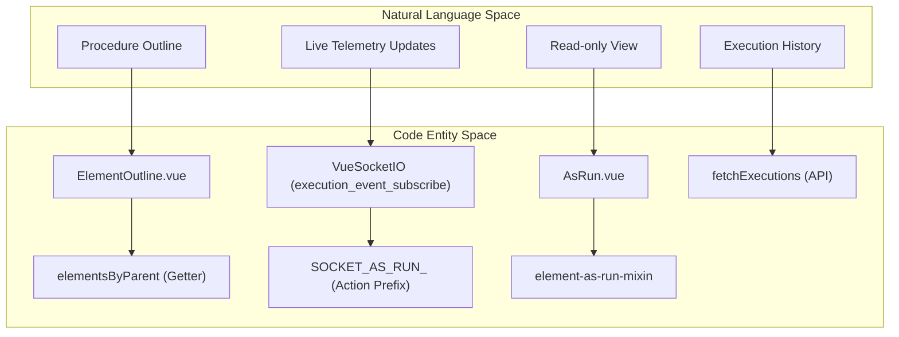
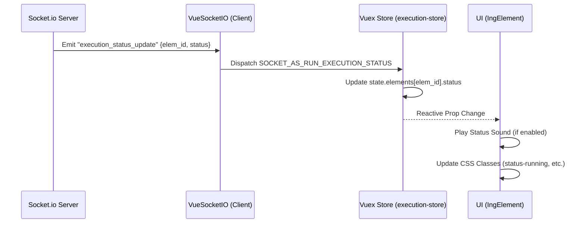

# Execution and As-Run Modules

Relevant source files

The following files were used as context for generating this wiki page:

- [src/client/src/api/execution.js](src/client/src/api/execution.js)
- [src/client/src/modules/as-run/AsRun.vue](src/client/src/modules/as-run/AsRun.vue)
- [src/client/src/modules/as-run/AsRunRouter.vue](src/client/src/modules/as-run/AsRunRouter.vue)
- [src/client/src/modules/as-run/MainPanel.vue](src/client/src/modules/as-run/MainPanel.vue)
- [src/client/src/modules/as-run/as-run.js](src/client/src/modules/as-run/as-run.js)
- [src/client/src/modules/as-run/side-panel/ElementOutline.vue](src/client/src/modules/as-run/side-panel/ElementOutline.vue)
- [src/client/src/modules/as-run/side-panel/SidePanel.vue](src/client/src/modules/as-run/side-panel/SidePanel.vue)

The Execution and As-Run modules provide the interface for running spacecraft procedures in real-time and reviewing historical execution data. The system utilizes WebSockets for live telemetry and execution status updates, while the As-Run module provides a read-only, audited view of completed or ongoing activities.

## Execution Module Overview

The execution module is responsible for the active lifecycle of a procedure. It manages the state of executable elements, handles user inputs (manual verifications, inputs), and coordinates with the backend "Execution Monitor Service" via WebSockets.

### Key Components

*   **Execution.vue**: The primary container for the execution interface. It initializes the WebSocket connection and fetches the initial execution state [src/client/src/modules/execution/Execution.vue:35-51]().
*   **ExecutionStatus.vue**: Displays the current high-level state of the execution (e.g., Running, Paused, Aborted) and provides global controls [src/client/src/modules/execution/ExecutionStatus.vue:1-15]().
*   **ExecutionToolbar.vue**: Contains action buttons for controlling the flow, such as "Step", "Resume", and "Pause" [src/client/src/modules/execution/ExecutionToolbar.vue:1-20]().
*   **KickoutModal.vue**: Handles scenarios where a user is forcibly removed from an execution session or when a session is hijacked by another user.

### Execution Data Flow and State Management

The `execution-store.js` manages the complex state of an active run, including the list of elements, their current execution status, and metadata.

| Function/Action | Description | File Reference |
| :--- | :--- | :--- |
| `fetchExecution` | Retrieves the execution object from the Core API. | [src/client/src/api/execution.js:92-100]() |
| `patchExecution` | Updates execution metadata (e.g., title, tags). | [src/client/src/api/execution.js:61-71]() |
| `refreshExecution` | Forces a state refresh from the execution engine. | [src/client/src/api/execution.js:82-90]() |
| `SOCKET_AS_RUN_EXECUTION_STATUS` | Vuex action triggered by WebSocket events to update element status. | [src/client/src/modules/as-run/as-run.js:52-53]() |

**Sources:** [src/client/src/api/execution.js](), [src/client/src/modules/execution/Execution.vue]()

## As-Run Module

The As-Run module (`AsRun.vue`) provides a view-only interface for reviewing executions. It is designed to look identical to the execution interface but with interaction disabled, serving as the "Electronic Procedure" record.

### Structural Organization

The As-Run interface is split into a Side Panel for navigation and a Main Panel for content display.

*   **MainPanel.vue**: Renders the `VenueDetails` and the `IngElementWrapper`, which recursively renders the procedure's elements [src/client/src/modules/as-run/MainPanel.vue:3-12]().
*   **SidePanel.vue**: Contains tabs for the Procedure Outline, Search, and Review (Comments) [src/client/src/modules/as-run/side-panel/SidePanel.vue:11-36]().
*   **ElementOutline.vue**: A recursive component that builds a navigable tree of the procedure based on `element.number` and `element.title` [src/client/src/modules/as-run/side-panel/ElementOutline.vue:11-19]().

### Natural Language to Code Entity Mapping: As-Run UI

The following diagram maps user-facing concepts to the specific Vue components and store entities that implement them.

**Sources:** [src/client/src/modules/as-run/AsRun.vue](), [src/client/src/modules/as-run/side-panel/ElementOutline.vue](), [src/client/src/modules/as-run/as-run.js]()

## Real-time Status via WebSockets

Real-time updates are handled by `vue-socket.io`. The connection is established using a JWT for authentication and subscribes to a specific `execution_id`.

### WebSocket Implementation Details
*   **Endpoint**: `/api/v2/execution_event_subscribe` [src/client/src/modules/as-run/as-run.js:45]().
*   **Path**: `/execution_monitor/socket.io` [src/client/src/modules/as-run/as-run.js:55]().
*   **Lifecycle**:
    1.  `connect()`: Emits `set-execution-id` to the server [src/client/src/modules/as-run/AsRun.vue:67]().
    2.  `SOCKET_AS_RUN_...`: Events are automatically mapped to Vuex actions via the `actionPrefix` [src/client/src/modules/as-run/as-run.js:52]().
    3.  `disconnect()`: Called in `beforeRouteLeave` to clean up resources [src/client/src/modules/as-run/AsRun.vue:56]().

### Execution Status Transitions

The system tracks statuses such as `READY`, `RUNNING`, `COMPLETED`, `FAILED`, and `ABORTED`. When a status change arrives via WebSocket, the `execution-store` updates the specific element in the `elements` state object, triggering a reactive UI update.

**Sources:** [src/client/src/modules/as-run/as-run.js](), [src/client/src/modules/as-run/AsRun.vue]()

## Audio Feedback and Element Sounds

The UI provides auditory cues for step-level transitions to assist operators during critical maneuvers.

*   **Implementation**: Sounds are triggered based on status changes (e.g., a "success" chime for `COMPLETED` or an "alert" for `FAILED`).
*   **Configuration**: Users can toggle audio feedback via the Execution Toolbar or user preferences.
*   **Mixins**: The `element-as-run-mixin` and `entry-as-run-mixin` handle the logic for reacting to status changes and playing the appropriate audio file [src/client/src/modules/as-run/as-run.js:23-24]().

## Execution List and Filtering

The `fetchExecutions` function in the API layer handles the retrieval of historical runs with support for complex filtering and pagination.

*   **Query Parameters**: Supports `venue_id`, `sort`, `limit`, and `offset` [src/client/src/api/execution.js:7-13]().
*   **Dynamic Filters**: Converts camelCase frontend filters to snake_case for the Core API [src/client/src/api/execution.js:14-16]().
*   **Headers**: Reads `x-total-count` from response headers to support pagination UI [src/client/src/api/execution.js:20]().

**Sources:** [src/client/src/api/execution.js](), [src/client/src/modules/as-run/side-panel/SidePanel.vue]()
