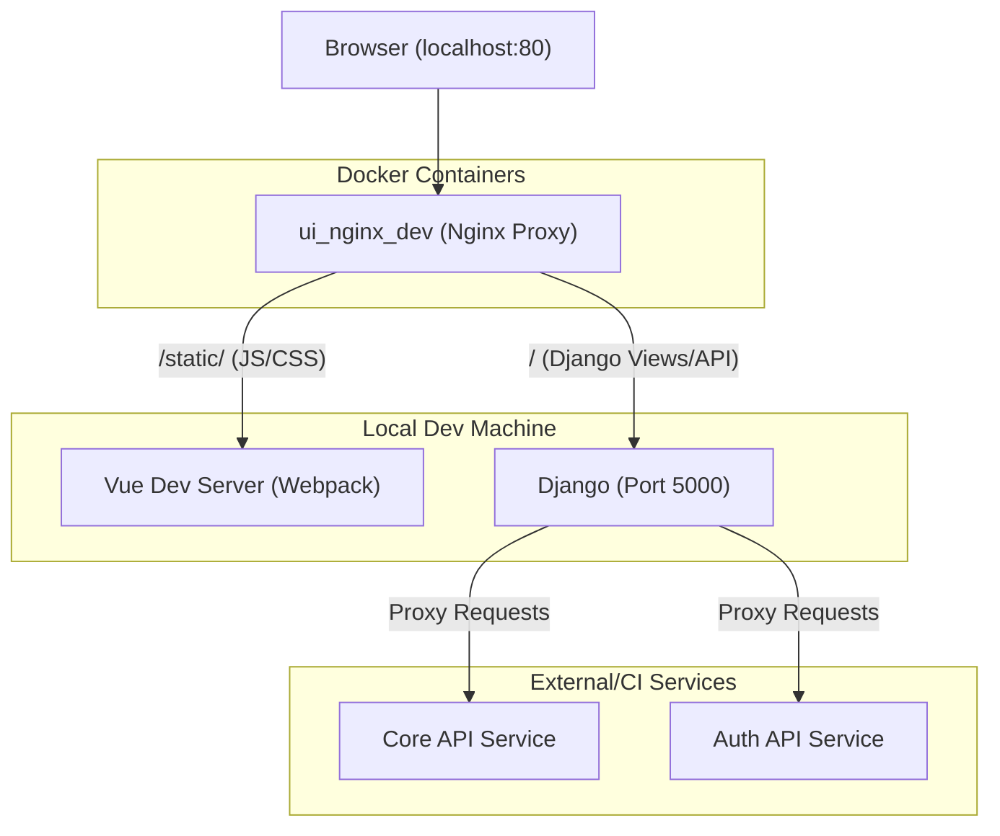
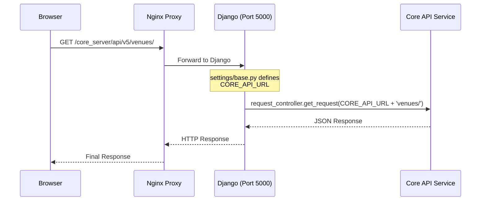

# Getting Started — Local Development Setup

<details>
<summary>Relevant source files</summary>

The following files were used as context for generating this wiki page:

- [README.md](README.md)
- [config/requirements.txt](config/requirements.txt)
- [src/client/config/dev.env.js](src/client/config/dev.env.js)
- [src/client/config/index.js](src/client/config/index.js)
- [src/client/package.json](src/client/package.json)

</details>


This page provides a comprehensive guide for engineers to set up the Ingenium UI development environment. The architecture consists of a Django backend serving as an orchestration layer and a Vue.js frontend, both proxied through Nginx to handle cross-origin requests and service routing.

## 1. Prerequisites and Repository Setup

Before beginning, ensure your local machine has Python 3 and Node.js (v8.10.0 recommended) installed [src/client/package.json:172-174]().

### Cloning the Repository
Clone the repository from the internal JPL GitHub instance:
```bash
git clone https://github.jpl.nasa.gov/Ingenium/ui.git
```
[README.md:9-11]()

### Python Virtual Environment
It is recommended to use `virtualenv` to isolate application dependencies.
1. Create the environment: `virtualenv ~/ingenium-env` [README.md:13-15]().
2. Activate the environment: `source ~/ingenium-env/bin/activate` [README.md:17-19]().
3. Install dependencies: `pip install -r config/requirements.txt` [README.md:21-23]().

**Note:** Some packages are hosted on JPL's Artifactory. You must be on the JPL network or VPN to install these [README.md:37-38](). The `requirements.txt` file specifies the extra index URL for Artifactory [config/requirements.txt:1-1]().

### Node.js Dependencies
Navigate to the client directory and install JavaScript dependencies:
```bash
cd src/client
npm install
```

## 2. Environment Configuration

Ingenium UI relies heavily on environment variables to locate backend microservices and identify compiled JavaScript bundles.

### API URL Configuration
Define the following variables in your `.bash_profile` or `.bashrc`. These variables are consumed by the Django backend in `settings/base.py` to route requests to the appropriate microservices [README.md:172-175]().

| Variable | Example Value | Description |
| :--- | :--- | :--- |
| `CORE_API_URL` | `http://127.0.0.1:8002/api/v5/` | Core spacecraft logic service |
| `AUTH_API_URL` | `https://ingenium-ci.jpl.nasa.gov/auth_server/api/v2/` | Authentication server |
| `DICT_API_URL` | `https://ingenium-ci.jpl.nasa.gov/dict_service/api/v3/` | Dictionary service |
| `VENUE_CONFIG_API_URL` | `http://127.0.0.1:5151/api/v1/` | Venue configuration service |
| `SERVER_ENVIRONMENT` | `dev` (or empty) | Sets the execution context [README.md:73-74]() |

### JS Bundle Mapping
Because the frontend uses hashed filenames for production, local development requires explicit mapping of module names to their entry points [README.md:76-85]().

```bash
export AUTHORING_JS_BUNDLE=authoring-bundle.js
export DASHBOARD_JS_BUNDLE=dashboard-bundle.js
export EXECUTION_JS_BUNDLE=execution-bundle.js
# ... and other modules defined in README.md
```

### Secrets
Sensitive information like `JWT_SECRET` must be obtained from a team member via secure channels [README.md:41-43]().

**Sources:** [README.md:39-46](), [README.md:63-88](), [config/requirements.txt:1-20]()

## 3. Running the Application

The development setup requires three concurrent processes: the Nginx proxy, the Django server, and the Vue dev server.

### Local Development Architecture
The following diagram illustrates how the components interact during local development.

**Development Component Interaction**

**Sources:** [README.md:57-61](), [README.md:90-95]()

### Step 1: Nginx Proxy (via Docker)
Nginx handles CORS and routes requests to the correct backend services [README.md:57-58]().
1. Navigate to the `ingenium-dep` repository.
2. Build the dev proxy: `./compose_single_node/run_compose.sh build ui_nginx_dev` [README.md:90]().
3. Start the proxy: `./compose_single_node/run_compose.sh up ui_dev` [README.md:91]().

### Step 2: Django Backend
Run the Django server on port 5000. This port is expected by the Nginx proxy configuration.
```bash
cd src
./manage.py runserver 0.0.0.0:5000
```
[README.md:93]()

### Step 3: Vue.js Frontend
Start the Webpack dev server to watch for changes and recompile bundles.
```bash
cd src/client
npm run dev
```
The `npm run dev` script executes `gen_version.sh` and starts Webpack in watch mode [src/client/package.json:8]().

### Accessing the App
Once all services are running, access the application at `http://localhost`. Nginx will serve the frontend assets and proxy API calls to the Django server [README.md:95]().

## 4. Data Flow: From Request to Service

The Django backend acts as a thin proxy. When a request hits a Django view, it typically uses a controller to forward that request to a backend microservice.

**Request Proxy Flow**


**Sources:** [README.md:57-58](), [src/client/config/dev.env.js:5-6](), [README.md:172-175]()

## 5. Testing Infrastructure

### Unit Tests
Frontend unit tests use Karma and Jasmine [src/client/package.json:39-41]().
* **Interactive mode:** `npm run unit` (keeps browser open for debugging) [README.md:101-103]().
* **CI mode:** `npm run unit-ci` (single run, exits) [src/client/package.json:14]().

### E2E Tests
End-to-end tests use Nightwatch/Protractor and require ChromeDriver [README.md:112-113]().
1. Ensure `JWT_SECRET`, `TEST_USER`, and `TEST_PASS` are set [README.md:116-120]().
2. Run tests: `npm run e2e` [README.md:131]().

**Sources:** [README.md:98-131](), [src/client/package.json:8-16]()
