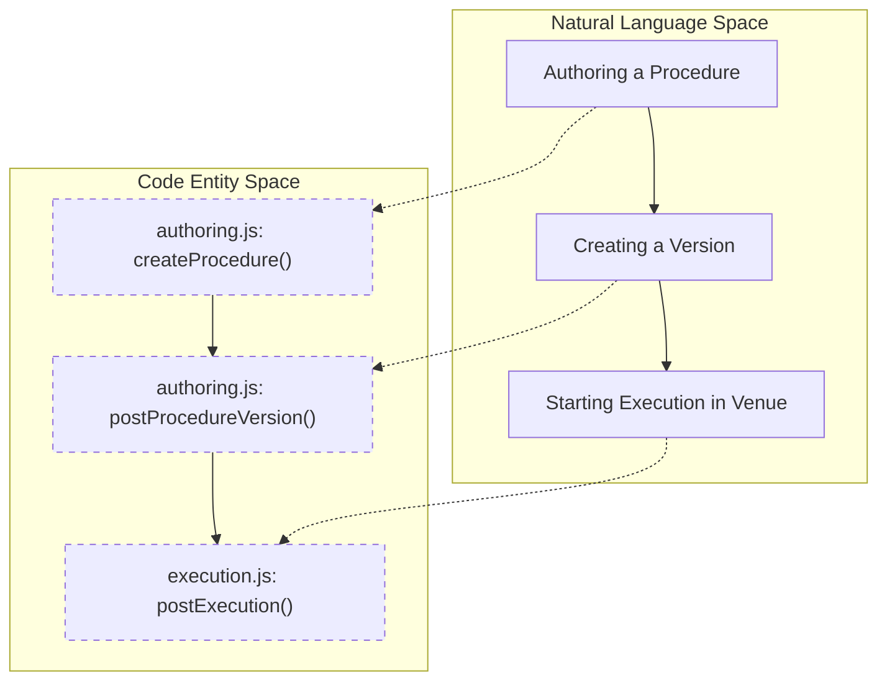
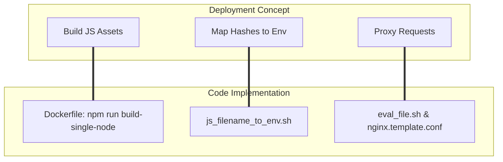

# Glossary

Relevant source files

The following files were used as context for generating this wiki page:

- [.gitignore](.gitignore)
- [Dockerfile](Dockerfile)
- [Dockerfile-nginx-single-node](Dockerfile-nginx-single-node)
- [eval_file.sh](eval_file.sh)
- [gen_version.sh](gen_version.sh)
- [js_filename_to_env.sh](js_filename_to_env.sh)
- [src/apps/ingenium_login/views/token_controller.py](src/apps/ingenium_login/views/token_controller.py)
- [src/client/src/api/authoring.js](src/client/src/api/authoring.js)
- [src/client/src/api/execution.js](src/client/src/api/execution.js)
- [src/client/src/api/transport.js](src/client/src/api/transport.js)
- [src/client/src/api/venue.js](src/client/src/api/venue.js)
- [src/client/src/assets/ing_version](src/client/src/assets/ing_version)

This page defines codebase-specific terminology, domain concepts, and technical jargon used throughout the Ingenium UI project. It serves as a reference for onboarding engineers to bridge the gap between spacecraft procedure domain knowledge and the underlying implementation.

## Domain & System Terms

### Procedure
A set of instructions or steps authored to be executed against a spacecraft or simulator. In the code, procedures are handled by the `authoring` module and stored in the Core API.
*   **Implementation**: Managed via `src/client/src/api/authoring.js` [src/client/src/api/authoring.js:6-15]().
*   **Data Model**: Defined in `ingenium_models/procedure_model.py`.

### Execution (As-Run)
The runtime instance of a procedure. When a procedure is "started" in a Venue, it becomes an Execution. The "As-Run" refers to the historical record of what actually occurred during that execution.
*   **Implementation**: Managed via `src/client/src/api/execution.js` [src/client/src/api/execution.js:5-27]().
*   **Data Flow**: Fetches real-time status updates via WebSockets and updates the `execution-store.js`.

### Venue
A logical environment where executions take place (e.g., a specific test bench, a simulator, or the flight vehicle). Venues have statuses (Active, Suspended, Closed).
*   **Implementation**: `src/client/src/api/venue.js` [src/client/src/api/venue.js:40-44]().
*   **Controller**: `venue_controller.py` in the Django backend handles the proxying of venue state changes [src/client/src/api/venue.js:89-96]().

### Element
The smallest unit of a procedure (a "step"). Elements can be commands (`cmd`), manual inputs, or logic gates like `wait` or `verify`.
*   **Implementation**: Located in `src/client/src/modules/elements/`.
*   **Fetch Logic**: `getExecutionElement` retrieves specific step data [src/client/src/api/execution.js:124-131]().

---

## Technical Jargon & Code Entities

### JS Bundle Mapping
Because the frontend is built into hashed bundles for cache busting (e.g., `authoring-a1b2c3d4-bundle.js`), the Django backend needs to know the exact filename to inject into templates.
*   **Mechanism**: `js_filename_to_env.sh` scans the `dist` folder and creates an environment variable export script [js_filename_to_env.sh:8-15]().
*   **Usage**: The Dockerfile runs this script to populate `js_bundle_env_var_export.sh`, which is then sourced by Gunicorn [Dockerfile:34-35](), [Dockerfile:73-75]().

### Token Controller
A backend utility module that manages JWT (JSON Web Token) operations, including extracting users from cookies and handling token renewal.
*   **Key Function**: `get_user_from_request` [src/apps/ingenium_login/views/token_controller.py:19-34]().
*   **Key Function**: `renew_token` handles the logic for refreshing expired sessions [src/apps/ingenium_login/views/token_controller.py:79-106]().

### Transport
The customized Axios instance used by the Vue.js frontend to communicate with the Django proxy. It includes interceptors for handling authentication headers and calculating server-client time drift.
*   **File**: `src/client/src/api/transport.js` [src/client/src/api/transport.js:1-9]().
*   **Time Drift**: The response interceptor calculates `ING_CLIENT_TIME_OFFSET_SECS` to ensure session expiration warnings are accurate regardless of local clock settings [src/client/src/api/transport.js:25-37]().

---

## System Architecture Diagrams

### Procedure Lifecycle: Authoring to Execution
The following diagram maps the conceptual lifecycle of a procedure to the specific code entities responsible for each phase.

**Procedure Data Flow**

**Sources**: [src/client/src/api/authoring.js:39-53](), [src/client/src/api/authoring.js:179-190](), [src/client/src/api/execution.js:73-80]()

### Infrastructure & Deployment Mapping
This diagram bridges the deployment concepts (Docker/Nginx) to the configuration scripts that manage the environment.

**Environment Configuration Mapping**

**Sources**: [Dockerfile:24-24](), [js_filename_to_env.sh:27-46](), [eval_file.sh:1-4](), [Dockerfile-nginx-single-node:64-67]()

---

## Abbreviations Table

| Abbreviation | Full Name | Definition | Code Reference |
| :--- | :--- | :--- | :--- |
| **VNV** | Verification and Validation | Services related to testing and confirming procedure requirements. | `authenticate_vnv_user` in `token_controller.py` [src/apps/ingenium_login/views/token_controller.py:70-76]() |
| **JWT** | JSON Web Token | The standard used for secure authentication between the UI and backend. | `transport.js` [src/client/src/api/transport.js:2-3]() |
| **SPA** | Single Page Application | The Vue.js architecture where the browser loads a single shell and updates dynamically. | `src/client/src/modules/` |
| **SSE** | Space System Engineering | Domain-specific dictionary types used in procedure elements. | `authoring.js` and `dictionary.js` |

**Sources**: [src/apps/ingenium_login/views/token_controller.py:70-76](), [src/client/src/api/transport.js:1-7](), [js_filename_to_env.sh:1-18]()
