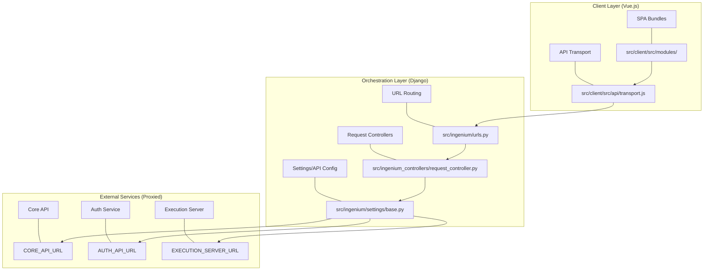
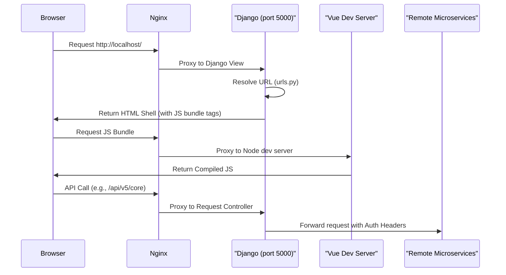

# Ingenium UI — Project Overview

Relevant source files

The following files were used as context for generating this wiki page:

- [.gitignore](.gitignore)
- [README.md](README.md)
- [__init__.py](__init__.py)

The **Ingenium UI** is a NASA JPL web application designed for the authoring and execution of spacecraft procedures. It serves as the primary human-machine interface for operators to create, manage, and monitor complex sequences of commands and telemetry verifications during spacecraft testing and operations.

The system is designed as a hybrid architecture, combining a **Django** backend that manages sessions and proxies requests with a **Vue.js** frontend composed of several feature-specific Single Page Applications (SPAs).

## High-Level Architecture

The project utilizes a three-tier architectural approach to ensure security, performance, and modularity:

1.  **Nginx Reverse Proxy**: Acts as the entry point for all traffic. It handles CORS by capturing `OPTIONS` requests [README.md:57-58]() and routes traffic between the Django backend and various microservices.
2.  **Django Backend**: Functions as a thin orchestration layer. It handles user authentication (via JWT and LDAP), session management, and serves as a secure proxy to backend APIs like Core, Auth, and Execution services [README.md:57-58]().
3.  **Vue.js SPA Frontend**: A collection of modular Single Page Applications. Each major feature (e.g., Authoring, Execution, Dashboard) is bundled separately to optimize load times and maintainability [README.md:76-85]().

### System Component Mapping
The following diagram maps high-level system components to their corresponding entities in the codebase.

**System Architecture and Code Mapping**

**Sources:** [README.md:63-88](), [README.md:172-177]()

## External Service Dependencies

Ingenium UI does not maintain its own primary database for spacecraft data; instead, it orchestrates data from several external microservices. These are configured via environment variables and defined centrally in the Django settings [README.md:63-88](), [README.md:172-177]().

| Service | Environment Variable | Purpose |
| :--- | :--- | :--- |
| **Core API** | `CORE_API_URL` | Primary procedure and metadata storage. |
| **Auth API** | `AUTH_API_URL` | User authentication and JWT issuance. |
| **Execution** | `EXECUTION_SERVER_URL` | Real-time procedure execution and telemetry. |
| **Dictionary** | `DICT_API_URL` | Command and telemetry definitions (Flight/SSE). |
| **Search** | `SEARCH_API_URL` | ElasticSearch-backed procedure and execution search. |
| **Report** | `REPORT_API_URL` | Generation of As-Run and summary reports. |

**Sources:** [README.md:63-88]()

## Project Workflow and Code Organization

The repository is structured to separate the Python/Django environment from the Node.js/Vue.js environment.

*   **`src/`**: Contains the Django project, including settings, URL configurations, and controllers.
*   **`src/client/`**: Contains the Vue.js source code, including components, Vuex stores, and the build pipeline.
*   **`config/`**: Contains environment-specific requirements and configuration files.

**Code Entity Interaction**

**Sources:** [README.md:90-96](), [README.md:57-58]()

## Wiki Navigation

To dive deeper into specific areas of the Ingenium UI project, refer to the following child pages:

*   **[Getting Started — Local Development Setup](#1.1)**: Detailed instructions on setting up your local environment, including virtualenv, environment variables, and running the Nginx proxy [README.md:1-55]().
*   **[Repository Structure and Configuration Files](#1.2)**: A guide to the file system, including how Git handles lock files and the purpose of root-level configuration files [README.md:92](), [.gitignore:1-88]().

For technical details on the backend and frontend architectures, see the subsequent main sections of the wiki.

**Sources:** [README.md:1-177](), [.gitignore:1-88]()
