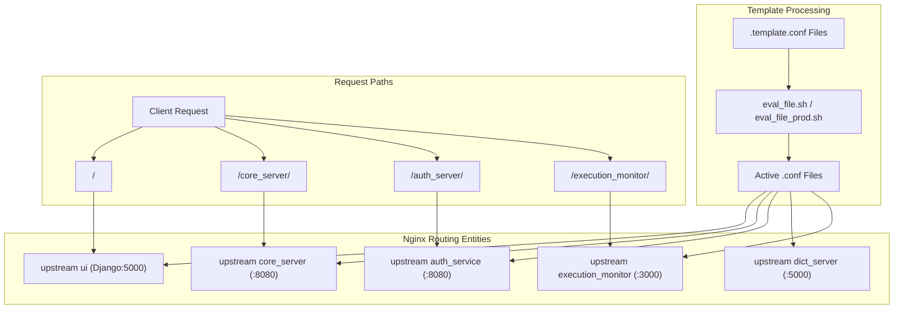
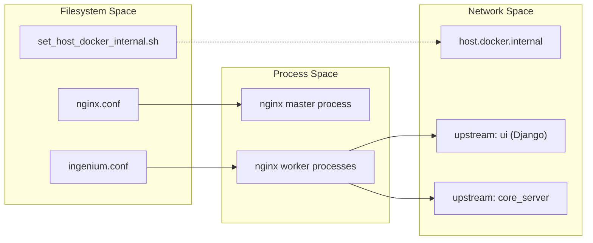

# Nginx Configuration and Runtime Scripts

Relevant source files

The following files were used as context for generating this wiki page:

- [eval_file.sh](eval_file.sh)
- [eval_file_prod.sh](eval_file_prod.sh)
- [ingenium-https.conf](ingenium-https.conf)
- [ingenium-single-node-ui_dev.template.conf](ingenium-single-node-ui_dev.template.conf)
- [ingenium-single-node-ui_dev_all.template.conf](ingenium-single-node-ui_dev_all.template.conf)
- [ingenium-single-node.template.conf](ingenium-single-node.template.conf)
- [ingenium.conf](ingenium.conf)
- [nginx.conf](nginx.conf)
- [ntp.conf](ntp.conf)
- [set_host_docker_internal.sh](set_host_docker_internal.sh)

This page documents the Nginx configuration infrastructure and the supporting shell scripts used to manage reverse proxying, environment variable substitution, and network resolution for the Ingenium UI.

## Overview and Purpose

The Ingenium UI architecture relies on Nginx as a central entry point. It serves three primary functions:
1.  **Static Asset Hosting**: Serving compiled Vue.js bundles and Django-collected static files [ingenium.conf:46-51]().
2.  **Reverse Proxying**: Routing traffic to the Django backend (Gunicorn) and various microservices (Core, Auth, Dictionary, etc.) [ingenium.conf:61-152]().
3.  **Protocol Termination**: Handling SSL/TLS for secure deployments [ingenium-https.conf:53-61]().

### Configuration Flow Diagram

The following diagram illustrates how configuration templates are processed into active Nginx configurations and how they route traffic to backend entities.

**Nginx Configuration and Routing Logic**

Sources: [eval_file.sh:3](), [ingenium.conf:1-35](), [ingenium.conf:61-168]()

---

## Configuration Templates and Substitution

Ingenium uses `envsubst` to inject environment-specific hostnames and ports into Nginx configuration files at runtime. This allows the same Docker image to target different environments (local dev, CI, production) by simply changing environment variables.

### Template Substitution Scripts

*   **`eval_file.sh`**: Replaces a specific list of environment variables including `${DJANGO_HOST}`, `${CORE_API_HOST}`, and `${EXECUTION_MONITOR_API_HOST}` [eval_file.sh:3](). It explicitly limits the variables replaced to avoid clobbering native Nginx variables like `$remote_addr` [eval_file.sh:2]().
*   **`eval_file_prod.sh`**: A specialized version for production environments that focuses on `${FILE_SERVER_API_HOST}`, `${SEARCH_API_URL}`, and `${REPORT_API_URL}` [eval_file_prod.sh:3]().

### Single-Node Configuration Variants

The repository provides several templates for single-node deployments:
*   **`ingenium-single-node.template.conf`**: Standard single-node setup where Nginx serves static files directly from `/static` [ingenium-single-node.template.conf:140-145]() and proxies all other requests to the Django container [ingenium-single-node.template.conf:147-149]().
*   **`ingenium-single-node-ui_dev.template.conf`**: Optimized for frontend development where the Dictionary service might be hosted on a remote CI server [ingenium-single-node-ui_dev.template.conf:101-114]().
*   **`ingenium-single-node-ui_dev_all.template.conf`**: Routes all services to their respective API hosts defined in environment variables [ingenium-single-node-ui_dev_all.template.conf:18-40]().

Sources: [eval_file.sh:1-4](), [eval_file_prod.sh:1-3](), [ingenium-single-node.template.conf:1-152](), [ingenium-single-node-ui_dev.template.conf:1-179]()

---

## Proxied Backend Service Routes

Nginx acts as the primary API Gateway, standardizing the URL space for the frontend.

| Frontend Route | Backend Upstream | Target Port | Notes |
| :--- | :--- | :--- | :--- |
| `/` | `ui` | 5000 | Primary Django/Gunicorn application [ingenium.conf:5, 158]() |
| `/core_server/` | `core_server` | 8080 | Core procedure logic [ingenium.conf:12, 72]() |
| `/auth_server/` | `auth_service` | 8080 | Authentication/LDAP services [ingenium.conf:26, 112]() |
| `/dict_server/` | `dict_server` | 5000 | Dictionary management [ingenium.conf:19, 98]() |
| `/execution_monitor/` | `execution_monitor` | 3000 | WebSocket/Status updates [ingenium.conf:33, 151]() |
| `/search_server/` | `${SEARCH_API_URL}` | N/A | ArangoDB search interface [ingenium.conf:138]() |
| `/report_server/` | `${REPORT_API_URL}` | N/A | PDF/Data reporting service [ingenium.conf:84]() |

### Special Route Handling

*   **WebSockets**: The `/execution_monitor/` route includes `Upgrade` and `Connection` headers to support WebSocket traffic [ingenium.conf:145-147]().
*   **Internal Redirection**: The `/file_server_internal/` route is marked as `internal`, meaning it can only be accessed via Nginx's `X-Accel-Redirect` mechanism, usually triggered by the Django backend [ingenium.conf:115-116]().
*   **ArangoDB Archive**: Direct access to ArangoDB's system APIs (`_db`, `_api`, etc.) is proxied to `arangodb_archive` on port 8529 [ingenium-https.conf:187-201]().

Sources: [ingenium.conf:1-168](), [ingenium-https.conf:1-230]()

---

## Network and Runtime Utilities

### Host Resolution: `set_host_docker_internal.sh`

In local development environments (specifically Linux), Docker containers often need to reach services running on the host machine. This script detects if `host.docker.internal` is resolvable [set_host_docker_internal.sh:6](). If not, it retrieves the host's IP from the default route and appends it to `/etc/hosts` [set_host_docker_internal.sh:8-9]().

### Time Synchronization: `ntp.conf`

To ensure consistent timestamps across distributed logs and procedure execution data, the Nginx container can be configured to synchronize with `time.jpl.nasa.gov` [ntp.conf:3]().

### Security and SSL

The `ingenium-https.conf` file implements security hardening:
*   **HSTS**: Enforces HTTPS via `Strict-Transport-Security` [ingenium-https.conf:63]().
*   **TLS Configuration**: Restricts protocols to TLS v1.2 and v1.3 and defines a specific cipher suite [ingenium-https.conf:59-60]().
*   **Body Size**: Limits uploads to 500MB via `client_max_body_size` [ingenium-https.conf:65]().

**Entity Mapping: Configuration to Runtime**

Sources: [nginx.conf:1-33](), [ingenium.conf:1-168](), [set_host_docker_internal.sh:1-10]()
