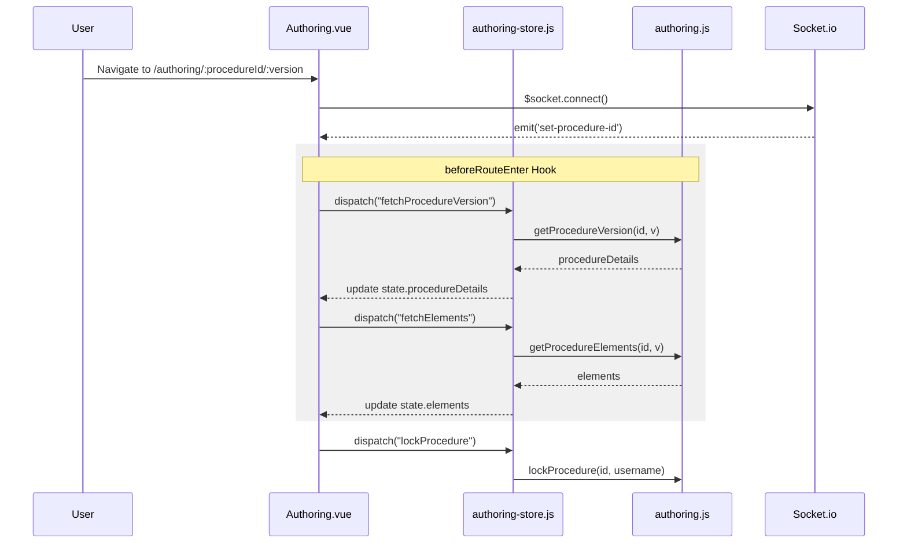
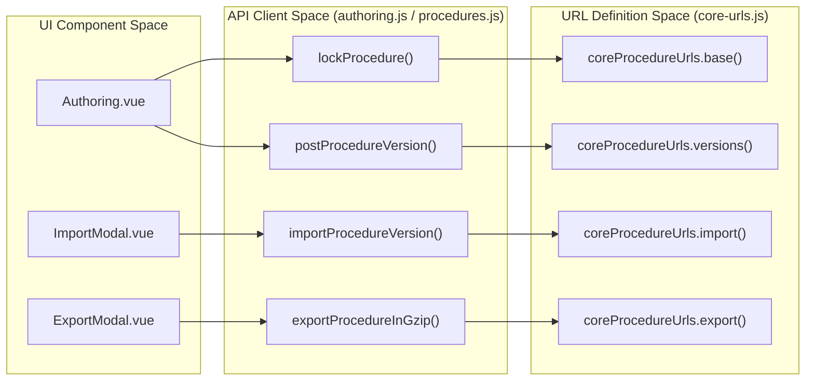

# Procedure Authoring Module

Relevant source files

The following files were used as context for generating this wiki page:

- [src/client/src/api/authoring.js](src/client/src/api/authoring.js)
- [src/client/src/api/procedures.js](src/client/src/api/procedures.js)
- [src/client/src/modules/authoring/Authoring.vue](src/client/src/modules/authoring/Authoring.vue)
- [src/client/src/modules/authoring/AuthoringRouter.vue](src/client/src/modules/authoring/AuthoringRouter.vue)
- [src/client/src/modules/authoring/ExportModal.vue](src/client/src/modules/authoring/ExportModal.vue)
- [src/client/src/modules/authoring/ImportModal.vue](src/client/src/modules/authoring/ImportModal.vue)

The **Procedure Authoring Module** is a dedicated Single Page Application (SPA) bundle within Ingenium UI designed for the creation, modification, and version control of spacecraft procedures. It provides a split-panel interface for navigating procedure structures and editing individual elements.

## Architecture and Lifecycle

The authoring module is built as a Vue.js application that interacts primarily with the **Core Service** via the Django proxy layer. The module manages the procedure lifecycle through three main states: **Create**, **Version** (Working Copy), and **Release**.

### Procedure Lifecycle Flow
1.  **Creation**: A new procedure is initialized with metadata (Title, Institutional ID) [src/client/src/api/authoring.js:39-53]().
2.  **Working Copy (Version 0)**: All edits occur on "Version 0". This version can be locked by a user to prevent concurrent modification [src/client/src/api/authoring.js:103-116]().
3.  **Versioning**: Snapshoting the current Working Copy into a permanent, immutable version (e.g., Version 1) [src/client/src/api/authoring.js:179-190]().
4.  **Release**: Promoting a version to a "Released" status, making it available for operational execution [src/client/src/api/authoring.js:201-208]().

### Data Flow Diagram: Authoring Initialization
This diagram illustrates how the `Authoring.vue` component initializes the workspace by fetching procedure metadata and elements while establishing a WebSocket connection for real-time updates.

Sources: [src/client/src/modules/authoring/Authoring.vue:39-74](), [src/client/src/api/authoring.js:169-177](), [src/client/src/api/authoring.js:103-116]()

## Core Components

### Authoring.vue
The main entry point for the authoring workspace. It utilizes a `canvasMixin` to handle layout resizing and manages the global "Busy" state (`isBusy`) which triggers a `SpinnerModal` during intensive operations like importing or moving elements [src/client/src/modules/authoring/Authoring.vue:153-155]().

### Side Panel and Main Panel
The interface is split by a resizer [src/client/src/modules/authoring/Authoring.vue:178-184]():
*   **SidePanel.vue**: Contains the procedure tree/outline, allowing users to navigate between sections and steps.
*   **MainPanel.vue**: The primary editing area where individual `IngElement` components are rendered for modification.

### Import and Export Modals
The module supports `tar.gz` based portability for procedures.
*   **ExportModal.vue**: Allows users to export specific versions, all versions, or only released versions of a procedure [src/client/src/modules/authoring/ExportModal.vue:115-127](). It uses `proceduresApi.exportProcedureInGzip` to trigger the backend generation [src/client/src/modules/authoring/ExportModal.vue:129-132]().
*   **ImportModal.vue**: Provides a drag-and-drop interface for uploading `.gz` files [src/client/src/modules/authoring/ImportModal.vue:26-31](). It dispatches `importProcedureVersions` to the store to process the upload [src/client/src/modules/authoring/ImportModal.vue:83]().

## API and State Management

### authoring-store.js
The Vuex store manages the complex state of the procedure being edited. Key state properties include:
*   `procedureDetails`: Metadata about the current procedure (labels, author, lock status).
*   `elements`: The flat list or tree of procedure elements (steps, commands, etc.).
*   `editMode`: Boolean toggling between read-only and interactive editing [src/client/src/modules/authoring/Authoring.vue:147]().

### API Layer Interaction
The module uses two primary API files to communicate with the backend:
*   `src/client/src/api/authoring.js`: Focuses on authoring-specific actions like locking [line 103](), unlocking [line 118](), and creating versions [line 179]().
*   `src/client/src/api/procedures.js`: Handles general procedure data retrieval, such as fetching the outline [line 155]() and managing tags [line 84]().

### Code Entity Mapping: Authoring Operations
This diagram maps UI actions to their corresponding API functions and Backend URL definitions.

Sources: [src/client/src/api/authoring.js:103-210](), [src/client/src/api/procedures.js:181-197](), [src/client/src/modules/authoring/ExportModal.vue:129-132](), [src/client/src/modules/authoring/ImportModal.vue:83]()

## Procedure Locking Mechanism
To prevent data loss in a multi-user environment, the authoring module implements a soft-lock pattern:
1.  When a user enters the Working Copy (Version 0) with the `update` query parameter, `Authoring.vue` attempts to lock the procedure [src/client/src/modules/authoring/Authoring.vue:59-62]().
2.  The `lockProcedure` API sends a `PATCH` request to the procedure endpoint with the `locked_by` field set to the current username [src/client/src/api/authoring.js:103-110]().
3.  If the procedure is already locked by another user, the backend returns an error which is caught and displayed via the `failureCallback` [src/client/src/api/authoring.js:114]().
4.  Unlocking occurs when the user explicitly releases the lock or leaves the editing session, clearing the `locked_by` field [src/client/src/api/authoring.js:118-125]().

Sources: [src/client/src/modules/authoring/Authoring.vue](), [src/client/src/api/authoring.js](), [src/client/src/api/procedures.js](), [src/client/src/modules/authoring/ExportModal.vue](), [src/client/src/modules/authoring/ImportModal.vue]()
