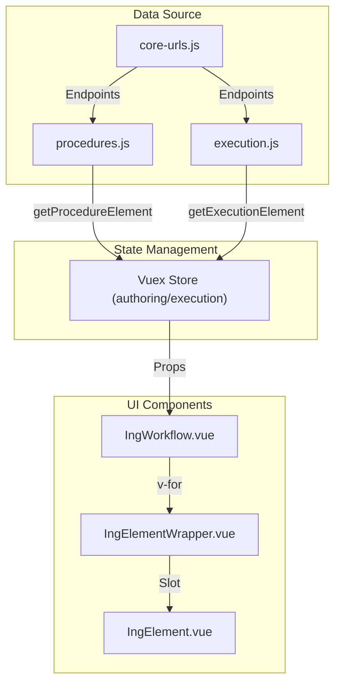

# Procedure Elements System

<details>
<summary>Relevant source files</summary>

The following files were used as context for generating this wiki page:

- [src/client/src/api/dictionary.js](src/client/src/api/dictionary.js)
- [src/client/src/api/execution.js](src/client/src/api/execution.js)
- [src/client/src/api/procedures.js](src/client/src/api/procedures.js)

</details>


The Procedure Elements System is the core architectural framework for representing and executing steps within a procedure. It provides a highly modular and extensible library of element types, ranging from simple descriptive text to complex automated command sequences and real-time telemetry queries.

## Core Framework Classes

The system is built on a hierarchy of Vue components and wrapper classes that manage the lifecycle, state, and rendering of procedure elements.

### IngElement and IngElementWrapper
`IngElement` serves as the base component for all individual element types. It is responsible for rendering the specific UI for an element (e.g., a command input or a telemetry graph) and handling user interactions. `IngElementWrapper` acts as a container that provides common functionality such as selection state, drag-and-drop handles, and the element's execution status indicators.

### IngWorkflow
`IngWorkflow` is the high-level container component that manages a sequence of elements. It handles the rendering of the element list, provides the context for element insertion/deletion, and manages the logic for bulk actions like multi-select and copy-paste.

### IngTag
`IngTag` provides a mechanism for categorizing and filtering elements within a procedure. Tags can be created at the procedure level and applied to specific elements to facilitate organization and searchability [src/client/src/api/procedures.js:84-141]().

### Element Data Flow
The following diagram illustrates how element data flows from the Core API through the Vue components.

**Diagram: Element Data Flow Architecture**

Sources: [src/client/src/api/procedures.js:62-82](), [src/client/src/api/execution.js:124-144](), [src/client/src/api/core-urls.js:1-10]()

---

## Executable Element Types

Executable elements are those that interact with external systems (spacecraft, ground systems, or environment) or require user input during an execution.

### Command Elements
These elements facilitate sending commands to different targets.
*   **cmd**: Standard command element for flight hardware.
*   **cmd-sse**: Commands specifically for Spacecraft Support Equipment.
*   **cmd-scmf**: Commands using the Spacecraft Command Message Format.

Command data is often validated against dictionaries fetched via `dictionary.js` [src/client/src/api/dictionary.js:83-121]().

### Manual Interaction Elements
*   **manual-input**: Prompts the operator to enter data (text, numbers, etc.) which is then stored in the execution record.
*   **manual-verification**: Requires the operator to manually confirm that a specific condition has been met.

### Wait and Telemetry Elements
These elements manage time-based or condition-based pauses in execution.
*   **wait**: A simple timer-based pause.
*   **wait-eha / wait-evr**: Pauses execution until a specific Engineering Health Analysis (EHA) channel value or Event Record (EVR) is received [src/client/src/api/dictionary.js:123-190]().
*   **query-evr**: Queries the telemetry history for specific event records.
*   **verify-eha**: Automatically checks if telemetry channels meet specified criteria.

### Visualization Elements
*   **graph-eha**: Renders real-time or historical telemetry data in a graphical format within the procedure flow.

**Diagram: Executable Element Type Mapping**
```mermaid
classDiagram
    class "IngElement" {
        +element_id
        +type
        +data
    }
    class "cmd" {
        +command_stem
        +arguments
    }
    class "wait-eha" {
        +channel_name
        +threshold
    }
    class "manual-input" {
        +prompt
        +input_type
    }

    "IngElement" <|-- "cmd"
    "IngElement" <|-- "wait-eha"
    "IngElement" <|-- "manual-input"
```
Sources: [src/client/src/api/dictionary.js:83-190](), [src/client/src/api/execution.js:124-131]()

---

## Infrastructure and Configuration Elements

These elements are used to set up the execution environment or define procedure-wide parameters.

*   **environment**: Defines variables and environmental settings for the procedure execution.
*   **venue-config**: Specifies the configuration of the venue (testbed, simulator, or flight) required for the procedure.
*   **custom_script**: Allows the execution of arbitrary Python or JavaScript logic to handle complex scenarios not covered by standard elements.
*   **eip**: (Element Integration Point) Used for interfacing with external automation frameworks.

### Dictionary Integration
Many elements rely on dictionaries to provide auto-completion and validation for commands and telemetry channels. The `dictionary.js` API module provides functions to fetch these definitions:
*   `getFlightCmds`: Fetches flight command definitions [src/client/src/api/dictionary.js:83-121]().
*   `getFlightEvrs`: Fetches event record definitions [src/client/src/api/dictionary.js:123-169]().
*   `getFlightEhas`: Fetches telemetry channel definitions [src/client/src/api/dictionary.js:172-190]().

---

## Element Manipulation Operations

The system supports complex restructuring of elements within both the Authoring and Execution modules.

| Operation | Function | Description |
| :--- | :--- | :--- |
| **Move** | `moveExecutionElement` | Reorders an element within the procedure tree [src/client/src/api/execution.js:146-160](). |
| **Copy** | `copyExecutionElement` | Duplicates an element at a new location [src/client/src/api/execution.js:162-177](). |
| **Multi-Copy** | `multiCopyExecutionElement` | Copies multiple elements, potentially from a different procedure or execution [src/client/src/api/execution.js:179-206](). |
| **Structure** | `getProcedureElementStructure` | Retrieves the hierarchical parent/child relationship of an element [src/client/src/api/procedures.js:73-82](). |

### Bulk Operations Logic
When performing multi-element operations, the system handles the `elem_ids`, `insert_after_id`, and `level` to maintain the integrity of the procedure outline [src/client/src/api/execution.js:208-232]().

Sources: [src/client/src/api/execution.js:146-232](), [src/client/src/api/procedures.js:73-82](), [src/client/src/api/dictionary.js:1-190]()
