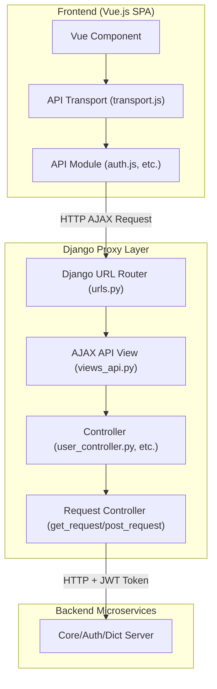
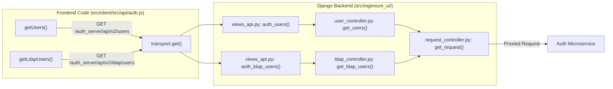

# Proxy Layer and API Controllers

Relevant source files

The following files were used as context for generating this wiki page:

- [src/client/src/api/admin-urls.js](src/client/src/api/admin-urls.js)
- [src/client/src/api/auth.js](src/client/src/api/auth.js)
- [src/client/src/api/core-urls.js](src/client/src/api/core-urls.js)
- [src/client/src/api/dict-urls.js](src/client/src/api/dict-urls.js)
- [src/client/src/api/venue-config-urls.js](src/client/src/api/venue-config-urls.js)

The Ingenium UI serves as a sophisticated orchestration and proxy layer between the Vue.js frontend and various backend microservices (Core, Auth, Dictionary, and Venue Config). Instead of the frontend communicating directly with these microservices, all requests are routed through the Django backend. This architecture allows Django to handle session validation, inject authentication headers, and provide a unified API interface for the Single Page Application (SPA).

## Request Architecture and HTTP Helpers

The foundation of the proxy layer is `request_controller.py`. This module provides a set of helper functions that wrap the Python `requests` library to standardize how Django communicates with backend microservices.

### Standard Request Helpers
These functions automate the inclusion of the `Authorization` bearer token (retrieved from the user's session) and handle common HTTP methods:

*   `get_request(url, request, params=None)` [src/ingenium_ui/controllers/request_controller.py:15-32]()
*   `post_request(url, request, data=None, files=None)` [src/ingenium_ui/controllers/request_controller.py:35-52]()
*   `put_request(url, request, data=None)` [src/ingenium_ui/controllers/request_controller.py:55-71]()
*   `patch_request(url, request, data=None)` [src/ingenium_ui/controllers/request_controller.py:74-90]()
*   `delete_request(url, request)` [src/ingenium_ui/controllers/request_controller.py:93-108]()

### Implementation Detail: Header Injection
Every request made via these helpers automatically extracts the `access_token` from `request.session` and attaches it as a `Bearer` token in the `Authorization` header [src/ingenium_ui/controllers/request_controller.py:22-24](). This ensures that the microservices can verify the user's identity and permissions for every proxied call.

**Sources:**
* `src/ingenium_ui/controllers/request_controller.py`

## Data Flow: Frontend to Microservices

The following diagram illustrates how a request from a Vue component travels through the system to reach a backend microservice.

### Request Proxy Flow

**Sources:**
* `src/client/src/api/transport.js`
* `src/ingenium_ui/controllers/request_controller.py`
* `src/ingenium_ui/views_api.py`

## API Controllers

Controllers in the Django backend act as the logic layer for specific domains. They translate incoming Django `HttpRequest` objects into specific microservice calls.

### User and Auth Controllers
*   **user_controller.py**: Manages user-related operations, including fetching user profiles and lists [src/ingenium_ui/controllers/user_controller.py:1-20]().
*   **role_controller.py**: Handles role assignments and role-based access control (RBAC) configurations [src/ingenium_ui/controllers/role_controller.py:1-25]().
*   **permission_controller.py**: Interfaces with the Auth microservice to retrieve and update granular permissions [src/ingenium_ui/controllers/permission_controller.py:1-15]().
*   **ldap_controller.py**: Specifically handles LDAP integration, allowing the UI to query for LDAP users and groups for role mapping [src/ingenium_ui/controllers/ldap_controller.py:1-30]().

### Venue and Dictionary Controllers
*   **venue_controller.py**: Orchestrates operations related to venues and venue groups, such as creation, status updates, and configuration [src/ingenium_ui/controllers/venue_controller.py:1-50]().
*   **dictionary_controller.py**: Manages the retrieval of Flight and SSE dictionaries, as well as custom scripts and Verification & Validation (V&V) data [src/ingenium_ui/controllers/dictionary_controller.py:1-40]().

**Sources:**
* `src/ingenium_ui/controllers/user_controller.py`
* `src/ingenium_ui/controllers/role_controller.py`
* `src/ingenium_ui/controllers/venue_controller.py`
* `src/ingenium_ui/controllers/dictionary_controller.py`

## Frontend URL Mapping

The frontend defines its own set of URL constants that match the routes exposed by the Django proxy. These are organized by service.

| Service | Frontend URL Constant File | Base Path (Proxied) |
| :--- | :--- | :--- |
| **Auth** | `admin-urls.js` | `/auth_server/api/v2` [src/client/src/api/admin-urls.js:3]() |
| **Core** | `core-urls.js` | `/core_server/api/v5` [src/client/src/api/core-urls.js:3]() |
| **Dict** | `dict-urls.js` | `/dict_server/api/v4` [src/client/src/api/dict-urls.js:3]() |
| **Venue Config** | `venue-config-urls.js` | `/venue_config/api/v1` [src/client/src/api/venue-config-urls.js:5]() |

### Code Entity Association: Auth Service Example
The following diagram bridges the frontend API calls to the specific Django controller entities.

**Sources:**
* `src/client/src/api/auth.js:8-45`
* `src/client/src/api/admin-urls.js:1-22`
* `src/client/src/api/core-urls.js:1-28`
* `src/client/src/api/dict-urls.js:1-65`
* `src/client/src/api/venue-config-urls.js:1-25`

## AJAX API Views

The `views_api.py` file contains the entry points for all AJAX requests coming from the Vue frontend. These views are responsible for:
1.  Receiving the request from the frontend.
2.  Calling the appropriate controller method.
3.  Returning a `JsonResponse` containing the data or error message from the microservice.

Because these views rely on the `request_controller`, they do not need to manually handle authentication tokens; the controller layer handles the session-to-bearer-token transformation automatically.

**Sources:**
* `src/ingenium_ui/views_api.py`
* `src/ingenium_ui/controllers/request_controller.py`
