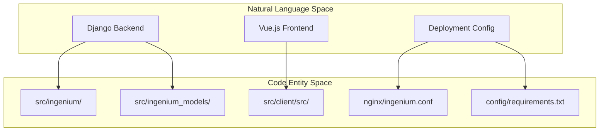
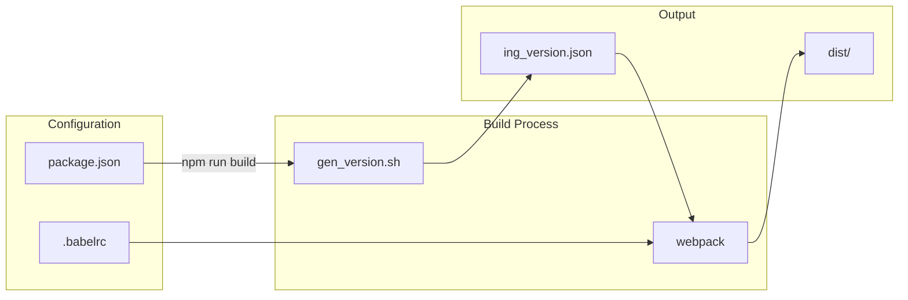

# Repository Structure and Configuration Files

Relevant source files

The following files were used as context for generating this wiki page:

- [.dockerignore](.dockerignore)
- [.gitattributes](.gitattributes)
- [.gitignore](.gitignore)
- [config/requirements.txt](config/requirements.txt)
- [src/client/.babelrc](src/client/.babelrc)
- [src/client/.editorconfig](src/client/.editorconfig)
- [src/client/package-lock.json](src/client/package-lock.json)
- [src/client/package.json](src/client/package.json)

This page details the organizational layout of the Ingenium UI repository and the configuration files that govern its build system, development environment, and runtime constraints.

## Top-Level Directory Layout

The repository is structured to separate the Python/Django backend logic, the Vue.js frontend source, and the deployment configuration.

| Directory | Purpose |
| :--- | :--- |
| `src/` | Contains all application source code, including the Django project and the Vue.js SPA. |
| `src/client/` | The root of the Vue.js single-page application, containing `package.json` and frontend source. |
| `config/` | Holds backend dependency specifications and environment-related configurations. |
| `nginx/` | Contains Nginx configuration templates for routing and serving static assets. |

### Source Directory Mapping
Title: "Source Code Entity Mapping"

Sources: [.dockerignore:1-2](), [config/requirements.txt:1-20](), [src/client/package.json:1-10]()

---

## Root-Level Configuration Files

### Git Configuration
The repository uses standard Git control files with specific overrides for lock files to prevent merge conflicts in large JSON structures.
*   **.gitignore**: Prevents environment-specific files (e.g., `secrets.json`, `ingenium_secrets.ini`), Python byte-code (`__pycache__`), and build artifacts (`/static`, `/media`) from being tracked [.gitignore:3-78](). It also explicitly ignores the generated version file `src/client/src/assets/ing_version.json` [.gitignore:87]().
*   **.gitattributes**: Enforces that all `*.lock` files (such as `package-lock.json`) are treated as **binary** files [.gitattributes:1](). This prevents Git from attempting to merge line-by-line changes in the massive lock file, requiring manual resolution or regeneration during conflicts.

### Docker and Editor Environment
*   **.dockerignore**: Optimizes build context by excluding the Python virtual environment (`ve`) and the massive `node_modules` directory [.dockerignore:1-2]().
*   **.editorconfig**: Defines cross-IDE coding standards. It specifies a 4-space indent for `.py`, `.js`, and `.vue` files, but a 2-space indent for `.html` and `.json` files [.editorconfig:3-38](). It also sets a `max_line_length` of 119 for Python files to accommodate Django's often verbose syntax while remaining PEP8-adjacent [.editorconfig:12-13]().

Sources: [.gitignore:1-88](), [.gitattributes:1](), [.dockerignore:1-2](), [.editorconfig:1-52]()

---

## Backend Configuration (`config/requirements.txt`)

The backend uses a strict dependency manifest. It points to a private JPL Artifactory instance for specific internal packages [.config/requirements.txt:1]().

**Key Backend Dependencies:**
*   **Web Framework**: `django==1.11.6` and `djangorestframework==3.8.2` [.config/requirements.txt:3-4]().
*   **Runtime**: `gunicorn` with `gevent` workers for asynchronous request handling [.config/requirements.txt:5-7]().
*   **Security/Auth**: `PyJWT` and `requests_jwt` for handling token-based communication with Core services [.config/requirements.txt:10-11]().
*   **UI Components**: `django-froala-editor` for rich text procedure authoring and `django_data_tables` for list views [.config/requirements.txt:13-16]().

Sources: [config/requirements.txt:1-20]()

---

## Frontend Configuration (`src/client/`)

The frontend is a Vue.js 2 application managed via NPM.

### Package Manifest (`package.json`)
The `package.json` file defines the build pipeline and external libraries.
*   **Scripts**: The `build` and `dev` scripts invoke `gen_version.sh` before running Webpack to ensure the UI version matches the repository state [.src/client/package.json:7-15]().
*   **Engines**: Strictly locked to Node `8.10.0` [.src/client/package.json:172-174]().

### Babel Configuration (`.babelrc`)
Babel is configured to support modern JavaScript while maintaining compatibility with legacy browsers (including IE 11) [.src/client/.babelrc:15]().
*   **Presets**: Uses `@babel/preset-env` with `corejs: 3` for polyfilling [.src/client/.babelrc:3-6]().
*   **Plugins**: Includes support for Optional Chaining and Nullish Coalescing, allowing for cleaner data access patterns when dealing with deeply nested API responses [.src/client/.babelrc:22-23]().

### Frontend Build Flow
Title: "Frontend Build and Configuration Flow"

Sources: [src/client/package.json:7-15](), [src/client/.babelrc:1-30](), [.gitignore:87]()

---

## Lock File Management
As noted in `.gitattributes`, the `package-lock.json` is treated as a binary blob [.gitattributes:1](). This file is exceptionally large (over 500,000 characters) and contains the entire dependency tree for the Vue.js application [.src/client/package-lock.json:1-16](). 

By treating it as binary, the team avoids the "merge hell" associated with multiple developers adding different NPM packages simultaneously, as Git will not attempt to auto-merge the JSON structure.

Sources: [.gitattributes:1](), [src/client/package-lock.json:1-16]()
