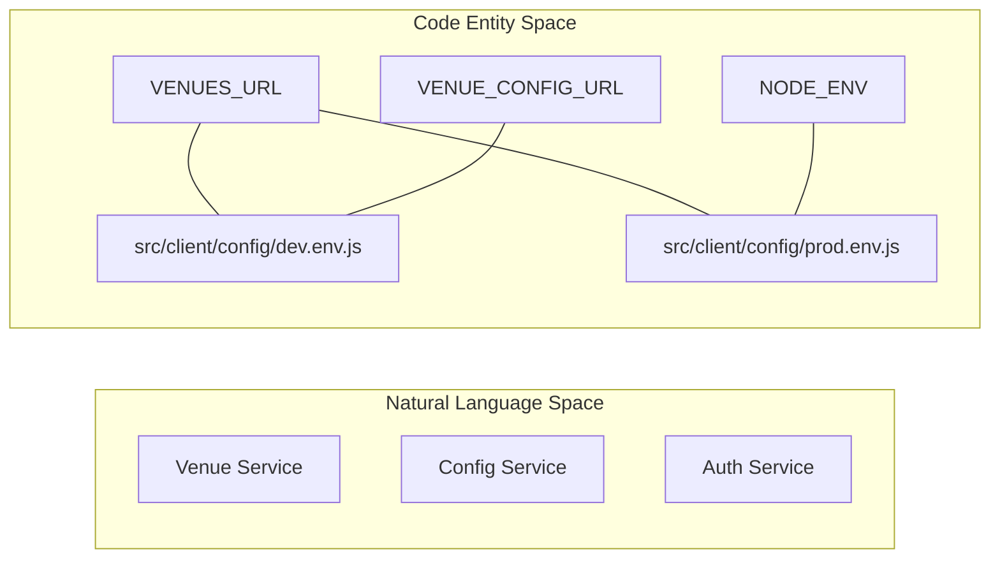

# Settings and Configuration

<details>
<summary>Relevant source files</summary>

The following files were used as context for generating this wiki page:

- [src/client/config/dev.env.js](src/client/config/dev.env.js)
- [src/client/config/index.js](src/client/config/index.js)
- [src/client/config/prod.env.js](src/client/config/prod.env.js)
- [src/client/config/test.env.js](src/client/config/test.env.js)

</details>


The Ingenium UI settings system is built upon a hierarchical Django configuration structure that manages the orchestration of backend microservices, frontend asset delivery, and environment-specific behaviors. Because the backend acts as a thin proxy layer without a local database, the configuration focuses heavily on service discovery (API URLs), session management, and the mapping of hashed JavaScript bundles for the Single Page Application (SPA).

## Settings Hierarchy and Environment Control

The project utilizes a standard Django settings split, controlled primarily by the `SERVER_ENVIRONMENT` variable. This variable dictates which configuration overrides are applied to the base settings.

### Configuration Flow
The system initializes with `base.py` and then layers environment-specific settings.

| File | Role | Key Responsibilities |
| :--- | :--- | :--- |
| `base.py` | **Core Configuration** | Defines `INSTALLED_APPS`, middleware, global API endpoint constants, and default session behaviors. |
| `local.py` | **Development Overrides** | Sets `DEBUG = True`, configures local logging, and allows for non-HTTPS session cookies for local testing. |
| `production.py`| **Production Hardening** | Enforces `SECURE_SSL_REDIRECT`, `SESSION_COOKIE_SECURE`, and production-grade logging. |

### The SERVER_ENVIRONMENT Variable
The environment is determined at runtime, typically through an environment variable passed into the Docker container or set in the shell. This variable is used to dynamically import the correct settings module.

### Logic Flow Diagram: Settings Initialization
This diagram shows how the Django process determines its configuration state based on the environment.

Title: Settings Module Resolution
```mermaid
graph TD
    subgraph "Natural Language Space"
        EnvVar["Environment Variable"]
        BaseConfig["Core Defaults"]
        DevMode["Development Mode"]
        ProdMode["Production Mode"]
    end

    subgraph "Code Entity Space"
        SERVER_ENV["SERVER_ENVIRONMENT"]
        BASE["ingenium_ui/settings/base.py"]
        LOCAL["ingenium_ui/settings/local.py"]
        PROD["ingenium_ui/settings/production.py"]
    end

    SERVER_ENV -->| "is 'local'" | LOCAL
    SERVER_ENV -->| "is 'production'" | PROD
    LOCAL --> BASE
    PROD --> BASE
```

**Sources:**
* The hierarchical structure is a standard pattern implemented in the `ingenium_ui/settings/` directory.

---

## Frontend Asset Mapping (JS Bundles)

Since the frontend is a Vue.js SPA with multiple modules (Authoring, Execution, Admin, etc.), the Django backend must know the exact filenames of the compiled JavaScript bundles to inject them into templates.

### Environment Variables for Bundles
In production, bundles are often hashed (e.g., `authoring.7a2b3c.js`). The build pipeline generates these hashes and exports them as environment variables. `base.py` reads these variables to populate a dictionary used by Django views to render the `<script>` tags.

* **JS Bundle Variables**: `JS_BUNDLE_AUTHORING`, `JS_BUNDLE_EXECUTION`, `JS_BUNDLE_DASHBOARD`, etc.
* **Fallback**: In local development, these typically default to non-hashed names (e.g., `authoring.js`) served by the Webpack dev server.

**Sources:**
* Bundle injection logic is defined in `base.py` and utilized by the SPA page views.

---

## Centralized API Definitions

A critical function of `base.py` is the centralized definition of backend microservice URLs. Since Ingenium UI proxies requests to services like "Core", "Dictionary", and "VNV", these endpoints must be configurable without changing application logic.

### API URL Structure
The bottom of `base.py` contains the definitions for all internal and external service routes. These are typically constructed using base hostnames provided by environment variables.

| Variable | Description |
| :--- | :--- |
| `CORE_SERVER_URL` | Base URL for the core orchestration service. |
| `DICTIONARY_SERVER_URL` | Endpoint for the procedure dictionary service. |
| `VNV_SERVER_URL` | Endpoint for Verification and Validation services. |
| `AUTH_SERVER_URL` | The central authentication service. |

### Code Mapping: API Constants
Title: API Endpoint Mapping


**Sources:**
* `src/client/config/dev.env.js:5-13`()
* `src/client/config/prod.env.js:1-8`()
* `src/client/config/index.js:9-13`()

---

## Session and Security Configuration

As a security-sensitive application for NASA JPL, the session configuration in `base.py` is strict.

### Key Session Settings
* **Session Engine**: Ingenium uses a cookie-based or cache-based session depending on the deployment, but primarily relies on JWTs stored in cookies for microservice authentication.
* **`SESSION_COOKIE_HTTPONLY`**: Set to `True` to prevent XSS-based session theft.
* **`SESSION_COOKIE_SECURE`**: Controlled by the environment; forced to `True` in `production.py`.
* **`INSTALLED_APPS`**: Includes standard Django apps plus `ingenium_ui`, `ingenium_models`, and any proxy-related modules.

**Sources:**
* Session configurations are found in the `MIDDLEWARE` and `SESSION_*` sections of `base.py`.

---

## Frontend Environment Configuration

The Vue.js frontend maintains its own set of configuration files under `src/client/config/` which are merged during the Webpack build process.

### dev.env.js vs prod.env.js
The frontend uses these files to determine which API endpoints to hit when making requests from the browser.

* **`VENUES_URL`**: In development, this points to the local hostname with a `/core_server/` prefix [src/client/config/dev.env.js:5-5](). In production, it uses HTTPS [src/client/config/prod.env.js:1-1]().
* **`DEBUG_MODE`**: A boolean used to enable/disable verbose logging in the browser console [src/client/config/dev.env.js:12-12]().
* **`NODE_ENV`**: Sets the environment context for Vue/Webpack optimizations [src/client/config/prod.env.js:5-5]().

**Sources:**
* `src/client/config/dev.env.js:1-13`()
* `src/client/config/prod.env.js:1-8`()
* `src/client/config/test.env.js:1-7`()
