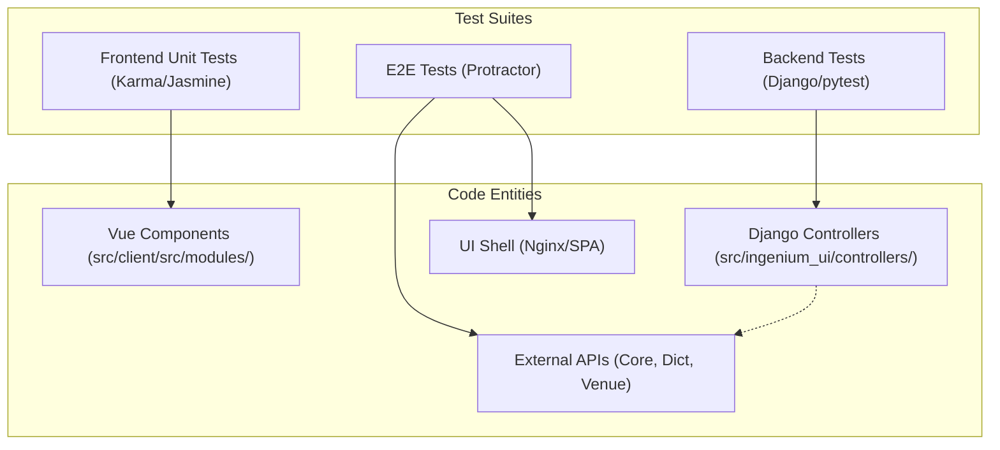
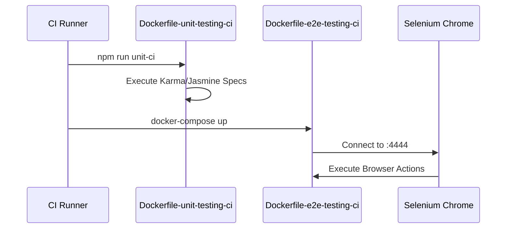

# Testing Infrastructure

Relevant source files

The following files were used as context for generating this wiki page:

- [Dockerfile-e2e-testing-ci](Dockerfile-e2e-testing-ci)
- [Dockerfile-unit-testing-ci](Dockerfile-unit-testing-ci)
- [docker-compose-e2e-tests.yml](docker-compose-e2e-tests.yml)

The Ingenium UI testing infrastructure is divided into three distinct layers to ensure reliability across the Django backend, the Vue.js single-page application, and the integrated system as a whole. These layers range from isolated unit tests to containerized end-to-end (E2E) suites that simulate user interactions in a browser environment.

### Testing Strategy Overview

The repository employs a "pyramid" approach to testing, utilizing specific tools for each architectural tier:

1.  **Backend Unit & Integration Tests**: Validates Django controllers, proxy logic, and session management using the standard Django test framework.
2.  **Frontend Unit Tests**: Exercises individual Vue.js components and Vuex modules using Karma and Jasmine.
3.  **End-to-End (E2E) Tests**: Validates full user workflows by driving a headless Chrome instance against a running deployment of the application.

The following diagram illustrates the relationship between the testing layers and the components they target:

**Test Layer Mapping**

Sources: [Dockerfile-unit-testing-ci:1-13](), [Dockerfile-e2e-testing-ci:1-13](), [docker-compose-e2e-tests.yml:3-27]()

---

### Frontend Testing Layers

The frontend testing infrastructure is managed within the `src/client` directory and is split into unit and E2E configurations. These tests are integrated into the CI/CD pipeline using specialized Dockerfiles.

*   **Unit Testing**: Uses `Karma` as the test runner and `Jasmine` as the assertion framework. It focuses on testing components in isolation, mocking API calls and WebSocket connections.
*   **E2E Testing**: Primarily uses `Protractor` (and elements of `Nightwatch`) to perform integration testing. In CI environments, this runs via a dedicated `selenium/standalone-chrome` container.

For a deep dive into component specs, Karma configurations, and E2E fixtures, see **[Frontend Unit and E2E Tests (#5.1)]()**.

**CI Execution Flow**

Sources: [Dockerfile-unit-testing-ci:13-13](), [Dockerfile-e2e-testing-ci:13-13](), [docker-compose-e2e-tests.yml:4-11]()

---

### Backend and Integration Testing

The backend testing suite focuses on the Django application's role as a proxy and orchestrator. Because the Ingenium UI is a "thin" backend without its own primary database, these tests frequently focus on:
*   **Controller Logic**: Ensuring `venue_controller.py` and `execution_controller.py` correctly format requests to backend microservices.
*   **Session Security**: Testing `IngeniumUserBackend` and session expiration middleware.
*   **Legacy UI Tests**: Maintaining existing Selenium-based tests that verify dashboard and venue configuration behavior.

For details on running these tests via `runtests.py` or within a Docker environment, see **[Backend and Integration Tests (#5.2)]()**.

---

### Continuous Integration (CI) Setup

The testing infrastructure is designed to be portable via Docker. The repository includes specific configurations for running the full suite in a headless environment:

| File | Purpose |
| :--- | :--- |
| `Dockerfile-unit-testing-ci` | Minimal Node environment to run `npm run unit-ci`. |
| `Dockerfile-e2e-testing-ci` | Node environment configured to talk to a Selenium grid for E2E tests. |
| `docker-compose-e2e-tests.yml` | Orchestrates the UI, the Selenium Chrome container, and the test runner. |

The E2E environment requires several environment variables to point to mock or CI instances of backend services, such as `CORE_API_URL`, `DICT_API_URL`, and `VENUE_CONFIG_API_URL`.

Sources: [Dockerfile-unit-testing-ci:1-13](), [Dockerfile-e2e-testing-ci:1-13](), [docker-compose-e2e-tests.yml:16-24]()
