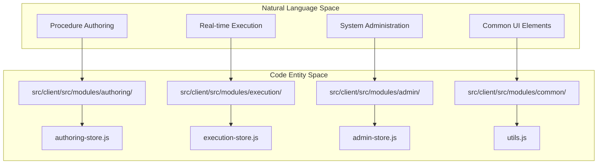
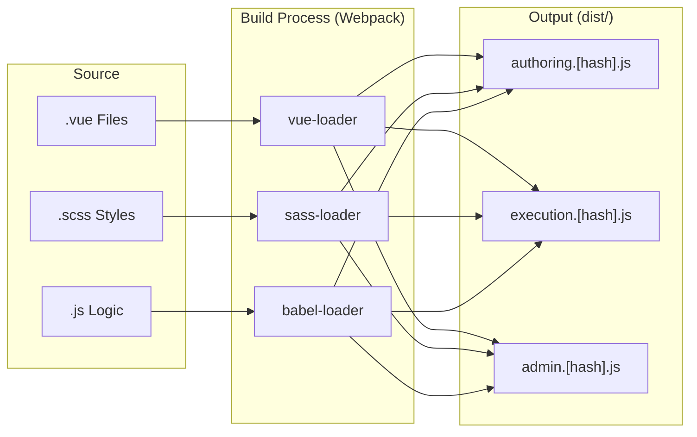

# Vue.js Frontend Architecture

Relevant source files

The following files were used as context for generating this wiki page:

- [src/client/package.json](src/client/package.json)
- [src/client/src/api/transport.js](src/client/src/api/transport.js)
- [src/client/src/assets/ing_version](src/client/src/assets/ing_version)

The Ingenium UI frontend is a sophisticated Vue.js single-page application (SPA) designed for spacecraft procedure management. It utilizes a modular architecture where major features are developed as independent Vue instances, allowing for optimized bundle sizes and clear separation of concerns. The frontend communicates with the Django backend via a centralized API layer and manages complex application states using Vuex.

## Modular Architecture

The frontend is organized into feature-based modules located under `src/client/src/modules/`. Unlike a traditional monolithic SPA, Ingenium compiles major functional areas (e.g., Authoring, Execution, Admin) into separate JavaScript bundles. This is orchestrated by Webpack and integrated into Django templates, which load the specific bundle required for a given view.

### Code-to-Module Mapping
The following diagram illustrates how high-level system features map to specific code entities within the modular structure.

**Diagram: Feature Module Mapping**

**Sources:** `src/client/package.json:1-64`()

## API Client Layer

All network communication is centralized in the `src/client/src/api/` directory. This layer uses [Axios](https://github.com/axios/axios) as the underlying transport mechanism, configured in `transport.js` [src/client/src/api/transport.js:1-9]().

Key characteristics of the API layer:
*   **JWT Authentication:** The transport layer automatically injects the JSON Web Token (JWT) into the `Authorization` header for every request [src/client/src/api/transport.js:7-22]().
*   **Time Synchronization:** The system calculates the time drift between the client browser and the server using the `Date` header in responses, storing the offset in `localStorage` [src/client/src/api/transport.js:25-37]().
*   **Service-Specific Modules:** APIs are grouped by backend service (e.g., `auth.js`, `authoring.js`, `execution.js`) to maintain a clean interface for Vue components.

For details, see [API Client Layer](#3.1).

**Sources:** `src/client/src/api/transport.js:1-46`()

## State Management (Vuex)

Ingenium uses **Vuex** for centralized state management. Each major module maintains its own Vuex store to handle complex data flows, such as procedure versioning or real-time execution telemetry.

*   **Global Stores:** Shared data like user sessions, system messages, and dictionary definitions are managed in common stores located in `src/client/src/modules/common/`.
*   **Feature Stores:** Modules like `authoring` and `execution` have dedicated stores (e.g., `authoring-store.js`) that encapsulate the business logic for those specific domains.

## Build and Compilation

The frontend build process is managed via NPM scripts defined in `package.json` [src/client/package.json:7-16](). It uses Webpack 3 to compile Vue components, SASS styles, and modern JavaScript (ES6+) into browser-compatible bundles.

**Build Pipeline Overview**

**Sources:** `src/client/package.json:105-107`()

## Feature Module Summaries

The following modules represent the core functional areas of the Ingenium UI. Each is documented in detail in its respective child page.

### Common Components and Shared Utilities
Provides the "Ingenium Design System," including reusable UI components like `IngModal` and `IngTable`, as well as global filters and utility functions.
For details, see [Common Components and Shared Utilities](#3.2).

### Procedure Authoring Module
The environment for creating and versioning spacecraft procedures. It handles the lifecycle of a procedure from draft to release.
For details, see [Procedure Authoring Module](#3.3).

### Execution and As-Run Modules
Manages the real-time execution of procedures, providing telemetry feedback and command status via WebSockets.
For details, see [Execution and As-Run Modules](#3.4).

### Procedure Elements System
A specialized library of Vue components representing different procedure steps (e.g., commands, manual inputs, wait timers).
For details, see [Procedure Elements System](#3.5).

### Dashboard, Search, and Reporting
The high-level views for monitoring system health, querying historical execution data, and generating mission reports.
For details, see [Dashboard, Search, Reporting, and Other Modules](#3.6).

### Admin Module
The administrative interface for managing users, roles, permissions, and venue configurations.
For details, see [Admin Module](#3.7).
