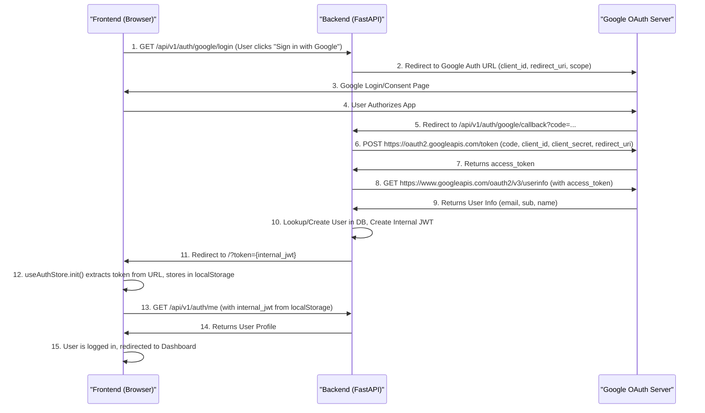

# API Client and Authentication Store

<details>
<summary>Relevant source files</summary>

The following files were used as context for generating this wiki page:

- [frontend/src/api/client.ts](frontend/src/api/client.ts)
- [frontend/src/stores/auth.ts](frontend/src/stores/auth.ts)
- [frontend/src/views/DashboardView.vue](frontend/src/views/DashboardView.vue)
- [frontend/src/views/auth/LoginView.vue](frontend/src/views/auth/LoginView.vue)
- [frontend/src/views/auth/RegisterView.vue](frontend/src/views/auth/RegisterView.vue)
- [interleague_scheduler/routers/auth.py](interleague_scheduler/routers/auth.py)

</details>


This page details the frontend's core mechanisms for interacting with the backend API and managing user authentication. It covers the Axios-based API client, which handles base URL configuration, JWT token injection, and global error handling, particularly for 401 Unauthorized responses. It also describes the `useAuthStore` Pinia store, responsible for user login, registration, session management, and the initialization logic that processes Google OAuth tokens embedded in the URL. Finally, the frontend-backend Google OAuth handshake flow is explained.

## API Client

The frontend uses an Axios instance, `api`, to make all HTTP requests to the backend. This client is configured to interact with the `/api/v1` endpoint and automatically handles authentication token injection and global 401 error responses.

### Implementation Details

The `api` client is initialized with a `baseURL` of `/api/v1` and sets the `Content-Type` header to `application/json` [frontend/src/api/client.ts:3-5]().

```typescript
// frontend/src/api/client.ts
import axios from 'axios'

const api = axios.create({
  baseURL: '/api/v1',
  headers: { 'Content-Type': 'application/json' },
})
```

#### Request Interceptor

A request interceptor is configured to automatically inject the JWT `token` stored in `localStorage` into the `Authorization` header of outgoing requests [frontend/src/api/client.ts:8-14](). This ensures that all authenticated API calls include the necessary `Bearer` token without requiring manual addition for each request.

```typescript
// frontend/src/api/client.ts
api.interceptors.request.use((config) => {
  const token = localStorage.getItem('token')
  if (token) {
    config.headers.Authorization = `Bearer ${token}`
  }
  return config
})
```

#### Response Interceptor (401 Handling)

A response interceptor globally handles `401 Unauthorized` errors [frontend/src/api/client.ts:16-28](). If a 401 status is received and the request was not to an authentication endpoint (i.e., not `/auth/`), the stored token is removed from `localStorage`, and the user is redirected to the `/login` page. This ensures that expired or invalid tokens automatically log out the user and prompt re-authentication.

```typescript
// frontend/src/api/client.ts
api.interceptors.response.use(
  (response) => response,
  (error) => {
    if (error.response?.status === 401) {
      const url = error.config?.url || ''
      if (!url.startsWith('/auth/')) {
        localStorage.removeItem('token')
        window.location.href = '/login'
      }
    }
    return Promise.reject(error)
  },
)
```

### API Client Usage

Components and stores throughout the frontend import and use this `api` instance for all backend communication. For example, the `DashboardView` uses it to fetch various statistics [frontend/src/views/DashboardView.vue:37-44]().

Sources:
- [frontend/src/api/client.ts:1-31]()
- [frontend/src/views/DashboardView.vue:3-4]()
- [frontend/src/views/DashboardView.vue:37-44]()

## Authentication Store (`useAuthStore`)

The `useAuthStore` is a Pinia store that centralizes authentication logic and state management for the frontend application. It manages the user's authentication status, JWT token, and user details.

### State

The store maintains the following reactive state:
- `user`: A `ref` holding the currently authenticated `User` object or `null` if not authenticated [frontend/src/stores/auth.ts:14]().
- `token`: A `ref` holding the JWT access token, initialized from `localStorage` [frontend/src/stores/auth.ts:15]().
- `isAuthenticated`: A `computed` property that is `true` if a `token` is present, `false` otherwise [frontend/src/stores/auth.ts:16]().

### Actions

#### `login(email, password)`

This asynchronous action handles local user login. It sends a `POST` request to `/auth/login` with the provided credentials. On success, it stores the received `access_token` in `token.value` and `localStorage`, then calls `fetchUser()` to retrieve and store the user's details [frontend/src/stores/auth.ts:18-23]().

#### `register(email, password, full_name?)`

This asynchronous action handles local user registration. It sends a `POST` request to `/auth/register` with the user details. Upon successful registration, it automatically calls `login()` with the same credentials to establish an authenticated session [frontend/src/stores/auth.ts:25-28]().

#### `fetchUser()`

This asynchronous action fetches the current user's details by making a `GET` request to `/auth/me`. If successful, it updates the `user.value` state. If the request fails (e.g., due to an invalid token), it calls `logout()` to clear the session [frontend/src/stores/auth.ts:30-37]().

#### `logout()`

This function clears the authentication state by setting `token.value` and `user.value` to `null` and removing the `token` from `localStorage` [frontend/src/stores/auth.ts:39-43]().

#### `init()`

This crucial asynchronous action is called during application startup to initialize the authentication state. It performs two main tasks:
1. **Google OAuth Token Handling**: It checks the current URL for a `token` query parameter. If found (which happens after a successful Google OAuth callback), it extracts the token, stores it in `token.value` and `localStorage`, and then removes the `token` from the URL to clean up the browser history [frontend/src/stores/auth.ts:46-52]().
2. **Session Restoration**: If a `token` is present (either from `localStorage` or the URL), it calls `fetchUser()` to validate the token and retrieve the user's profile [frontend/src/stores/auth.ts:53-55]().

### `useAuthStore` Data Flow

The following diagram illustrates the data flow within the `useAuthStore` and its interactions with the `api` client and `localStorage`.

```mermaid
graph TD
    subgraph "Frontend Application"
        A[Vue Component] -->|Calls| B(useAuthStore)
        B -->|login(email, password)| C{api.post("/auth/login")}
        B -->|register(email, password, full_name)| D{api.post("/auth/register")}
        B -->|fetchUser()| E{api.get("/auth/me")}
        B -->|logout()| F[Clear State & localStorage]
        B -->|init()| G{Check URL for 'token'}
        G -- "token found" --> H[Set token.value & localStorage]
        G -- "token not found" --> I[Load token from localStorage]
        H --> E
        I --> E
        C -- "access_token" --> J[Set token.value]
        D -- "success" --> C
        J --> K[localStorage.setItem('token')]
        K --> E
        E -- "User Data" --> L[Set user.value]
        E -- "Error (e.g., 401)" --> F
        F --> M[Redirect to /login]
    end
    subgraph "Backend API"
        C -- "Auth API" --> N(FastAPI /auth/login)
        D -- "Auth API" --> O(FastAPI /auth/register)
        E -- "Auth API" --> P(FastAPI /auth/me)
    end
    subgraph "Browser Storage"
        K --> Q[localStorage]
        I --> Q
        F --> Q
    end

    style A fill:#f9f,stroke:#333,stroke-width:2px
    style B fill:#ccf,stroke:#333,stroke-width:2px
    style C fill:#fcf,stroke:#333,stroke-width:2px
    style D fill:#fcf,stroke:#333,stroke-width:2px
    style E fill:#fcf,stroke:#333,stroke-width:2px
    style F fill:#f9f,stroke:#333,stroke-width:2px
    style G fill:#f9f,stroke:#333,stroke-width:2px
    style H fill:#f9f,stroke:#333,stroke-width:2px
    style I fill:#f9f,stroke:#333,stroke-width:2px
    style J fill:#f9f,stroke:#333,stroke-width:2px
    style K fill:#f9f,stroke:#333,stroke-width:2px
    style L fill:#f9f,stroke:#333,stroke-width:2px
    style M fill:#f9f,stroke:#333,stroke-width:2px
    style N fill:#cfc,stroke:#333,stroke-width:2px
    style O fill:#cfc,stroke:#333,stroke-width:2px
    style P fill:#cfc,stroke:#333,stroke-width:2px
    style Q fill:#ffc,stroke:#333,stroke-width:2px
```
Title: "useAuthStore" Data Flow

Sources:
- [frontend/src/stores/auth.ts:1-59]()
- [frontend/src/stores/auth.ts:14]()
- [frontend/src/stores/auth.ts:15]()
- [frontend/src/stores/auth.ts:16]()
- [frontend/src/stores/auth.ts:18-23]()
- [frontend/src/stores/auth.ts:25-28]()
- [frontend/src/stores/auth.ts:30-37]()
- [frontend/src/stores/auth.ts:39-43]()
- [frontend/src/stores/auth.ts:46-52]()
- [frontend/src/stores/auth.ts:53-55]()

## Frontend-Backend Google OAuth Handshake Flow

The Google OAuth flow involves a multi-step interaction between the frontend, the backend, and Google's authentication servers.

### Flow Description

1.  **Initiate Google Login (Frontend)**: When a user clicks "Sign in with Google" on the frontend `LoginView`, the `loginWithGoogle()` method is called [frontend/src/views/auth/LoginView.vue:29-31](). This method redirects the browser to the backend's `/api/v1/auth/google/login` endpoint.

2.  **Backend Redirect to Google (Backend)**: The backend's `/auth/google/login` endpoint [interleague_scheduler/routers/auth.py:74-92]() constructs a Google OAuth authorization URL with necessary parameters (client ID, redirect URI, scopes) and redirects the user's browser to this Google URL.

3.  **User Authorization (Google)**: The user interacts with Google, authenticating and granting permission to the application.

4.  **Google Redirect to Backend Callback (Google)**: After successful authorization, Google redirects the user's browser back to the `redirect_uri` specified by the backend, which is `/api/v1/auth/google/callback`, including an authorization `code` as a query parameter.

5.  **Backend Exchanges Code for Token (Backend)**: The backend's `/auth/google/callback` endpoint [interleague_scheduler/routers/auth.py:95-164]() receives the `code`. It then makes a server-to-server `POST` request to Google's `GOOGLE_TOKEN_URL` to exchange this `code` for an `access_token` and potentially other tokens.

6.  **Backend Fetches User Info (Backend)**: Using the `access_token` obtained from Google, the backend makes another server-to-server `GET` request to Google's `GOOGLE_USERINFO_URL` to retrieve the user's profile information (e.g., `email`, `sub`, `name`).

7.  **Backend User Management & JWT Creation (Backend)**:
    *   The backend checks if a `User` with the `google_sub` (Google's unique user ID) already exists in its database.
    *   If not, it checks if a `User` with the same `email` exists. If so, it links the existing user to the Google account by setting `google_sub` and `auth_provider` [interleague_scheduler/routers/auth.py:141-144]().
    *   If no user exists with either `google_sub` or `email`, a new `User` record is created with `auth_provider` set to "google" [interleague_scheduler/routers/auth.py:146-151]().
    *   Finally, the backend creates its own JWT `access_token` for the user [interleague_scheduler/routers/auth.py:161]() and redirects the user's browser back to the frontend's root URL (`/`) with this JWT embedded as a query parameter: `/?token={jwt}` [interleague_scheduler/routers/auth.py:162-163]().

8.  **Frontend Processes Token (Frontend)**: The frontend's `useAuthStore.init()` method [frontend/src/stores/auth.ts:46-52]() detects the `token` query parameter in the URL. It extracts this JWT, stores it in `localStorage`, clears the `token` from the URL, and then proceeds to call `fetchUser()` to load the user's profile and establish the authenticated session.

### Google OAuth Handshake Diagram


Title: Frontend-Backend Google OAuth Handshake

Sources:
- [frontend/src/views/auth/LoginView.vue:29-31]()
- [interleague_scheduler/routers/auth.py:74-92]()
- [interleague_scheduler/routers/auth.py:95-164]()
- [interleague_scheduler/routers/auth.py:141-144]()
- [interleague_scheduler/routers/auth.py:146-151]()
- [interleague_scheduler/routers/auth.py:161]()
- [interleague_scheduler/routers/auth.py:162-163]()
- [frontend/src/stores/auth.ts:46-52]()
