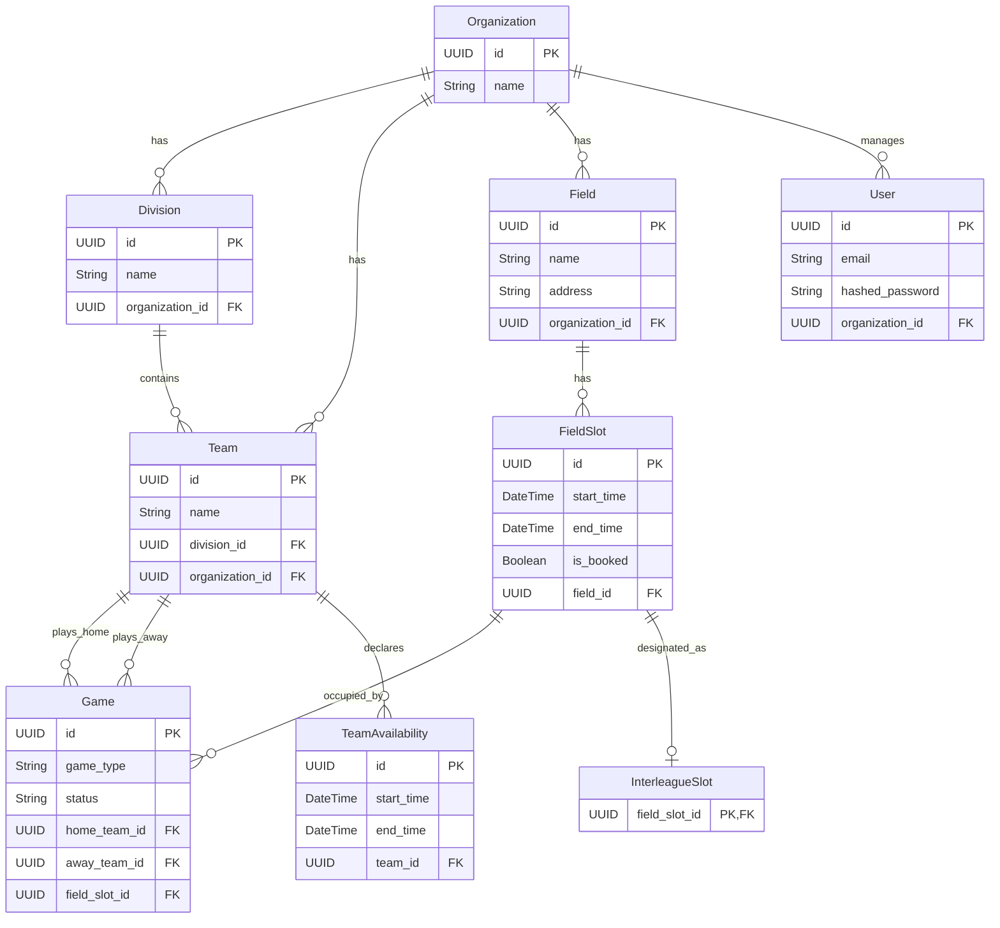

# 1.2. Architecture Overview

<details>
<summary>Relevant source files</summary>

The following files were used as context for generating this wiki page:

- [frontend/src/App.vue](frontend/src/App.vue)
- [frontend/src/main.ts](frontend/src/main.ts)
- [interleague_scheduler/database.py](interleague_scheduler/database.py)
- [interleague_scheduler/main.py](interleague_scheduler/main.py)
- [interleague_scheduler/models/__init__.py](interleague_scheduler/models/__init__.py)

</details>


This page describes the overall system architecture of the Interleague Scheduler application. It covers the FastAPI backend with its SQLAlchemy ORM, the Vue 3 + Vuetify frontend, their communication mechanism, and the core entity hierarchy that structures the application's data.

## System Architecture

The Interleague Scheduler is built as a single-page application (SPA) with a clear separation between its frontend and backend components.

### Backend

The backend is implemented using Python with the FastAPI framework [interleague_scheduler/main.py:1-29](). It provides a RESTful API for all data operations. Key characteristics include:
*   **FastAPI**: Handles routing, request validation, and response serialization.
*   **SQLAlchemy ORM**: Manages interactions with the database, mapping Python objects to database tables [interleague_scheduler/database.py:14]().
*   **Pydantic**: Used for data validation and serialization, integrated seamlessly with FastAPI.
*   **Database**: Configurable via `DATABASE_URL` [interleague_scheduler/database.py:9](), supporting SQLite for development and PostgreSQL for production.

All API endpoints are prefixed with `/api/v1` [interleague_scheduler/main.py:31-38]().

### Frontend

The frontend is a single-page application developed with Vue 3 and styled using Vuetify [frontend/src/main.ts:1-28](). It consumes the RESTful API provided by the backend. Key characteristics include:
*   **Vue 3**: The progressive JavaScript framework for building user interfaces.
*   **Vuetify**: A Vue UI Library with Material Design components, providing a consistent and responsive user experience.
*   **Pinia**: The state management library for Vue applications, used for managing authentication state [frontend/src/main.ts:11, frontend/src/App.vue:4]().
*   **Vue Router**: Manages client-side navigation and routing [frontend/src/main.ts:10, frontend/src/App.vue:7]().

### Communication

The frontend communicates with the backend exclusively through HTTP requests to the `/api/v1` endpoints. This separation allows for independent development and deployment of both components.

### Architecture Diagram

The following diagram illustrates the high-level architecture and the interaction between the frontend and backend.

```mermaid
graph TD
    subgraph "Client (Browser)"
        A[Vue 3 + Vuetify Frontend]
    end

    subgraph "Server (Python)"
        B[FastAPI Backend]
        C[SQLAlchemy ORM]
        D[Database (e.g., SQLite/PostgreSQL)]
    end

    A -- "HTTP Requests (GET, POST, PUT, DELETE)" --> B
    B -- "API Endpoints (/api/v1/...)" --> B
    B -- "ORM Calls" --> C
    C -- "SQL Queries" --> D
    D -- "Data" --> C
    C -- "Python Objects" --> B
    B -- "JSON Responses" --> A
```
Sources: [interleague_scheduler/main.py:1-38](), [frontend/src/main.ts:1-28](), [frontend/src/App.vue:1-64]()

## Entity Hierarchy

The application's data model is structured around a hierarchical relationship of entities, primarily centered on `Organization` and `Field` entities. This hierarchy dictates how scheduling components relate to each other.

### Core Entities

The main SQLAlchemy models defined in the application are [interleague_scheduler/models/__init__.py:1-9]():
*   `Organization`: The top-level entity, representing a sports league or club.
*   `Division`: A subdivision within an `Organization`, grouping teams of similar age or skill levels.
*   `Team`: Belongs to a `Division` and an `Organization`.
*   `Field`: A physical location where games are played, associated with an `Organization`.
*   `FieldSlot`: A specific date and time slot available on a `Field`.
*   `Game`: Represents a scheduled match between two `Team`s, occupying a `FieldSlot`.
*   `InterleagueSlot`: An extension of `FieldSlot` specifically designated for interleague play.
*   `TeamAvailability`: Declares a team's availability for interleague games.
*   `User`: Represents a user of the system, associated with an `Organization`.

### Entity Relationship Diagram

The following diagram illustrates the relationships between the core entities.


Sources: [interleague_scheduler/models/__init__.py:1-9]()
