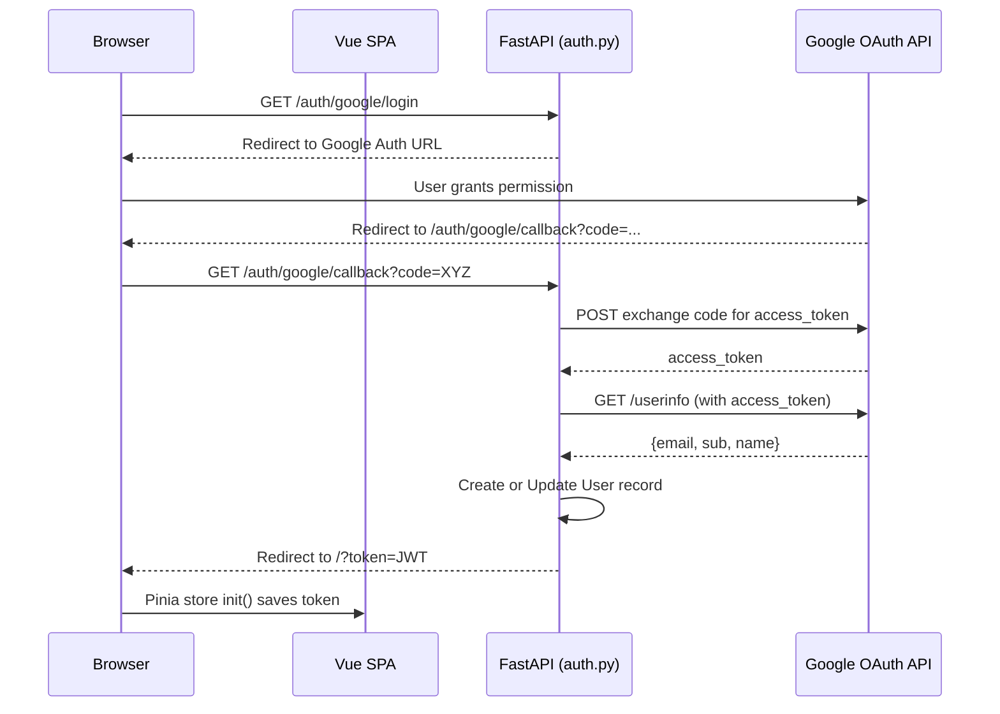
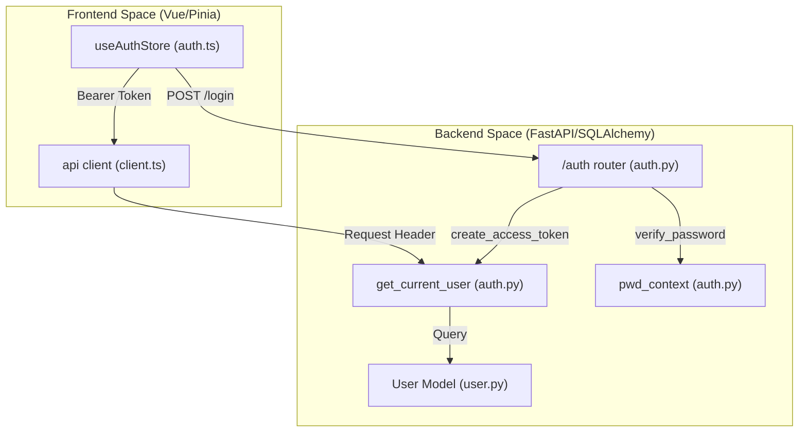

# Authentication and Security

Relevant source files

The following files were used as context for generating this wiki page:

- [.github/workflows/ci.yml](.github/workflows/ci.yml)
- [frontend/src/stores/auth.ts](frontend/src/stores/auth.ts)
- [frontend/src/views/DashboardView.vue](frontend/src/views/DashboardView.vue)
- [interleague_scheduler/auth.py](interleague_scheduler/auth.py)
- [interleague_scheduler/models/user.py](interleague_scheduler/models/user.py)
- [interleague_scheduler/routers/auth.py](interleague_scheduler/routers/auth.py)
- [interleague_scheduler/schemas/auth.py](interleague_scheduler/schemas/auth.py)

This section details the security architecture of the Interleague Scheduler, covering the implementation of identity management, token-based authorization, and the multi-provider authentication flow (Local and Google OAuth2).

## Security Utilities

The core security logic resides in `interleague_scheduler/auth.py`. This module abstracts password hashing, JWT management, and FastAPI dependencies for route protection.

### Password Hashing and Verification
The system uses `passlib` with the `bcrypt` hashing algorithm to secure user credentials [interleague_scheduler/auth.py:13]().
- **`hash_password(password: str)`**: Returns a bcrypt hash of the plain text password [interleague_scheduler/auth.py:17-18]().
- **`verify_password(plain_password: str, hashed_password: str)`**: Compares a plain text password against a stored hash [interleague_scheduler/auth.py:21-22]().

### JWT Management
Authentication is stateless, utilizing JSON Web Tokens (JWT) signed with a secret key defined in the system settings [interleague_scheduler/auth.py:31]().
- **`create_access_token(data: dict, ...)`**: Generates a JWT containing the user ID in the `sub` claim. Expiration is controlled by `settings.access_token_expire_minutes` [interleague_scheduler/auth.py:25-31]().
- **`decode_access_token(token: str)`**: Validates the signature and expiration of a token, raising a `401 UNAUTHORIZED` error if the token is invalid [interleague_scheduler/auth.py:34-41]().

### Dependency Injection
The `get_current_user` function serves as the primary FastAPI dependency for protecting endpoints [interleague_scheduler/auth.py:44-47](). It extracts the token from the `Authorization: Bearer <token>` header, decodes it, and retrieves the corresponding `User` entity from the database [interleague_scheduler/auth.py:48-55]().

**Sources:** [interleague_scheduler/auth.py:1-67](), [interleague_scheduler/config.py:9-11]()

---

## Data Models and Schemas

### User Model
The `User` model represents the identity entity within the system, supporting both local and OAuth2 providers.

| Attribute | Type | Description |
| :--- | :--- | :--- |
| `id` | String(36) | Primary Key (UUID v4) [interleague_scheduler/models/user.py:11]() |
| `email` | String(255) | Unique identifier and login credential [interleague_scheduler/models/user.py:12]() |
| `hashed_password` | String(255) | Bcrypt hash (null for Google-only users) [interleague_scheduler/models/user.py:13]() |
| `auth_provider` | String(50) | Either "local" or "google" [interleague_scheduler/models/user.py:16]() |
| `google_sub` | String(255) | Unique Google Subject ID [interleague_scheduler/models/user.py:17]() |
| `is_active` | Boolean | Flag to disable accounts [interleague_scheduler/models/user.py:15]() |

**Sources:** [interleague_scheduler/models/user.py:8-18](), [interleague_scheduler/schemas/auth.py:20-27]()

---

## Authentication Flow

The `/auth` router manages user lifecycle and session establishment.

### Local Registration and Login
1. **Registration (`POST /auth/register`)**: Checks for email uniqueness, hashes the provided password, and creates a `User` record with `auth_provider="local"` [interleague_scheduler/routers/auth.py:32-49]().
2. **Login (`POST /auth/login`)**: Validates credentials using `verify_password`. If successful and the account is active, it returns a `Token` schema containing the JWT [interleague_scheduler/routers/auth.py:52-71]().

### Google OAuth2 Integration
The system implements a standard Authorization Code flow.

**OAuth Data Flow: Code Exchange**

**Sources:** [interleague_scheduler/routers/auth.py:74-163](), [frontend/src/stores/auth.ts:45-56]()

---

## Frontend Integration

The frontend utilizes a Pinia store (`useAuthStore`) to manage authentication state and synchronize with the backend.

### Token Handling
- **Storage**: Tokens are stored in `localStorage` [frontend/src/stores/auth.ts:21]().
- **Initialization**: On application load, `init()` checks for a `token` in the URL query parameters (used after Google callback) or `localStorage` [frontend/src/stores/auth.ts:45-53]().
- **Global Identity**: The `fetchUser()` method calls `/auth/me` to populate the user profile [frontend/src/stores/auth.ts:30-37]().

### Authentication Guarding
The following diagram illustrates how the frontend entities interact with the backend security layers.

**Security Architecture: Code Entity Map**

**Sources:** [frontend/src/stores/auth.ts:13-59](), [interleague_scheduler/auth.py:44-66](), [interleague_scheduler/routers/auth.py:25-52]()
